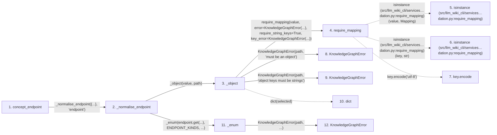

# concept_endpoint

**Entry point:** `concept_endpoint` (`api`)
**Source:** [knowledge_graph](../modules/knowledge_graph.md)
**Modules touched:** [knowledge_evidence](../modules/knowledge_evidence.md), [knowledge_graph](../modules/knowledge_graph.md), [validation](../modules/validation.md), [wiki_media](../modules/wiki_media.md), and 1 more

**Complete modules touched:**

- [knowledge_evidence](../modules/knowledge_evidence.md)
- [knowledge_graph](../modules/knowledge_graph.md)
- [validation](../modules/validation.md)
- [wiki_media](../modules/wiki_media.md)
- [wiki_surface](../modules/wiki_surface.md)

## Call sequence

> Static overview in presentation order, not runtime execution order. Arrows retain captured callers; representative internal continuations and boundary examples precede repeated helper detail.

<!-- Auto-generated from static call edges. Dashed arrows are external or unresolved calls. Reviewed runtime conditions and side effects belong in Behavior. -->

```mermaid
sequenceDiagram
    participant p0 as concept_endpoint
    participant p1 as _normalise_endpoint
    participant p2 as _object
    participant p3 as _enum
    participant p4 as _only_fields
    participant p5 as _locator
    participant p6 as _relative_path
    participant p7 as _external_uri
    participant p8 as _array
    participant p9 as _canonical_json
    participant p10 as _name
    participant p11 as validate_exact_page_coordinate
    participant p12 as require_repository_relative_path
    participant p13 as require_choice
    participant p14 as contains_uri_authority_userinfo
    participant p15 as require_trimmed_text
    participant p16 as _matches_directory_path
    participant p17 as _matches_directory_uri
    participant p18 as require_portable_relative_path
    participant p19 as require_nonempty_text
    participant p20 as _default_path_error
    participant p21 as is_safe_page_id
    participant p22 as canonical_path
    participant p23 as mcp_uri
    participant p24 as _check_path_collision
    participant p25 as require_portable_path_component
    participant p26 as KnowledgeGraphError
    participant p27 as require_mapping
    participant p28 as require_exact_fields
    participant p29 as len (src/llm_wiki_cli/services…ph.py:_normalise_endpoint)
    participant p30 as endpoint.get
    p0->>p1: _normalise_endpoint
    p1->>p2: _object
    p1->>p3: _enum
    p1->>p4: _only_fields
    p1->>p5: _locator
    p1->>p6: _relative_path
    p1->>p7: _external_uri
    p1->>p8: _array
    p1->>p9: _canonical_json
    p5->>p10: _name
    p5->>p11: validate_exact_page_coordinate
    p6->>p12: require_repository_relative_path
    p3->>p13: require_choice
    p7->>p14: contains_uri_authority_userinfo
    p13->>p15: require_trimmed_text
    p11->>p16: _matches_directory_path
    p11->>p17: _matches_directory_uri
    p12->>p18: require_portable_relative_path
    p15->>p19: require_nonempty_text
    p18->>p20: _default_path_error
    p16->>p21: is_safe_page_id
    p16->>p22: canonical_path
    p17->>p23: mcp_uri
    p18->>p24: _check_path_collision
    p18->>p25: require_portable_path_component
    p1->>p26: KnowledgeGraphError
    p2->>p27: require_mapping
    p4->>p28: require_exact_fields
    p1-->>p29: len (src/llm_wiki_cli/services…ph.py:_normalise_endpoint)(present)
    p1-->>p30: endpoint.get('kind')
```

> Call sequence diagram shows 30 of 216 interactions; 186 omitted to keep the visualization within the 30-interaction and generated-diagram limits, with uncertain identities omitted rather than inferred.

> Captured boundary calls: external 1 of 63 (62 omitted); unresolved 1 of 56 (55 omitted). These counts cover the captured static trace.

Omitted captured detail, grouped by actual caller occurrence and target module:

| Caller | Parent step | Target module | Kind | Omitted interactions |
| --- | --- | --- | --- | --- |
| `src/llm_wiki_cli/services/validation.py:require_mapping` | 4 | - | external | 2 |
| `src/llm_wiki_cli/services/validation.py:require_mapping` | 4 | - | unresolved | 1 |
| `src/llm_wiki_cli/services/knowledge_graph.py:_object` | 3 | [src/llm_wiki_cli/services/knowledge_graph.py](../modules/knowledge_graph.md) | internal | 2 |
| `src/llm_wiki_cli/services/knowledge_graph.py:_object` | 3 | - | external | 1 |
| `src/llm_wiki_cli/services/knowledge_graph.py:_enum` | 11 | [src/llm_wiki_cli/services/knowledge_graph.py](../modules/knowledge_graph.md) | internal | 1 |
| `src/llm_wiki_cli/services/knowledge_graph.py:_enum` | 11 | - | unresolved | 1 |
| `src/llm_wiki_cli/services/knowledge_graph.py:_enum` | 11 | - | external | 1 |
| `src/llm_wiki_cli/services/validation.py:require_nonempty_text` | 17 | - | external | 1 |
> Omission summary shows 8 of 67 groups; 59 further groups are not expanded here. Counts above include all omitted interactions.
> Detailed flow queries retain their own coverage and limits; omitted paths may execute at runtime.

> Trace truncated at the depth limit; deeper calls are omitted.

## Data flow

<!-- Auto-generated static analysis. Treat values and boundaries as best-effort hints, not runtime proof. -->

### Analysis coverage

**Effect analysis partially available.** Flow assembly and source effect analysis are separate; empty observations do not prove an empty handler body.

Source steps: 98; effect analysis evaluated: 63, partial: 4, unavailable: 31. Counts include steps omitted from the displayed trace.

Collector observations for 67 source steps with known totals: observed: 315, emitted: 299, omitted: 16. Unavailable totals are excluded.

- Callable record unavailable; the selected entry symbol has no represented callable body.
- Effect collector omitted observations before flow assembly; displayed effects are partial.
- Effect collector totals unavailable; observed counts cover captured records only.

| Step | Callable record | Effect analysis | Collector totals | Observed | Emitted | Omitted |
|---|---|---|---|---:|---:|---:|
| `concept_endpoint` | `available` | `evaluated` | `available` | `2` | `2` | `0` |
| `_normalise_endpoint` | `available` | `evaluated` | `available` | `10` | `10` | `0` |
| `_object` | `available` | `evaluated` | `available` | `3` | `3` | `0` |
| `require_mapping` | `available` | `evaluated` | `available` | `8` | `8` | `0` |
| `isinstance (src/llm_wiki_cli/services…dation.py:require_mapping)` | `not_applicable` | `not_applicable` | `not_applicable` | — | — | — |
| `isinstance (src/llm_wiki_cli/services…dation.py:require_mapping)` | `not_applicable` | `not_applicable` | `not_applicable` | — | — | — |
| `key.encode` | `not_applicable` | `not_applicable` | `not_applicable` | — | — | — |
| `KnowledgeGraphError` | `unavailable` | `unavailable` | `unavailable` | — | — | — |
| `KnowledgeGraphError` | `unavailable` | `unavailable` | `unavailable` | — | — | — |
| `dict` | `not_applicable` | `not_applicable` | `not_applicable` | — | — | — |
| `_enum` | `available` | `evaluated` | `available` | `4` | `4` | `0` |
| `KnowledgeGraphError` | `unavailable` | `unavailable` | `unavailable` | — | — | — |

```mermaid
flowchart LR
    s1["1. concept_endpoint"]
    s2["2. _normalise_endpoint"]
    s3["3. _object"]
    s4["4. require_mapping"]
    s5["5. isinstance (src/llm_wiki_cli/services…dation.py:require_mapping)"]
    s6["6. isinstance (src/llm_wiki_cli/services…dation.py:require_mapping)"]
    s7["7. key.encode"]
    s8["8. KnowledgeGraphError"]
    s9["9. KnowledgeGraphError"]
    s10["10. dict"]
    s11["11. _enum"]
    s12["12. KnowledgeGraphError"]
    s1 -->|"_normalise_endpoint({...}, 'endpoint')"| s2
    s2 -->|"_object(value, path)"| s3
    s3 -->|"require_mapping(value, error=KnowledgeGraphError(...), require_string_keys=True, key_error=KnowledgeGraphError(...))"| s4
    s4 -. "isinstance (src/llm_wiki_cli/services…dation.py:require_mapping)(value, Mapping)" .-> s5
    s4 -. "isinstance (src/llm_wiki_cli/services…dation.py:require_mapping)(key, str)" .-> s6
    s4 -. "key.encode('utf-8')" .-> s7
    s3 -->|"KnowledgeGraphError(path, 'must be an object')"| s8
    s3 -->|"KnowledgeGraphError(path, 'object keys must be strings')"| s9
    s3 -. "dict(selected)" .-> s10
    s2 -->|"_enum(endpoint.get(...), ENDPOINT_KINDS, ...)"| s11
    s11 -->|"KnowledgeGraphError(path, ...)"| s12
    click s1 "../modules/knowledge_graph.md"
    click s2 "../modules/knowledge_graph.md"
    click s3 "../modules/knowledge_graph.md"
    click s4 "../modules/validation.md"
    click s8 "../modules/knowledge_graph.md"
    click s9 "../modules/knowledge_graph.md"
    click s11 "../modules/knowledge_graph.md"
    click s12 "../modules/knowledge_graph.md"
```

### Step data

| Step | Inputs | Reads | Writes | Returns |
|---|---|---|---|---|
| `concept_endpoint` | `locator: str` | - | - | `_normalise_endpoint(...)` |
| `_normalise_endpoint` | `value: object`, `path: str` | `ENDPOINT_KINDS` | `result[...]`, `result[...]` | `{...}`, `{...}`, `{...}`, `result`, `result` |
| `_object` | `value: object`, `path: str` | - | - | `dict(...)` |
| `require_mapping` | `value: object`, `error: Exception`, `require_string_keys: bool`, `key_error: Exception \| None`, `require_utf8_keys: bool`, `utf8_key_error: Exception \| None` | `Mapping` | - | `value` |
| `isinstance (src/llm_wiki_cli/services…dation.py:require_mapping)` | - | - | - | - |
| `isinstance (src/llm_wiki_cli/services…dation.py:require_mapping)` | - | - | - | - |
| `key.encode` | - | - | - | - |
| `KnowledgeGraphError` | - | - | - | - |
| `KnowledgeGraphError` | - | - | - | - |
| `dict` | - | - | - | - |
| `_enum` | `value: object`, `values: Sequence[str]`, `path: str` | - | - | `require_choice(...)` |
| `KnowledgeGraphError` | - | - | - | - |

### Call data

| From | To | Line | Call |
|---|---|---:|---|
| concept_endpoint | _normalise_endpoint | 255 | `_normalise_endpoint({...}, 'endpoint')` |
| _normalise_endpoint | _object | 1411 | `_object(value, path)` |
| _object | require_mapping | 2309 | `require_mapping(value, error=KnowledgeGraphError(...), require_string_keys=True, key_error=KnowledgeGraphError(...))` |
| require_mapping | isinstance (src/llm_wiki_cli/services…dation.py:require_mapping) | 765 | `isinstance(value, Mapping)` |
| require_mapping | isinstance (src/llm_wiki_cli/services…dation.py:require_mapping) | 769 | `isinstance(key, str)` |
| require_mapping | key.encode | 774 | `key.encode('utf-8')` |
| _object | KnowledgeGraphError | 2311 | `KnowledgeGraphError(path, 'must be an object')` |
| _object | KnowledgeGraphError | 2313 | `KnowledgeGraphError(path, 'object keys must be strings')` |
| _object | dict | 2315 | `dict(selected)` |
| _normalise_endpoint | _enum | 1412 | `_enum(endpoint.get(...), ENDPOINT_KINDS, ...)` |
| _enum | KnowledgeGraphError | 2348 | `KnowledgeGraphError(path, ...)` |

### Boundary effects

*No boundary-effect observations were captured in this static trace.*

### Static analysis gaps

| Kind | Step | Target | Line |
|---|---|---|---:|
| external_call | `require_mapping` | `isinstance` | 765 |
| external_call | `require_mapping` | `isinstance` | 769 |
| unresolved_call | `require_mapping` | `key.encode` | 774 |
| step_limit | `concept_endpoint` | `first 12 steps` | 0 |
| truncated_flow | `concept_endpoint` | `depth limit` | 0 |

## Behavior

This flow starts at `concept_endpoint` and is classified as `api`. The generated call and data-flow sections are bounded static projections; runtime conditions and side effects require source-level confirmation.
