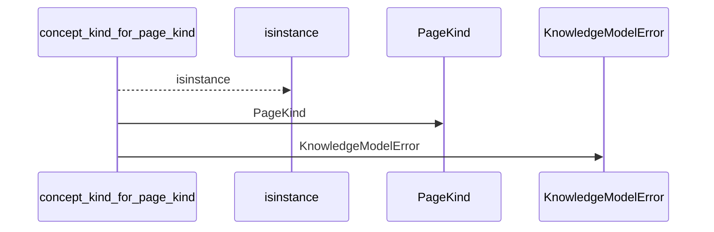
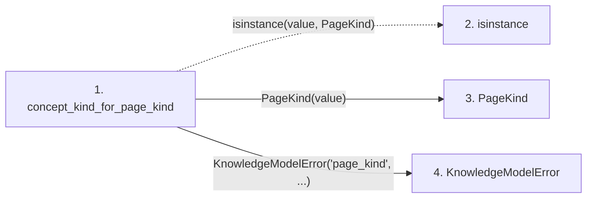

# concept_kind_for_page_kind

**Entry point:** `concept_kind_for_page_kind` (`api`)
**Source:** [knowledge_model](../modules/knowledge_model.md)
**Modules touched:** [knowledge_model](../modules/knowledge_model.md), [wiki_surface](../modules/wiki_surface.md)

## Call sequence

<!-- Auto-generated from static call edges. Dashed arrows are external or unresolved calls. Reviewed runtime conditions and side effects belong in Behavior. -->

## Data flow

<!-- Auto-generated static analysis. Treat values and boundaries as best-effort hints, not runtime proof. -->

### Step data

| Step | Inputs | Reads | Writes | Returns |
|---|---|---|---|---|
| `concept_kind_for_page_kind` | `value: Union[PageKind, str]` | `PageKind`, `PAGE_KIND_TO_CONCEPT_KIND` | - | `PAGE_KIND_TO_CONCEPT_KIND[...]` |
| `isinstance` | - | - | - | - |
| `PageKind` | - | - | - | - |
| `KnowledgeModelError` | - | - | - | - |

### Call data

| From | To | Line | Call |
|---|---|---:|---|
| concept_kind_for_page_kind | isinstance | 485 | `isinstance(value, PageKind)` |
| concept_kind_for_page_kind | PageKind | 485 | `PageKind(value)` |
| concept_kind_for_page_kind | KnowledgeModelError | 487 | `KnowledgeModelError('page_kind', ...)` |

### Boundary effects

*No boundary effects detected.*

### Static analysis gaps

| Kind | Step | Target | Line |
|---|---|---|---:|
| unresolved_call | `concept_kind_for_page_kind` | `isinstance` | 485 |

## Behavior

This flow starts at `concept_kind_for_page_kind` and is classified as `api`. The generated call and data-flow sections are bounded static projections; runtime conditions and side effects require source-level confirmation.
