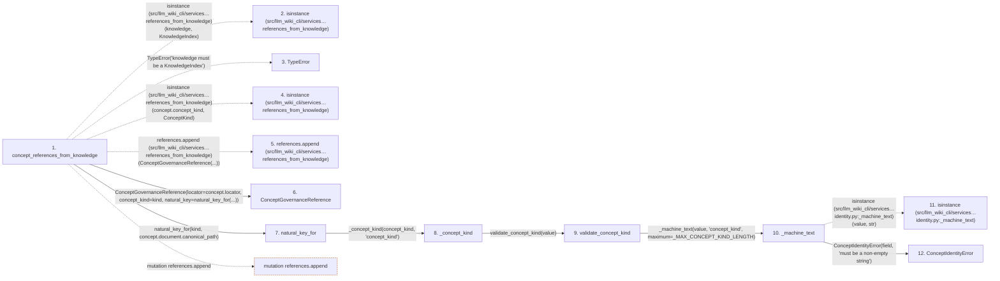

# concept_references_from_knowledge

**Entry point:** `concept_references_from_knowledge` (`api`)
**Source:** [knowledge_governance](../modules/knowledge_governance.md)
**Modules touched:** [concept_identity](../modules/concept_identity.md), [knowledge_governance](../modules/knowledge_governance.md), [validation](../modules/validation.md), [wiki_media](../modules/wiki_media.md), and 1 more

**Complete modules touched:**

- [concept_identity](../modules/concept_identity.md)
- [knowledge_governance](../modules/knowledge_governance.md)
- [validation](../modules/validation.md)
- [wiki_media](../modules/wiki_media.md)
- [wiki_surface](../modules/wiki_surface.md)

## Call sequence

```mermaid
sequenceDiagram
    participant p0 as concept_references_from_knowledge
    participant p1 as isinstance (src/llm_wiki_cli/services…references_from_knowledge)
    participant p2 as TypeError
    participant p3 as references.append (src/llm_wiki_cli/services…references_from_knowledge)
    participant p4 as ConceptGovernanceReference
    participant p5 as natural_key_for
    participant p6 as _concept_kind
    participant p7 as validate_concept_kind
    participant p8 as _machine_text
    participant p9 as isinstance (src/llm_wiki_cli/services…identity.py:_machine_text)
    participant p10 as ConceptIdentityError
    participant p11 as len (src/llm_wiki_cli/services…identity.py:_machine_text)
    participant p12 as value.strip (src/llm_wiki_cli/services…identity.py:_machine_text)
    participant p13 as any (src/llm_wiki_cli/services…identity.py:_machine_text)
    participant p14 as character.isspace (src/llm_wiki_cli/services…identity.py:_machine_text)
    participant p15 as unicodedata.normalize (src/llm_wiki_cli/services…identity.py:_machine_text)
    participant p16 as unicodedata.category(…).startswith (src/llm_wiki_cli/services…identity.py:_machine_text)
    participant p17 as unicodedata.category (src/llm_wiki_cli/services…identity.py:_machine_text)
    participant p18 as _QUALIFIED_KIND_RE.fullmatch
    participant p19 as GovernanceError
    participant p20 as _relative_path
    participant p21 as require_repository_relative_path
    participant p22 as isinstance (src/llm_wiki_cli/services…_repository_relative_path)
    participant p23 as value.strip (src/llm_wiki_cli/services…_repository_relative_path)
    p0-->>p1: isinstance (src/llm_wiki_cli/services…references_from_knowledge)
    p0-->>p2: TypeError
    p0-->>p1: isinstance (src/llm_wiki_cli/services…references_from_knowledge)
    p0-->>p3: references.append (src/llm_wiki_cli/services…references_from_knowledge)
    p0->>p4: ConceptGovernanceReference
    p0->>p5: natural_key_for
    p5->>p6: _concept_kind
    p6->>p7: validate_concept_kind
    p7->>p8: _machine_text
    p8-->>p9: isinstance (src/llm_wiki_cli/services…identity.py:_machine_text)
    p8->>p10: ConceptIdentityError
    p8-->>p11: len (src/llm_wiki_cli/services…identity.py:_machine_text)
    p8->>p10: ConceptIdentityError
    p8-->>p12: value.strip (src/llm_wiki_cli/services…identity.py:_machine_text)
    p8-->>p13: any (src/llm_wiki_cli/services…identity.py:_machine_text)
    p8-->>p14: character.isspace (src/llm_wiki_cli/services…identity.py:_machine_text)
    p8->>p10: ConceptIdentityError
    p8-->>p15: unicodedata.normalize (src/llm_wiki_cli/services…identity.py:_machine_text)
    p8->>p10: ConceptIdentityError
    p8-->>p13: any (src/llm_wiki_cli/services…identity.py:_machine_text)
    p8-->>p16: unicodedata.category(…).startswith (src/llm_wiki_cli/services…identity.py:_machine_text)
    p8-->>p17: unicodedata.category (src/llm_wiki_cli/services…identity.py:_machine_text)
    p8->>p10: ConceptIdentityError
    p7-->>p18: _QUALIFIED_KIND_RE.fullmatch
    p7->>p10: ConceptIdentityError
    p6->>p19: GovernanceError
    p5->>p20: _relative_path
    p20->>p21: require_repository_relative_path
    p21-->>p22: isinstance (src/llm_wiki_cli/services…_repository_relative_path)
    p21-->>p23: value.strip (src/llm_wiki_cli/services…_repository_relative_path)
```

<!-- Auto-generated from static call edges. Dashed arrows are external or unresolved calls. Reviewed runtime conditions and side effects belong in Behavior. -->

> Call sequence diagram shows 30 of 223 interactions; 193 omitted to keep the visualization within the 30-interaction and generated-diagram limits.

> Trace truncated at the depth limit; deeper calls are omitted.

## Data flow

<!-- Auto-generated static analysis. Treat values and boundaries as best-effort hints, not runtime proof. -->

### Step data

| Step | Inputs | Reads | Writes | Returns |
|---|---|---|---|---|
| `concept_references_from_knowledge` | `knowledge: KnowledgeIndex` | `KnowledgeIndex`, `ConceptKind` | - | `_validated_references(...)` |
| `isinstance (src/llm_wiki_cli/services…references_from_knowledge)` | - | - | - | - |
| `TypeError` | - | - | - | - |
| `isinstance (src/llm_wiki_cli/services…references_from_knowledge)` | - | - | - | - |
| `references.append (src/llm_wiki_cli/services…references_from_knowledge)` | - | - | - | - |
| `ConceptGovernanceReference` | - | - | - | - |
| `natural_key_for` | `concept_kind: str`, `canonical_path: str` | - | - | `_natural_key(...)` |
| `_concept_kind` | `value: object`, `path: str` | `ConceptIdentityError` | - | `validate_concept_kind(...)` |
| `validate_concept_kind` | `value: object` | `_MAX_CONCEPT_KIND_LENGTH`, `_UID_TAG_BY_KIND` | - | `text` |
| `_machine_text` | `value: object`, `field: str`, `maximum: int` | - | - | `value` |
| `isinstance (src/llm_wiki_cli/services…identity.py:_machine_text)` | - | - | - | - |
| `ConceptIdentityError` | - | - | - | - |

### Call data

| From | To | Line | Call |
|---|---|---:|---|
| concept_references_from_knowledge | isinstance (src/llm_wiki_cli/services…references_from_knowledge) | 1461 | `isinstance(knowledge, KnowledgeIndex)` |
| concept_references_from_knowledge | TypeError | 1462 | `TypeError('knowledge must be a KnowledgeIndex')` |
| concept_references_from_knowledge | isinstance (src/llm_wiki_cli/services…references_from_knowledge) | 1467 | `isinstance(concept.concept_kind, ConceptKind)` |
| concept_references_from_knowledge | references.append (src/llm_wiki_cli/services…references_from_knowledge) | 1470 | `references.append(ConceptGovernanceReference(...))` |
| concept_references_from_knowledge | ConceptGovernanceReference | 1471 | `ConceptGovernanceReference(locator=concept.locator, concept_kind=kind, natural_key=natural_key_for(...))` |
| concept_references_from_knowledge | natural_key_for | 1474 | `natural_key_for(kind, concept.document.canonical_path)` |
| natural_key_for | _concept_kind | 394 | `_concept_kind(concept_kind, 'concept_kind')` |
| _concept_kind | validate_concept_kind | 3364 | `validate_concept_kind(value)` |
| validate_concept_kind | _machine_text | 305 | `_machine_text(value, 'concept_kind', maximum=_MAX_CONCEPT_KIND_LENGTH)` |
| _machine_text | isinstance (src/llm_wiki_cli/services…identity.py:_machine_text) | 912 | `isinstance(value, str)` |
| _machine_text | ConceptIdentityError | 913 | `ConceptIdentityError(field, 'must be a non-empty string')` |

### Boundary effects

| Kind | Target | Step | Line |
|---|---|---|---:|
| mutation | `references.append` | `concept_references_from_knowledge` | 1470 |

### Static analysis gaps

| Kind | Step | Target | Line |
|---|---|---|---:|
| external_call | `concept_references_from_knowledge` | `isinstance` | 1461 |
| external_call | `concept_references_from_knowledge` | `TypeError` | 1462 |
| external_call | `concept_references_from_knowledge` | `isinstance` | 1467 |
| external_call | `_machine_text` | `isinstance` | 912 |
| step_limit | `concept_references_from_knowledge` | `first 12 steps` | 0 |
| truncated_flow | `concept_references_from_knowledge` | `depth limit` | 0 |

## Behavior

This flow starts at `concept_references_from_knowledge` and is classified as `api`. The generated call and data-flow sections are bounded static projections; runtime conditions and side effects require source-level confirmation.
