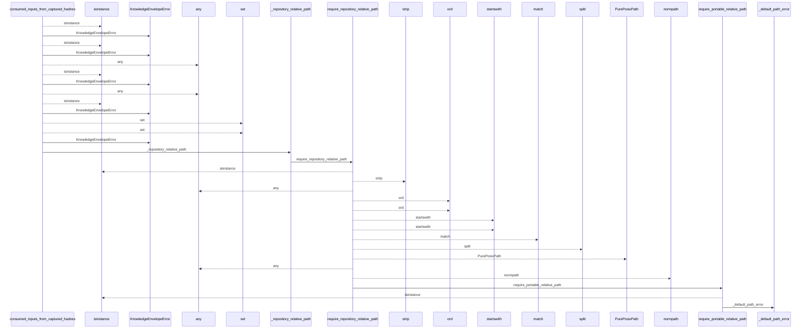
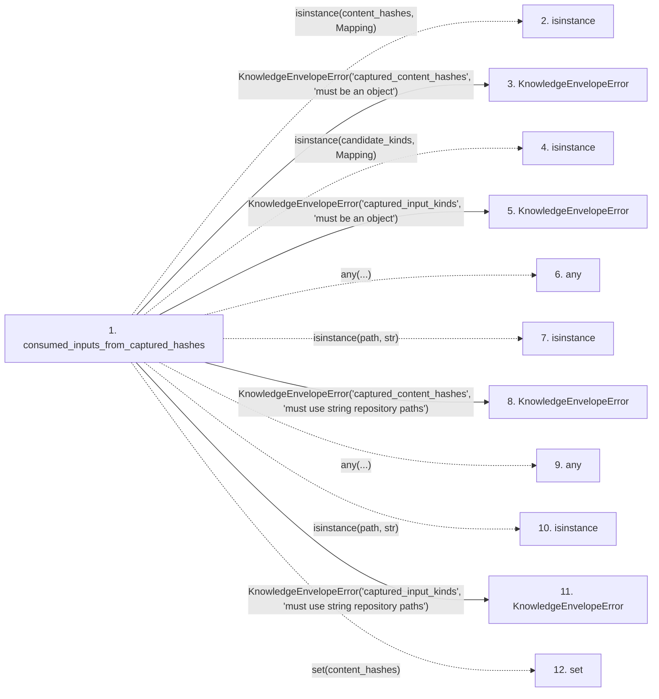

# consumed_inputs_from_captured_hashes

**Entry point:** `consumed_inputs_from_captured_hashes` (`api`)
**Source:** [knowledge_envelope](../modules/knowledge_envelope.md)
**Modules touched:** [knowledge_envelope](../modules/knowledge_envelope.md), [validation](../modules/validation.md)

## Call sequence

<!-- Auto-generated from static call edges. Dashed arrows are external or unresolved calls. Reviewed runtime conditions and side effects belong in Behavior. -->

> Call sequence diagram shows 30 of 94 interactions; 64 omitted to keep the visualization within the 30-interaction and generated-diagram limits.

## Data flow

<!-- Auto-generated static analysis. Treat values and boundaries as best-effort hints, not runtime proof. -->

### Step data

| Step | Inputs | Reads | Writes | Returns |
|---|---|---|---|---|
| `consumed_inputs_from_captured_hashes` | `content_hashes: Mapping[str, str]`, `candidate_kinds: Mapping[str, ConsumedInputKind \| str \| Iterable[ConsumedInputKind \| str]]` | `Mapping`, `Mapping` | - | `tuple(...)` |
| `isinstance` | - | - | - | - |
| `KnowledgeEnvelopeError` | - | - | - | - |
| `isinstance` | - | - | - | - |
| `KnowledgeEnvelopeError` | - | - | - | - |
| `any` | - | - | - | - |
| `isinstance` | - | - | - | - |
| `KnowledgeEnvelopeError` | - | - | - | - |
| `any` | - | - | - | - |
| `isinstance` | - | - | - | - |
| `KnowledgeEnvelopeError` | - | - | - | - |
| `set` | - | - | - | - |

### Call data

| From | To | Line | Call |
|---|---|---:|---|
| consumed_inputs_from_captured_hashes | isinstance | 179 | `isinstance(content_hashes, Mapping)` |
| consumed_inputs_from_captured_hashes | KnowledgeEnvelopeError | 180 | `KnowledgeEnvelopeError('captured_content_hashes', 'must be an object')` |
| consumed_inputs_from_captured_hashes | isinstance | 181 | `isinstance(candidate_kinds, Mapping)` |
| consumed_inputs_from_captured_hashes | KnowledgeEnvelopeError | 182 | `KnowledgeEnvelopeError('captured_input_kinds', 'must be an object')` |
| consumed_inputs_from_captured_hashes | any | 183 | `any(...)` |
| consumed_inputs_from_captured_hashes | isinstance | 183 | `isinstance(path, str)` |
| consumed_inputs_from_captured_hashes | KnowledgeEnvelopeError | 184 | `KnowledgeEnvelopeError('captured_content_hashes', 'must use string repository paths')` |
| consumed_inputs_from_captured_hashes | any | 188 | `any(...)` |
| consumed_inputs_from_captured_hashes | isinstance | 188 | `isinstance(path, str)` |
| consumed_inputs_from_captured_hashes | KnowledgeEnvelopeError | 189 | `KnowledgeEnvelopeError('captured_input_kinds', 'must use string repository paths')` |
| consumed_inputs_from_captured_hashes | set | 193 | `set(content_hashes)` |

### Boundary effects

*No boundary effects detected.*

### Static analysis gaps

| Kind | Step | Target | Line |
|---|---|---|---:|
| unresolved_call | `consumed_inputs_from_captured_hashes` | `isinstance` | 179 |
| unresolved_call | `consumed_inputs_from_captured_hashes` | `isinstance` | 181 |
| unresolved_call | `consumed_inputs_from_captured_hashes` | `any` | 183 |
| unresolved_call | `consumed_inputs_from_captured_hashes` | `isinstance` | 183 |
| unresolved_call | `consumed_inputs_from_captured_hashes` | `any` | 188 |
| unresolved_call | `consumed_inputs_from_captured_hashes` | `isinstance` | 188 |
| step_limit | `consumed_inputs_from_captured_hashes` | `first 12 steps` | 0 |

## Behavior

This flow starts at `consumed_inputs_from_captured_hashes` and is classified as `api`. The generated call and data-flow sections are bounded static projections; runtime conditions and side effects require source-level confirmation.
