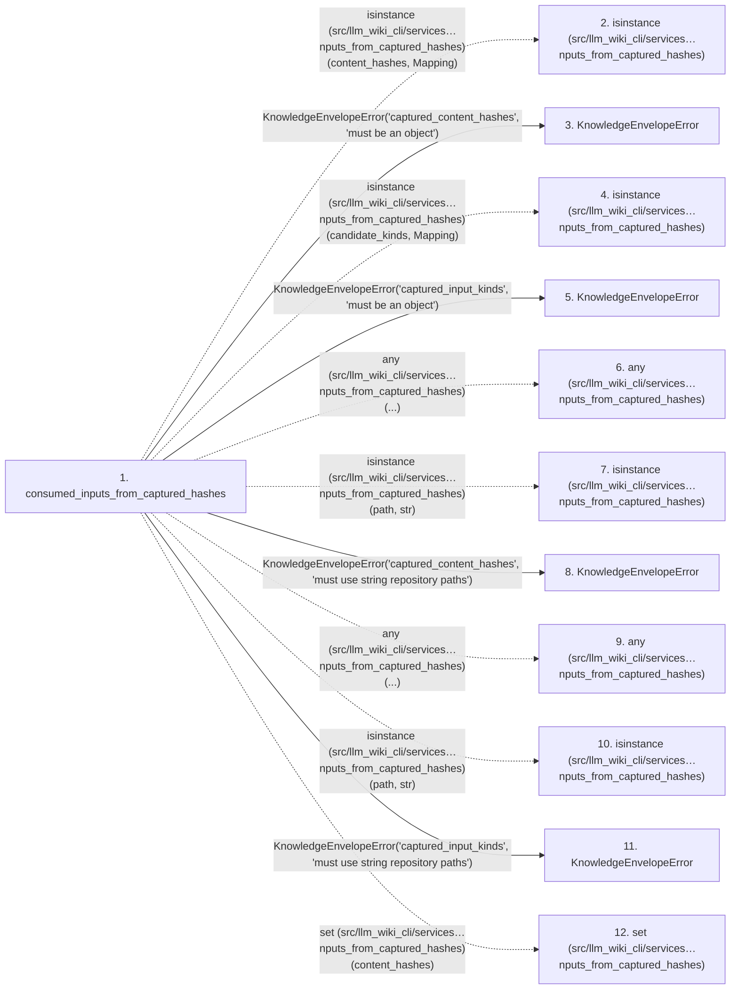

# consumed_inputs_from_captured_hashes

**Entry point:** `consumed_inputs_from_captured_hashes` (`api`)
**Source:** [knowledge_envelope](../modules/knowledge_envelope.md)
**Modules touched:** [knowledge_envelope](../modules/knowledge_envelope.md), [validation](../modules/validation.md)

## Call sequence

```mermaid
sequenceDiagram
    participant p0 as consumed_inputs_from_captured_hashes
    participant p1 as isinstance (src/llm_wiki_cli/services…nputs_from_captured_hashes)
    participant p2 as KnowledgeEnvelopeError
    participant p3 as any (src/llm_wiki_cli/services…nputs_from_captured_hashes)
    participant p4 as set (src/llm_wiki_cli/services…nputs_from_captured_hashes)
    participant p5 as _repository_relative_path
    participant p6 as require_repository_relative_path
    participant p7 as isinstance (src/llm_wiki_cli/services…e_repository_relative_path)
    participant p8 as value.strip
    participant p9 as any (src/llm_wiki_cli/services…e_repository_relative_path)
    participant p10 as ord (src/llm_wiki_cli/services…e_repository_relative_path)
    participant p11 as value.startswith
    participant p12 as _WINDOWS_DRIVE_PREFIX_RE.match
    participant p13 as value.split
    participant p14 as PurePosixPath (src/llm_wiki_cli/services…e_repository_relative_path)
    participant p15 as posixpath.normpath
    participant p16 as require_portable_relative_path
    participant p17 as isinstance (src/llm_wiki_cli/services…ire_portable_relative_path)
    participant p18 as _default_path_error
    p0-->>p1: isinstance (src/llm_wiki_cli/services…nputs_from_captured_hashes)
    p0->>p2: KnowledgeEnvelopeError
    p0-->>p1: isinstance (src/llm_wiki_cli/services…nputs_from_captured_hashes)
    p0->>p2: KnowledgeEnvelopeError
    p0-->>p3: any (src/llm_wiki_cli/services…nputs_from_captured_hashes)
    p0-->>p1: isinstance (src/llm_wiki_cli/services…nputs_from_captured_hashes)
    p0->>p2: KnowledgeEnvelopeError
    p0-->>p3: any (src/llm_wiki_cli/services…nputs_from_captured_hashes)
    p0-->>p1: isinstance (src/llm_wiki_cli/services…nputs_from_captured_hashes)
    p0->>p2: KnowledgeEnvelopeError
    p0-->>p4: set (src/llm_wiki_cli/services…nputs_from_captured_hashes)
    p0-->>p4: set (src/llm_wiki_cli/services…nputs_from_captured_hashes)
    p0->>p2: KnowledgeEnvelopeError
    p0->>p5: _repository_relative_path
    p5->>p6: require_repository_relative_path
    p6-->>p7: isinstance (src/llm_wiki_cli/services…e_repository_relative_path)
    p6-->>p8: value.strip
    p6-->>p9: any (src/llm_wiki_cli/services…e_repository_relative_path)
    p6-->>p10: ord (src/llm_wiki_cli/services…e_repository_relative_path)
    p6-->>p10: ord (src/llm_wiki_cli/services…e_repository_relative_path)
    p6-->>p11: value.startswith
    p6-->>p11: value.startswith
    p6-->>p12: _WINDOWS_DRIVE_PREFIX_RE.match
    p6-->>p13: value.split
    p6-->>p14: PurePosixPath (src/llm_wiki_cli/services…e_repository_relative_path)
    p6-->>p9: any (src/llm_wiki_cli/services…e_repository_relative_path)
    p6-->>p15: posixpath.normpath
    p6->>p16: require_portable_relative_path
    p16-->>p17: isinstance (src/llm_wiki_cli/services…ire_portable_relative_path)
    p16->>p18: _default_path_error
```

<!-- Auto-generated from static call edges. Dashed arrows are external or unresolved calls. Reviewed runtime conditions and side effects belong in Behavior. -->

> Call sequence diagram shows 30 of 94 interactions; 64 omitted to keep the visualization within the 30-interaction and generated-diagram limits.

## Data flow

<!-- Auto-generated static analysis. Treat values and boundaries as best-effort hints, not runtime proof. -->

### Step data

| Step | Inputs | Reads | Writes | Returns |
|---|---|---|---|---|
| `consumed_inputs_from_captured_hashes` | `content_hashes: Mapping[str, str]`, `candidate_kinds: Mapping[str, ConsumedInputKind \| str \| Iterable[ConsumedInputKind \| str]]` | `Mapping`, `Mapping` | - | `tuple(...)` |
| `isinstance (src/llm_wiki_cli/services…nputs_from_captured_hashes)` | - | - | - | - |
| `KnowledgeEnvelopeError` | - | - | - | - |
| `isinstance (src/llm_wiki_cli/services…nputs_from_captured_hashes)` | - | - | - | - |
| `KnowledgeEnvelopeError` | - | - | - | - |
| `any (src/llm_wiki_cli/services…nputs_from_captured_hashes)` | - | - | - | - |
| `isinstance (src/llm_wiki_cli/services…nputs_from_captured_hashes)` | - | - | - | - |
| `KnowledgeEnvelopeError` | - | - | - | - |
| `any (src/llm_wiki_cli/services…nputs_from_captured_hashes)` | - | - | - | - |
| `isinstance (src/llm_wiki_cli/services…nputs_from_captured_hashes)` | - | - | - | - |
| `KnowledgeEnvelopeError` | - | - | - | - |
| `set (src/llm_wiki_cli/services…nputs_from_captured_hashes)` | - | - | - | - |

### Call data

| From | To | Line | Call |
|---|---|---:|---|
| consumed_inputs_from_captured_hashes | isinstance (src/llm_wiki_cli/services…nputs_from_captured_hashes) | 183 | `isinstance(content_hashes, Mapping)` |
| consumed_inputs_from_captured_hashes | KnowledgeEnvelopeError | 184 | `KnowledgeEnvelopeError('captured_content_hashes', 'must be an object')` |
| consumed_inputs_from_captured_hashes | isinstance (src/llm_wiki_cli/services…nputs_from_captured_hashes) | 185 | `isinstance(candidate_kinds, Mapping)` |
| consumed_inputs_from_captured_hashes | KnowledgeEnvelopeError | 186 | `KnowledgeEnvelopeError('captured_input_kinds', 'must be an object')` |
| consumed_inputs_from_captured_hashes | any (src/llm_wiki_cli/services…nputs_from_captured_hashes) | 187 | `any(...)` |
| consumed_inputs_from_captured_hashes | isinstance (src/llm_wiki_cli/services…nputs_from_captured_hashes) | 187 | `isinstance(path, str)` |
| consumed_inputs_from_captured_hashes | KnowledgeEnvelopeError | 188 | `KnowledgeEnvelopeError('captured_content_hashes', 'must use string repository paths')` |
| consumed_inputs_from_captured_hashes | any (src/llm_wiki_cli/services…nputs_from_captured_hashes) | 192 | `any(...)` |
| consumed_inputs_from_captured_hashes | isinstance (src/llm_wiki_cli/services…nputs_from_captured_hashes) | 192 | `isinstance(path, str)` |
| consumed_inputs_from_captured_hashes | KnowledgeEnvelopeError | 193 | `KnowledgeEnvelopeError('captured_input_kinds', 'must use string repository paths')` |
| consumed_inputs_from_captured_hashes | set (src/llm_wiki_cli/services…nputs_from_captured_hashes) | 197 | `set(content_hashes)` |

### Boundary effects

*No boundary effects detected.*

### Static analysis gaps

| Kind | Step | Target | Line |
|---|---|---|---:|
| external_call | `consumed_inputs_from_captured_hashes` | `isinstance` | 183 |
| external_call | `consumed_inputs_from_captured_hashes` | `isinstance` | 185 |
| external_call | `consumed_inputs_from_captured_hashes` | `any` | 187 |
| external_call | `consumed_inputs_from_captured_hashes` | `isinstance` | 187 |
| external_call | `consumed_inputs_from_captured_hashes` | `any` | 192 |
| external_call | `consumed_inputs_from_captured_hashes` | `isinstance` | 192 |
| step_limit | `consumed_inputs_from_captured_hashes` | `first 12 steps` | 0 |

## Behavior

This flow starts at `consumed_inputs_from_captured_hashes` and is classified as `api`. The generated call and data-flow sections are bounded static projections; runtime conditions and side effects require source-level confirmation.
