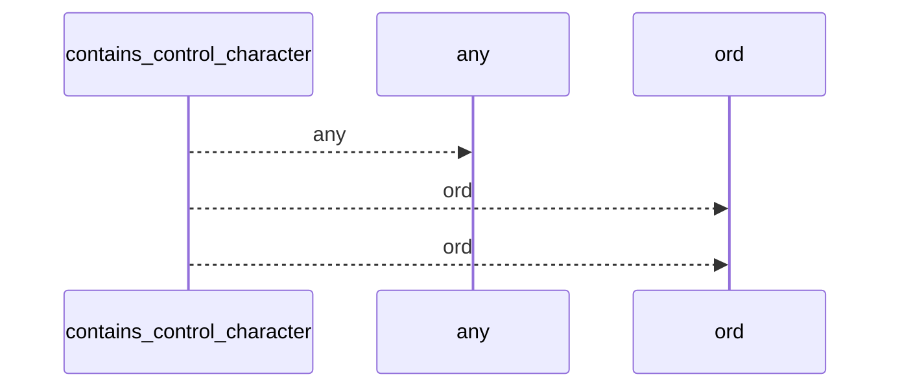
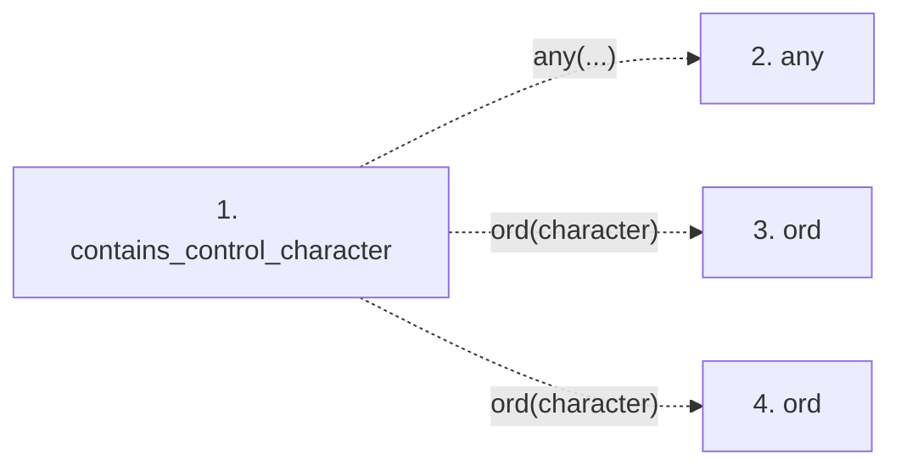

# contains_control_character

**Entry point:** `contains_control_character` (`api`)
**Source:** [validation](../modules/validation.md)
**Modules touched:** [validation](../modules/validation.md)

## Call sequence

<!-- Auto-generated from static call edges. Dashed arrows are external or unresolved calls. Reviewed runtime conditions and side effects belong in Behavior. -->

## Data flow

<!-- Auto-generated static analysis. Treat values and boundaries as best-effort hints, not runtime proof. -->

### Step data

| Step | Inputs | Reads | Writes | Returns |
|---|---|---|---|---|
| `contains_control_character` | `value: str`, `reject_delete_character: bool` | - | - | `any(...)` |
| `any` | - | - | - | - |
| `ord` | - | - | - | - |
| `ord` | - | - | - | - |

### Call data

| From | To | Line | Call |
|---|---|---:|---|
| contains_control_character | any | 643 | `any(...)` |
| contains_control_character | ord | 644 | `ord(character)` |
| contains_control_character | ord | 645 | `ord(character)` |

### Boundary effects

*No boundary effects detected.*

### Static analysis gaps

| Kind | Step | Target | Line |
|---|---|---|---:|
| unresolved_call | `contains_control_character` | `any` | 643 |
| unresolved_call | `contains_control_character` | `ord` | 644 |
| unresolved_call | `contains_control_character` | `ord` | 645 |

## Behavior

This flow starts at `contains_control_character` and is classified as `api`. The generated call and data-flow sections are bounded static projections; runtime conditions and side effects require source-level confirmation.
