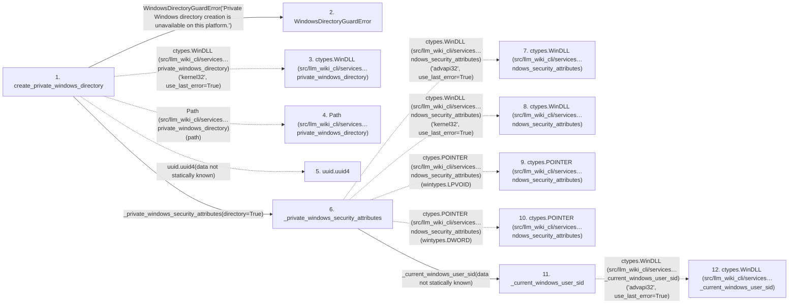

# create_private_windows_directory

**Entry point:** `create_private_windows_directory` (`api`)
**Source:** [filesystem_guard](../modules/filesystem_guard.md)
**Modules touched:** [filesystem_guard](../modules/filesystem_guard.md)

## Call sequence

```mermaid
sequenceDiagram
    participant p0 as create_private_windows_directory
    participant p1 as WindowsDirectoryGuardError
    participant p2 as ctypes.WinDLL (src/llm_wiki_cli/services…private_windows_directory)
    participant p3 as Path (src/llm_wiki_cli/services…private_windows_directory)
    participant p4 as uuid.uuid4
    participant p5 as _private_windows_security_attributes
    participant p6 as ctypes.WinDLL (src/llm_wiki_cli/services…ndows_security_attributes)
    participant p7 as ctypes.POINTER (src/llm_wiki_cli/services…ndows_security_attributes)
    participant p8 as _current_windows_user_sid
    participant p9 as ctypes.WinDLL (src/llm_wiki_cli/services…_current_windows_user_sid)
    participant p10 as ctypes.POINTER (src/llm_wiki_cli/services…_current_windows_user_sid)
    participant p11 as wintypes.HANDLE (src/llm_wiki_cli/services…_current_windows_user_sid)
    participant p12 as open_process_token
    participant p13 as get_current_process
    participant p14 as ctypes.byref (src/llm_wiki_cli/services…_current_windows_user_sid)
    participant p15 as ctypes.WinError (src/llm_wiki_cli/services…_current_windows_user_sid)
    participant p16 as ctypes.get_last_error (src/llm_wiki_cli/services…_current_windows_user_sid)
    participant p17 as WindowsSecurityGuardError
    participant p18 as wintypes.DWORD (src/llm_wiki_cli/services…_current_windows_user_sid)
    participant p19 as get_token_information
    participant p20 as ctypes.create_string_buffer
    p0->>p1: WindowsDirectoryGuardError
    p0-->>p2: ctypes.WinDLL (src/llm_wiki_cli/services…private_windows_directory)
    p0-->>p3: Path (src/llm_wiki_cli/services…private_windows_directory)
    p0-->>p4: uuid.uuid4
    p0->>p5: _private_windows_security_attributes
    p5-->>p6: ctypes.WinDLL (src/llm_wiki_cli/services…ndows_security_attributes)
    p5-->>p6: ctypes.WinDLL (src/llm_wiki_cli/services…ndows_security_attributes)
    p5-->>p7: ctypes.POINTER (src/llm_wiki_cli/services…ndows_security_attributes)
    p5-->>p7: ctypes.POINTER (src/llm_wiki_cli/services…ndows_security_attributes)
    p5->>p8: _current_windows_user_sid
    p8-->>p9: ctypes.WinDLL (src/llm_wiki_cli/services…_current_windows_user_sid)
    p8-->>p9: ctypes.WinDLL (src/llm_wiki_cli/services…_current_windows_user_sid)
    p8-->>p10: ctypes.POINTER (src/llm_wiki_cli/services…_current_windows_user_sid)
    p8-->>p10: ctypes.POINTER (src/llm_wiki_cli/services…_current_windows_user_sid)
    p8-->>p11: wintypes.HANDLE (src/llm_wiki_cli/services…_current_windows_user_sid)
    p8-->>p12: open_process_token
    p8-->>p13: get_current_process
    p8-->>p14: ctypes.byref (src/llm_wiki_cli/services…_current_windows_user_sid)
    p8-->>p15: ctypes.WinError (src/llm_wiki_cli/services…_current_windows_user_sid)
    p8-->>p16: ctypes.get_last_error (src/llm_wiki_cli/services…_current_windows_user_sid)
    p8->>p17: WindowsSecurityGuardError
    p8-->>p18: wintypes.DWORD (src/llm_wiki_cli/services…_current_windows_user_sid)
    p8-->>p19: get_token_information
    p8-->>p14: ctypes.byref (src/llm_wiki_cli/services…_current_windows_user_sid)
    p8-->>p15: ctypes.WinError (src/llm_wiki_cli/services…_current_windows_user_sid)
    p8-->>p16: ctypes.get_last_error (src/llm_wiki_cli/services…_current_windows_user_sid)
    p8->>p17: WindowsSecurityGuardError
    p8-->>p20: ctypes.create_string_buffer
    p8-->>p19: get_token_information
    p8-->>p14: ctypes.byref (src/llm_wiki_cli/services…_current_windows_user_sid)
```

<!-- Auto-generated from static call edges. Dashed arrows are external or unresolved calls. Reviewed runtime conditions and side effects belong in Behavior. -->

> Call sequence diagram shows 30 of 190 interactions; 160 omitted to keep the visualization within the 30-interaction and generated-diagram limits.

## Data flow

<!-- Auto-generated static analysis. Treat values and boundaries as best-effort hints, not runtime proof. -->

### Step data

| Step | Inputs | Reads | Writes | Returns |
|---|---|---|---|---|
| `create_private_windows_directory` | `path: Path` | `os` | `create_directory.argtypes`, `create_directory.restype`, `remove_directory.argtypes`, `remove_directory.restype` | - |
| `WindowsDirectoryGuardError` | - | - | - | - |
| `ctypes.WinDLL (src/llm_wiki_cli/services…private_windows_directory)` | - | - | - | - |
| `Path (src/llm_wiki_cli/services…private_windows_directory)` | - | - | - | - |
| `uuid.uuid4` | - | - | - | - |
| `_private_windows_security_attributes` | `directory: bool` | - | `convert.argtypes`, `convert.restype`, `local_free.argtypes`, `local_free.restype` | - |
| `ctypes.WinDLL (src/llm_wiki_cli/services…ndows_security_attributes)` | - | - | - | - |
| `ctypes.WinDLL (src/llm_wiki_cli/services…ndows_security_attributes)` | - | - | - | - |
| `ctypes.POINTER (src/llm_wiki_cli/services…ndows_security_attributes)` | - | - | - | - |
| `ctypes.POINTER (src/llm_wiki_cli/services…ndows_security_attributes)` | - | - | - | - |
| `_current_windows_user_sid` | - | `ctypes` | `open_process_token.argtypes`, `open_process_token.restype`, `get_token_information.argtypes`, `get_token_information.restype`, `get_current_process.argtypes`, `get_current_process.restype` | `_windows_sid_string(...)` |
| `ctypes.WinDLL (src/llm_wiki_cli/services…_current_windows_user_sid)` | - | - | - | - |

### Call data

| From | To | Line | Call |
|---|---|---:|---|
| create_private_windows_directory | WindowsDirectoryGuardError | 497 | `WindowsDirectoryGuardError('Private Windows directory creation is unavailable on this platform.')` |
| create_private_windows_directory | ctypes.WinDLL (src/llm_wiki_cli/services…private_windows_directory) | 502 | `ctypes.WinDLL('kernel32', use_last_error=True)` |
| create_private_windows_directory | Path (src/llm_wiki_cli/services…private_windows_directory) | 510 | `Path(path)` |
| create_private_windows_directory | uuid.uuid4 | 511 | `uuid.uuid4(data not statically known)` |
| create_private_windows_directory | _private_windows_security_attributes | 514 | `_private_windows_security_attributes(directory=True)` |
| _private_windows_security_attributes | ctypes.WinDLL (src/llm_wiki_cli/services…ndows_security_attributes) | 943 | `ctypes.WinDLL('advapi32', use_last_error=True)` |
| _private_windows_security_attributes | ctypes.WinDLL (src/llm_wiki_cli/services…ndows_security_attributes) | 944 | `ctypes.WinDLL('kernel32', use_last_error=True)` |
| _private_windows_security_attributes | ctypes.POINTER (src/llm_wiki_cli/services…ndows_security_attributes) | 949 | `ctypes.POINTER(wintypes.LPVOID)` |
| _private_windows_security_attributes | ctypes.POINTER (src/llm_wiki_cli/services…ndows_security_attributes) | 950 | `ctypes.POINTER(wintypes.DWORD)` |
| _private_windows_security_attributes | _current_windows_user_sid | 964 | `_current_windows_user_sid(data not statically known)` |
| _current_windows_user_sid | ctypes.WinDLL (src/llm_wiki_cli/services…_current_windows_user_sid) | 992 | `ctypes.WinDLL('advapi32', use_last_error=True)` |

### Boundary effects

*No boundary effects detected.*

### Static analysis gaps

| Kind | Step | Target | Line |
|---|---|---|---:|
| external_call | `create_private_windows_directory` | `ctypes.WinDLL` | 502 |
| external_call | `create_private_windows_directory` | `uuid.uuid4` | 511 |
| external_call | `_private_windows_security_attributes` | `ctypes.WinDLL` | 943 |
| external_call | `_private_windows_security_attributes` | `ctypes.WinDLL` | 944 |
| external_call | `_private_windows_security_attributes` | `ctypes.POINTER` | 949 |
| external_call | `_private_windows_security_attributes` | `ctypes.POINTER` | 950 |
| external_call | `_current_windows_user_sid` | `ctypes.WinDLL` | 992 |
| step_limit | `create_private_windows_directory` | `first 12 steps` | 0 |

## Behavior

This flow starts at `create_private_windows_directory` and is classified as `api`. The generated call and data-flow sections are bounded static projections; runtime conditions and side effects require source-level confirmation.
