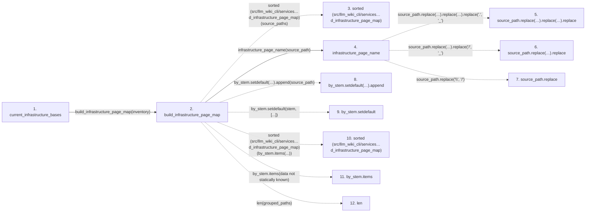

# current_infrastructure_bases

**Entry point:** `current_infrastructure_bases` (`api`)
**Source:** [infrastructure_sync](../modules/infrastructure_sync.md)
**Modules touched:** [infrastructure_inventory](../modules/infrastructure_inventory.md), [infrastructure_sync](../modules/infrastructure_sync.md), [knowledge_evidence](../modules/knowledge_evidence.md), and 1 more

**Complete modules touched:**

- [infrastructure_inventory](../modules/infrastructure_inventory.md)
- [infrastructure_sync](../modules/infrastructure_sync.md)
- [knowledge_evidence](../modules/knowledge_evidence.md)
- [validation](../modules/validation.md)

## Call sequence

```mermaid
sequenceDiagram
    participant p0 as current_infrastructure_bases
    participant p1 as build_infrastructure_page_map
    participant p2 as sorted (src/llm_wiki_cli/services…d_infrastructure_page_map)
    participant p3 as infrastructure_page_name
    participant p4 as source_path.replace(…).replace(…).replace
    participant p5 as source_path.replace(…).replace
    participant p6 as source_path.replace
    participant p7 as by_stem.setdefault(…).append
    participant p8 as by_stem.setdefault
    participant p9 as by_stem.items
    participant p10 as len
    participant p11 as hash_json(…).removeprefix
    participant p12 as hash_json
    participant p13 as sha256_bytes
    participant p14 as hashlib.sha256(…).hexdigest
    participant p15 as hashlib.sha256
    participant p16 as canonical_json_bytes
    participant p17 as canonical_json_text(…).encode
    participant p18 as canonical_json_text
    participant p19 as json.dumps
    participant p20 as build_infrastructure_observation_basis
    participant p21 as _validate_source_path
    participant p22 as require_repository_relative_path
    participant p23 as isinstance (src/llm_wiki_cli/services…_repository_relative_path)
    participant p24 as value.strip (src/llm_wiki_cli/services…_repository_relative_path)
    participant p25 as any (src/llm_wiki_cli/services…_repository_relative_path)
    participant p26 as ord (src/llm_wiki_cli/services…_repository_relative_path)
    participant p27 as value.startswith
    p0->>p1: build_infrastructure_page_map
    p1-->>p2: sorted (src/llm_wiki_cli/services…d_infrastructure_page_map)
    p1->>p3: infrastructure_page_name
    p3-->>p4: source_path.replace(…).replace(…).replace
    p3-->>p5: source_path.replace(…).replace
    p3-->>p6: source_path.replace
    p1-->>p7: by_stem.setdefault(…).append
    p1-->>p8: by_stem.setdefault
    p1-->>p2: sorted (src/llm_wiki_cli/services…d_infrastructure_page_map)
    p1-->>p9: by_stem.items
    p1-->>p10: len
    p1-->>p11: hash_json(…).removeprefix
    p1->>p12: hash_json
    p12->>p13: sha256_bytes
    p13-->>p14: hashlib.sha256(…).hexdigest
    p13-->>p15: hashlib.sha256
    p12->>p16: canonical_json_bytes
    p16-->>p17: canonical_json_text(…).encode
    p16->>p18: canonical_json_text
    p18-->>p19: json.dumps
    p0->>p20: build_infrastructure_observation_basis
    p20->>p21: _validate_source_path
    p21->>p22: require_repository_relative_path
    p22-->>p23: isinstance (src/llm_wiki_cli/services…_repository_relative_path)
    p22-->>p24: value.strip (src/llm_wiki_cli/services…_repository_relative_path)
    p22-->>p25: any (src/llm_wiki_cli/services…_repository_relative_path)
    p22-->>p26: ord (src/llm_wiki_cli/services…_repository_relative_path)
    p22-->>p26: ord (src/llm_wiki_cli/services…_repository_relative_path)
    p22-->>p27: value.startswith
    p22-->>p27: value.startswith
```

<!-- Auto-generated from static call edges. Dashed arrows are external or unresolved calls. Reviewed runtime conditions and side effects belong in Behavior. -->

> Call sequence diagram shows 30 of 115 interactions; 85 omitted to keep the visualization within the 30-interaction and generated-diagram limits.

## Data flow

<!-- Auto-generated static analysis. Treat values and boundaries as best-effort hints, not runtime proof. -->

### Step data

| Step | Inputs | Reads | Writes | Returns |
|---|---|---|---|---|
| `current_infrastructure_bases` | `snapshot: SourceSnapshot`, `inventory: Mapping[str, Mapping[str, object]]` | `INFRASTRUCTURE_EXTRACTOR_REF` | - | `...` |
| `build_infrastructure_page_map` | `source_paths: Mapping[str, object] \| tuple[str, ...] \| list[str] \| set[str]` | - | `result[...]` | `result` |
| `sorted (src/llm_wiki_cli/services…d_infrastructure_page_map)` | - | - | - | - |
| `infrastructure_page_name` | `source_path: str` | - | - | `...` |
| `source_path.replace(…).replace(…).replace` | - | - | - | - |
| `source_path.replace(…).replace` | - | - | - | - |
| `source_path.replace` | - | - | - | - |
| `by_stem.setdefault(…).append` | - | - | - | - |
| `by_stem.setdefault` | - | - | - | - |
| `sorted (src/llm_wiki_cli/services…d_infrastructure_page_map)` | - | - | - | - |
| `by_stem.items` | - | - | - | - |
| `len` | - | - | - | - |

### Call data

| From | To | Line | Call |
|---|---|---:|---|
| current_infrastructure_bases | build_infrastructure_page_map | 296 | `build_infrastructure_page_map(inventory)` |
| build_infrastructure_page_map | sorted (src/llm_wiki_cli/services…d_infrastructure_page_map) | 42 | `sorted(source_paths)` |
| build_infrastructure_page_map | infrastructure_page_name | 45 | `infrastructure_page_name(source_path)` |
| infrastructure_page_name | source_path.replace(…).replace(…).replace | 28 | `source_path.replace('\\', '/').replace('/', '_').replace('.', '_')` |
| infrastructure_page_name | source_path.replace(…).replace | 28 | `source_path.replace('\\', '/').replace('/', '_')` |
| infrastructure_page_name | source_path.replace | 28 | `source_path.replace('\\', '/')` |
| build_infrastructure_page_map | by_stem.setdefault(…).append | 46 | `by_stem.setdefault(stem, []).append(source_path)` |
| build_infrastructure_page_map | by_stem.setdefault | 46 | `by_stem.setdefault(stem, [...])` |
| build_infrastructure_page_map | sorted (src/llm_wiki_cli/services…d_infrastructure_page_map) | 48 | `sorted(by_stem.items(...))` |
| build_infrastructure_page_map | by_stem.items | 48 | `by_stem.items(data not statically known)` |
| build_infrastructure_page_map | len | 49 | `len(grouped_paths)` |

### Boundary effects

*No boundary effects detected.*

### Static analysis gaps

| Kind | Step | Target | Line |
|---|---|---|---:|
| external_call | `build_infrastructure_page_map` | `sorted` | 42 |
| unresolved_call | `infrastructure_page_name` | `source_path.replace('\\', '/').replace('/', '_').replace` | 28 |
| unresolved_call | `infrastructure_page_name` | `source_path.replace('\\', '/').replace` | 28 |
| unresolved_call | `infrastructure_page_name` | `source_path.replace` | 28 |
| unresolved_call | `build_infrastructure_page_map` | `by_stem.setdefault(stem, []).append` | 46 |
| unresolved_call | `build_infrastructure_page_map` | `by_stem.setdefault` | 46 |
| external_call | `build_infrastructure_page_map` | `sorted` | 48 |
| unresolved_call | `build_infrastructure_page_map` | `by_stem.items` | 48 |
| step_limit | `current_infrastructure_bases` | `first 12 steps` | 0 |

## Behavior

This flow starts at `current_infrastructure_bases` and is classified as `api`. The generated call and data-flow sections are bounded static projections; runtime conditions and side effects require source-level confirmation.
