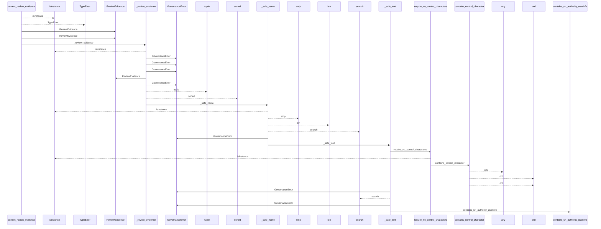
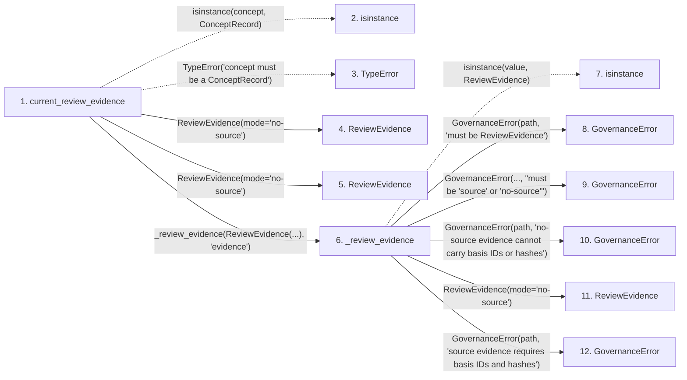

# current_review_evidence

**Entry point:** `current_review_evidence` (`api`)
**Source:** [knowledge_governance](../modules/knowledge_governance.md)
**Modules touched:** [knowledge_governance](../modules/knowledge_governance.md), [validation](../modules/validation.md), [wiki_media](../modules/wiki_media.md)

## Call sequence

<!-- Auto-generated from static call edges. Dashed arrows are external or unresolved calls. Reviewed runtime conditions and side effects belong in Behavior. -->

> Call sequence diagram shows 30 of 71 interactions; 41 omitted to keep the visualization within the 30-interaction and generated-diagram limits.

## Data flow

<!-- Auto-generated static analysis. Treat values and boundaries as best-effort hints, not runtime proof. -->

### Step data

| Step | Inputs | Reads | Writes | Returns |
|---|---|---|---|---|
| `current_review_evidence` | `concept: ConceptRecord` | `ConceptRecord`, `EvidenceState`, `EvidenceState`, `EvidenceState` | - | `ReviewEvidence(...)`, `ReviewEvidence(...)`, `None`, `None`, `_review_evidence(...)` |
| `isinstance` | - | - | - | - |
| `TypeError` | - | - | - | - |
| `ReviewEvidence` | - | - | - | - |
| `ReviewEvidence` | - | - | - | - |
| `_review_evidence` | `value: ReviewEvidence`, `path: str` | `ReviewEvidence`, `REVIEW_EVIDENCE_MODES` | - | `ReviewEvidence(...)`, `ReviewEvidence(...)` |
| `isinstance` | - | - | - | - |
| `GovernanceError` | - | - | - | - |
| `GovernanceError` | - | - | - | - |
| `GovernanceError` | - | - | - | - |
| `ReviewEvidence` | - | - | - | - |
| `GovernanceError` | - | - | - | - |

### Call data

| From | To | Line | Call |
|---|---|---:|---|
| current_review_evidence | isinstance | 1492 | `isinstance(concept, ConceptRecord)` |
| current_review_evidence | TypeError | 1493 | `TypeError('concept must be a ConceptRecord')` |
| current_review_evidence | ReviewEvidence | 1497 | `ReviewEvidence(mode='no-source')` |
| current_review_evidence | ReviewEvidence | 1501 | `ReviewEvidence(mode='no-source')` |
| current_review_evidence | _review_evidence | 1520 | `_review_evidence(ReviewEvidence(...), 'evidence')` |
| _review_evidence | isinstance | 2889 | `isinstance(value, ReviewEvidence)` |
| _review_evidence | GovernanceError | 2890 | `GovernanceError(path, 'must be ReviewEvidence')` |
| _review_evidence | GovernanceError | 2892 | `GovernanceError(..., "must be 'source' or 'no-source'")` |
| _review_evidence | GovernanceError | 2898 | `GovernanceError(path, 'no-source evidence cannot carry basis IDs or hashes')` |
| _review_evidence | ReviewEvidence | 2902 | `ReviewEvidence(mode='no-source')` |
| _review_evidence | GovernanceError | 2904 | `GovernanceError(path, 'source evidence requires basis IDs and hashes')` |

### Boundary effects

*No boundary effects detected.*

### Static analysis gaps

| Kind | Step | Target | Line |
|---|---|---|---:|
| unresolved_call | `current_review_evidence` | `isinstance` | 1492 |
| unresolved_call | `current_review_evidence` | `TypeError` | 1493 |
| unresolved_call | `_review_evidence` | `isinstance` | 2889 |
| step_limit | `current_review_evidence` | `first 12 steps` | 0 |

## Behavior

This flow starts at `current_review_evidence` and is classified as `api`. The generated call and data-flow sections are bounded static projections; runtime conditions and side effects require source-level confirmation.
