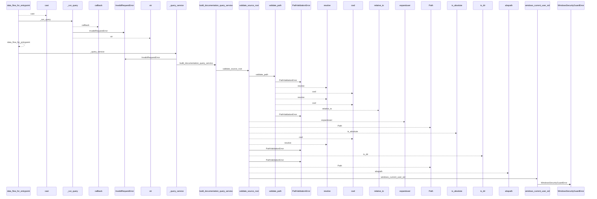
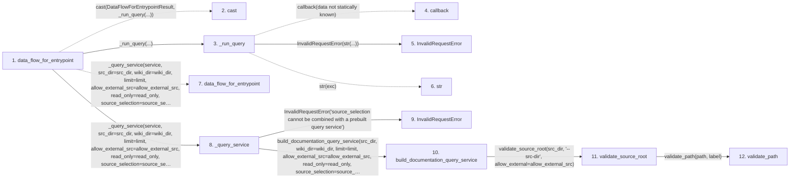

# data_flow_for_entrypoint

**Entry point:** `data_flow_for_entrypoint` (`api`)
**Source:** [api](../modules/api.md)
**Modules touched:** [api](../modules/api.md), [common](../modules/common.md), [config](../modules/config.md), [documentation_queries](../modules/documentation_queries.md), and 6 more

**Complete modules touched:**

- [api](../modules/api.md)
- [common](../modules/common.md)
- [config](../modules/config.md)
- [documentation_queries](../modules/documentation_queries.md)
- [documentation_query_builder](../modules/documentation_query_builder.md)
- [filesystem_guard](../modules/filesystem_guard.md)
- [io](../modules/io.md)
- [source_selection](../modules/source_selection.md)
- [source_snapshot](../modules/source_snapshot.md)
- [validation](../modules/validation.md)

## Call sequence

<!-- Auto-generated from static call edges. Dashed arrows are external or unresolved calls. Reviewed runtime conditions and side effects belong in Behavior. -->

> Call sequence diagram shows 30 of 280 interactions; 250 omitted to keep the visualization within the 30-interaction and generated-diagram limits.

> Trace truncated at the depth limit; deeper calls are omitted.

## Data flow

<!-- Auto-generated static analysis. Treat values and boundaries as best-effort hints, not runtime proof. -->

### Step data

| Step | Inputs | Reads | Writes | Returns |
|---|---|---|---|---|
| `data_flow_for_entrypoint` | `id_or_symbol: object`, `service: DocumentationGraphQueryService \| None`, `src_dir: str`, `wiki_dir: str`, `limit: int`, `allow_external_src: bool`, `read_only: bool`, `source_selection: str \| Path \| None` | `DataFlowForEntrypointResult` | - | `cast(...)` |
| `cast` | - | - | - | - |
| `_run_query` | `callback: Callable[[], dict[str, Any]]` | `DocumentationQueryError` | - | `callback(...)` |
| `callback` | - | - | - | - |
| `InvalidRequestError` | - | - | - | - |
| `str` | - | - | - | - |
| `data_flow_for_entrypoint` | - | - | - | - |
| `_query_service` | `service: DocumentationGraphQueryService \| None`, `src_dir: str`, `wiki_dir: str`, `limit: int`, `allow_external_src: bool`, `read_only: bool`, `source_selection: str \| Path \| None` | - | - | `service`, `build_documentation_query_service(...)` |
| `InvalidRequestError` | - | - | - | - |
| `build_documentation_query_service` | `src_dir: str`, `wiki_dir: str`, `limit: int`, `allow_external_src: bool`, `read_only: bool`, `source_selection: str \| Path \| None` | `extract_cmd`, `extract_cmd`, `extract_cmd`, `build_flow`, `evaluate_surface_index`, `context_cmd`, `context_cmd`, `analyze_dependencies` | - | `build_live_documentation_query_service(...)` |
| `validate_source_root` | `path: str`, `label: str`, `allow_external: bool` | `sys`, `os`, `WindowsSecurityGuardError`, `sys` | - | `validate_path(...)`, `resolved` |
| `validate_path` | `path: str`, `label: str` | - | - | `resolved` |

### Call data

| From | To | Line | Call |
|---|---|---:|---|
| data_flow_for_entrypoint | cast | 938 | `cast(DataFlowForEntrypointResult, _run_query(...))` |
| data_flow_for_entrypoint | _run_query | 940 | `_run_query(...)` |
| _run_query | callback | 1314 | `callback(data not statically known)` |
| _run_query | InvalidRequestError | 1316 | `InvalidRequestError(str(...))` |
| _run_query | str | 1316 | `str(exc)` |
| data_flow_for_entrypoint | data_flow_for_entrypoint | 941 | `_query_service(service, src_dir=src_dir, wiki_dir=wiki_dir, limit=limit, allow_external_src=allow_external_src, read_only=read_only, source_selection=source_selection).data_flow_for_entrypoint(id_or_symbol)` |
| data_flow_for_entrypoint | _query_service | 941 | `_query_service(service, src_dir=src_dir, wiki_dir=wiki_dir, limit=limit, allow_external_src=allow_external_src, read_only=read_only, source_selection=source_selection)` |
| _query_service | InvalidRequestError | 1298 | `InvalidRequestError('source_selection cannot be combined with a prebuilt query service')` |
| _query_service | build_documentation_query_service | 1302 | `build_documentation_query_service(src_dir, wiki_dir=wiki_dir, limit=limit, allow_external_src=allow_external_src, read_only=read_only, source_selection=source_selection)` |
| build_documentation_query_service | validate_source_root | 858 | `validate_source_root(src_dir, '--src-dir', allow_external=allow_external_src)` |
| validate_source_root | validate_path | 156 | `validate_path(path, label)` |

### Boundary effects

*No boundary effects detected.*

### Static analysis gaps

| Kind | Step | Target | Line |
|---|---|---|---:|
| external_call | `data_flow_for_entrypoint` | `cast` | 938 |
| unresolved_call | `_run_query` | `callback` | 1314 |
| unresolved_call | `data_flow_for_entrypoint` | `_query_service(service, src_dir=src_dir, wiki_dir=wiki_dir, limit=limit, allow_external_src=allow_external_src, read_only=read_only, source_selection=source_selection).data_flow_for_entrypoint` | 941 |
| step_limit | `data_flow_for_entrypoint` | `first 12 steps` | 0 |
| truncated_flow | `data_flow_for_entrypoint` | `depth limit` | 0 |

## Behavior

This flow starts at `data_flow_for_entrypoint` and is classified as `api`. The generated call and data-flow sections are bounded static projections; runtime conditions and side effects require source-level confirmation.
