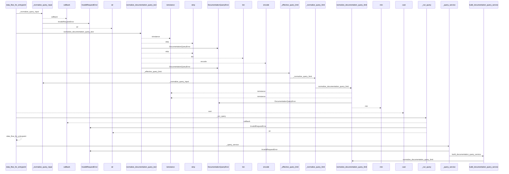
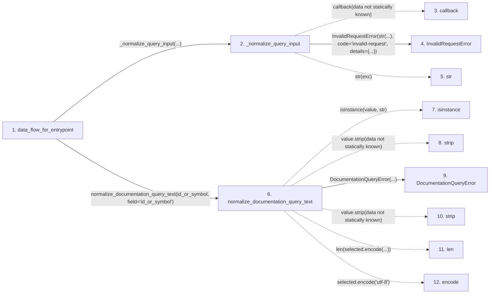

# data_flow_for_entrypoint

**Entry point:** `data_flow_for_entrypoint` (`api`)
**Source:** [api](../modules/api.md)
**Modules touched:** [api](../modules/api.md), [common](../modules/common.md), [config](../modules/config.md), [documentation_queries](../modules/documentation_queries.md), and 6 more

**Complete modules touched:**

- [api](../modules/api.md)
- [common](../modules/common.md)
- [config](../modules/config.md)
- [documentation_queries](../modules/documentation_queries.md)
- [documentation_query_builder](../modules/documentation_query_builder.md)
- [filesystem_guard](../modules/filesystem_guard.md)
- [io](../modules/io.md)
- [source_selection](../modules/source_selection.md)
- [source_snapshot](../modules/source_snapshot.md)
- [validation](../modules/validation.md)

## Call sequence

<!-- Auto-generated from static call edges. Dashed arrows are external or unresolved calls. Reviewed runtime conditions and side effects belong in Behavior. -->

> Call sequence diagram shows 30 of 347 interactions; 317 omitted to keep the visualization within the 30-interaction and generated-diagram limits.

> Trace truncated at the depth limit; deeper calls are omitted.

## Data flow

<!-- Auto-generated static analysis. Treat values and boundaries as best-effort hints, not runtime proof. -->

### Step data

| Step | Inputs | Reads | Writes | Returns |
|---|---|---|---|---|
| `data_flow_for_entrypoint` | `id_or_symbol: object`, `service: DocumentationGraphQueryService \| None`, `src_dir: str`, `wiki_dir: str`, `limit: int`, `allow_external_src: bool`, `read_only: bool`, `source_selection: str \| Path \| None` | `DataFlowForEntrypointResult` | - | `cast(...)` |
| `_normalize_query_input` | `callback: Callable[[], _R]`, `field: str` | `DocumentationQueryError` | - | `callback(...)` |
| `callback` | - | - | - | - |
| `InvalidRequestError` | - | - | - | - |
| `str` | - | - | - | - |
| `normalize_documentation_query_text` | `value: object`, `field: str` | `QUERY_IDENTITY_BYTE_LIMIT`, `QUERY_IDENTITY_BYTE_LIMIT` | - | `selected` |
| `isinstance` | - | - | - | - |
| `strip` | - | - | - | - |
| `DocumentationQueryError` | - | - | - | - |
| `strip` | - | - | - | - |
| `len` | - | - | - | - |
| `encode` | - | - | - | - |

### Call data

| From | To | Line | Call |
|---|---|---:|---|
| data_flow_for_entrypoint | _normalize_query_input | 1291 | `_normalize_query_input(...)` |
| _normalize_query_input | callback | 1137 | `callback(data not statically known)` |
| _normalize_query_input | InvalidRequestError | 1139 | `InvalidRequestError(str(...), code='invalid-request', details={...})` |
| _normalize_query_input | str | 1140 | `str(exc)` |
| data_flow_for_entrypoint | normalize_documentation_query_text | 1292 | `normalize_documentation_query_text(id_or_symbol, field='id_or_symbol')` |
| normalize_documentation_query_text | isinstance | 60 | `isinstance(value, str)` |
| normalize_documentation_query_text | strip | 60 | `value.strip(data not statically known)` |
| normalize_documentation_query_text | DocumentationQueryError | 61 | `DocumentationQueryError(...)` |
| normalize_documentation_query_text | strip | 62 | `value.strip(data not statically known)` |
| normalize_documentation_query_text | len | 63 | `len(selected.encode(...))` |
| normalize_documentation_query_text | encode | 63 | `selected.encode('utf-8')` |

### Boundary effects

*No boundary effects detected.*

### Static analysis gaps

| Kind | Step | Target | Line |
|---|---|---|---:|
| unresolved_call | `_normalize_query_input` | `callback` | 1137 |
| unresolved_call | `normalize_documentation_query_text` | `isinstance` | 60 |
| unresolved_call | `normalize_documentation_query_text` | `value.strip` | 60 |
| unresolved_call | `normalize_documentation_query_text` | `value.strip` | 62 |
| unresolved_call | `normalize_documentation_query_text` | `selected.encode` | 63 |
| step_limit | `data_flow_for_entrypoint` | `first 12 steps` | 0 |
| truncated_flow | `data_flow_for_entrypoint` | `depth limit` | 0 |

## Behavior

This flow starts at `data_flow_for_entrypoint` and is classified as `api`. The generated call and data-flow sections are bounded static projections; runtime conditions and side effects require source-level confirmation.
