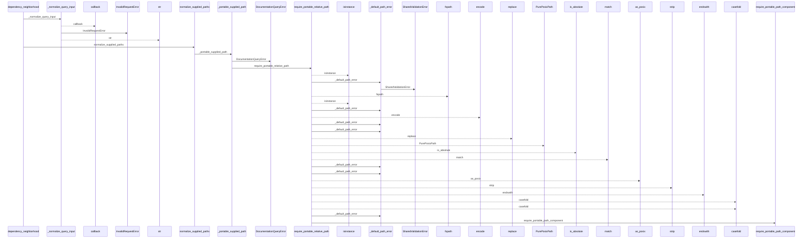
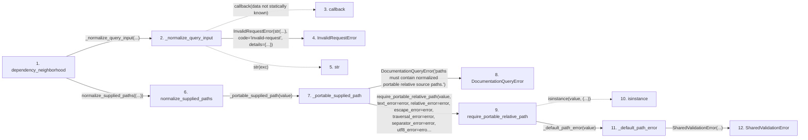

# dependency_neighborhood

**Entry point:** `dependency_neighborhood` (`api`)
**Source:** [api](../modules/api.md)
**Modules touched:** [api](../modules/api.md), [common](../modules/common.md), [config](../modules/config.md), [documentation_queries](../modules/documentation_queries.md), and 6 more

**Complete modules touched:**

- [api](../modules/api.md)
- [common](../modules/common.md)
- [config](../modules/config.md)
- [documentation_queries](../modules/documentation_queries.md)
- [documentation_query_builder](../modules/documentation_query_builder.md)
- [filesystem_guard](../modules/filesystem_guard.md)
- [io](../modules/io.md)
- [source_selection](../modules/source_selection.md)
- [source_snapshot](../modules/source_snapshot.md)
- [validation](../modules/validation.md)

## Call sequence

<!-- Auto-generated from static call edges. Dashed arrows are external or unresolved calls. Reviewed runtime conditions and side effects belong in Behavior. -->

> Call sequence diagram shows 30 of 382 interactions; 352 omitted to keep the visualization within the 30-interaction and generated-diagram limits.

> Trace truncated at the depth limit; deeper calls are omitted.

## Data flow

<!-- Auto-generated static analysis. Treat values and boundaries as best-effort hints, not runtime proof. -->

### Step data

| Step | Inputs | Reads | Writes | Returns |
|---|---|---|---|---|
| `dependency_neighborhood` | `path: object`, `service: DocumentationGraphQueryService \| None`, `src_dir: str`, `wiki_dir: str`, `limit: int`, `allow_external_src: bool`, `read_only: bool`, `source_selection: str \| Path \| None` | `DependencyNeighborhoodResult` | - | `cast(...)` |
| `_normalize_query_input` | `callback: Callable[[], _R]`, `field: str` | `DocumentationQueryError` | - | `callback(...)` |
| `callback` | - | - | - | - |
| `InvalidRequestError` | - | - | - | - |
| `str` | - | - | - | - |
| `normalize_supplied_paths` | `values: object` | - | - | `tuple(...)` |
| `_portable_supplied_path` | `value: object` | - | - | `require_portable_relative_path(...)` |
| `DocumentationQueryError` | - | - | - | - |
| `require_portable_relative_path` | `value: object`, `normalize_backslashes: bool`, `normalize_posix_spelling: bool`, `required_suffix: str \| None`, `defer_non_nfc_error: bool`, `reject_delete_character: bool`, `text_error: Exception \| None`, `relative_error: Exception \| None` | `os` | - | `canonical` |
| `isinstance` | - | - | - | - |
| `_default_path_error` | `value: object` | - | - | `SharedValidationError(...)` |
| `SharedValidationError` | - | - | - | - |

### Call data

| From | To | Line | Call |
|---|---|---:|---|
| dependency_neighborhood | _normalize_query_input | 1393 | `_normalize_query_input(...)` |
| _normalize_query_input | callback | 1137 | `callback(data not statically known)` |
| _normalize_query_input | InvalidRequestError | 1139 | `InvalidRequestError(str(...), code='invalid-request', details={...})` |
| _normalize_query_input | str | 1140 | `str(exc)` |
| dependency_neighborhood | normalize_supplied_paths | 1393 | `normalize_supplied_paths((...))` |
| normalize_supplied_paths | _portable_supplied_path | 135 | `_portable_supplied_path(value)` |
| _portable_supplied_path | DocumentationQueryError | 113 | `DocumentationQueryError('paths must contain normalized portable relative source paths.')` |
| _portable_supplied_path | require_portable_relative_path | 116 | `require_portable_relative_path(value, text_error=error, relative_error=error, escape_error=error, traversal_error=error, separator_error=error, utf8_error=error, control_error=error, non_nfc_error=error, nonportable_error=error, reserved_error=error)` |
| require_portable_relative_path | isinstance | 170 | `isinstance(value, (...))` |
| require_portable_relative_path | _default_path_error | 171 | `_default_path_error(value)` |
| _default_path_error | SharedValidationError | 67 | `SharedValidationError(...)` |

### Boundary effects

*No boundary effects detected.*

### Static analysis gaps

| Kind | Step | Target | Line |
|---|---|---|---:|
| unresolved_call | `_normalize_query_input` | `callback` | 1137 |
| unresolved_call | `require_portable_relative_path` | `isinstance` | 170 |
| step_limit | `dependency_neighborhood` | `first 12 steps` | 0 |
| truncated_flow | `dependency_neighborhood` | `depth limit` | 0 |

## Behavior

This flow starts at `dependency_neighborhood` and is classified as `api`. The generated call and data-flow sections are bounded static projections; runtime conditions and side effects require source-level confirmation.
