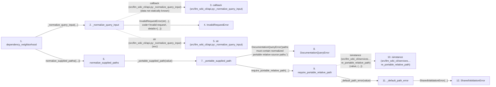

# dependency_neighborhood

**Entry point:** `dependency_neighborhood` (`api`)
**Source:** [api](../modules/api.md)
**Modules touched:** [api](../modules/api.md), [common](../modules/common.md), [config](../modules/config.md), [context_packet](../modules/context_packet.md), and 20 more

**Complete modules touched:**

- [api](../modules/api.md)
- [common](../modules/common.md)
- [config](../modules/config.md)
- [context_packet](../modules/context_packet.md)
- [documentation_queries](../modules/documentation_queries.md)
- [documentation_query_builder](../modules/documentation_query_builder.md)
- [filesystem_guard](../modules/filesystem_guard.md)
- [implementation_evidence](../modules/implementation_evidence.md)
- [io](../modules/io.md)
- [knowledge_consumption](../modules/knowledge_consumption.md)
- [knowledge_evidence](../modules/knowledge_evidence.md)
- [knowledge_governance](../modules/knowledge_governance.md)
- [knowledge_storage](../modules/knowledge_storage.md)
- [knowledge_storage_io](../modules/knowledge_storage_io.md)
- [maintenance_evidence](../modules/maintenance_evidence.md)
- [maintenance_shapes](../modules/maintenance_shapes.md)
- [maintenance_state](../modules/maintenance_state.md)
- [maintenance_status](../modules/maintenance_status.md)
- [python_implementation](../modules/python_implementation.md)
- [source_path_diagnostics](../modules/source_path_diagnostics.md)
- [source_selection](../modules/source_selection.md)
- [source_snapshot](../modules/source_snapshot.md)
- [sync_manifest](../modules/sync_manifest.md)
- [validation](../modules/validation.md)

## Call sequence

> Static overview in presentation order, not runtime execution order. Arrows retain captured callers; siblings are shown before deeper helper detail.

<!-- Auto-generated from static call edges. Dashed arrows are external or unresolved calls. Reviewed runtime conditions and side effects belong in Behavior. -->

```mermaid
sequenceDiagram
    participant p0 as dependency_neighborhood
    participant p1 as _normalize_query_input
    participant p2 as normalize_supplied_paths
    participant p3 as _effective_query_limit
    participant p4 as cast
    participant p5 as _run_query
    participant p6 as _query_service(…).dependency_neighborhood
    participant p7 as _query_service
    participant p8 as callback (src/llm_wiki_cli/api.py:_normalize_query_input)
    participant p9 as _portable_supplied_path
    participant p10 as _normalize_query_limit
    participant p11 as callback (src/llm_wiki_cli/api.py:_run_query)
    participant p12 as InvalidRequestError
    participant p13 as _supplied_path_values
    participant p14 as build_documentation_query_service
    participant p15 as str (src/llm_wiki_cli/api.py:_normalize_query_input)
    participant p16 as tuple (src/llm_wiki_cli/services…:normalize_supplied_paths)
    participant p17 as str (src/llm_wiki_cli/api.py:_run_query)
    participant p18 as sorted (src/llm_wiki_cli/services…:normalize_supplied_paths)
    participant p19 as item.casefold
    participant p20 as DocumentationQueryError
    participant p21 as isinstance (src/llm_wiki_cli/services….py:_supplied_path_values)
    participant p22 as isinstance (src/llm_wiki_cli/api.py:b…cumentation_query_service)
    participant p23 as require_portable_relative_path
    participant p24 as normalize_documentation_query_limit
    p0->>p1: _normalize_query_input
    p0->>p2: normalize_supplied_paths
    p0->>p3: _effective_query_limit
    p0-->>p4: cast(DependencyNeighborhoodResult, _run_query(...))
    p0->>p5: _run_query
    p0-->>p6: _query_service(…).dependency_neighborhood(query)
    p0->>p7: _query_service
    p1-->>p8: callback (src/llm_wiki_cli/api.py:_normalize_query_input)
    p2->>p9: _portable_supplied_path
    p3->>p10: _normalize_query_limit
    p5-->>p11: callback (src/llm_wiki_cli/api.py:_run_query)
    p7->>p12: InvalidRequestError
    p1->>p12: InvalidRequestError
    p2->>p13: _supplied_path_values
    p5->>p12: InvalidRequestError
    p7->>p14: build_documentation_query_service
    p1-->>p15: str (src/llm_wiki_cli/api.py:_normalize_query_input)(exc)
    p2-->>p16: tuple (src/llm_wiki_cli/services…:normalize_supplied_paths)(sorted(...))
    p5-->>p17: str (src/llm_wiki_cli/api.py:_run_query)(exc)
    p2-->>p18: sorted (src/llm_wiki_cli/services…:normalize_supplied_paths)(normalized, key=...)
    p2-->>p19: item.casefold
    p9->>p20: DocumentationQueryError
    p13-->>p21: isinstance (src/llm_wiki_cli/services….py:_supplied_path_values)(values, (...))
    p10->>p1: _normalize_query_input
    p14-->>p22: isinstance (src/llm_wiki_cli/api.py:b…cumentation_query_service)(value, bool)
    p9->>p23: require_portable_relative_path
    p13-->>p21: isinstance (src/llm_wiki_cli/services….py:_supplied_path_values)(values, Iterable)
    p10->>p24: normalize_documentation_query_limit
    p14->>p12: InvalidRequestError
    p13->>p20: DocumentationQueryError
```

> Call sequence diagram shows 30 of 957 interactions; 927 omitted to keep the visualization within the 30-interaction and generated-diagram limits, with uncertain identities omitted rather than inferred.

> Captured boundary calls: external 8 of 384 (376 omitted); unresolved 4 of 227 (223 omitted). These counts cover the captured static trace.

Omitted captured detail, grouped by actual caller occurrence and target module:

| Caller | Parent step | Target module | Kind | Omitted interactions |
| --- | --- | --- | --- | --- |
| `src/llm_wiki_cli/services/validation.py:require_portable_relative_path` | 9 | - | external | 4 |
| `src/llm_wiki_cli/services/validation.py:require_portable_relative_path` | 9 | [src/llm_wiki_cli/services/validation.py](../modules/validation.md) | internal | 13 |
| `src/llm_wiki_cli/services/validation.py:_default_path_error` | 11 | [src/llm_wiki_cli/services/validation.py](../modules/validation.md) | internal | 1 |
| `src/llm_wiki_cli/services/validation.py:_syntax_key` | 16 | - | external | 6 |
| `src/llm_wiki_cli/services/validation.py:_known_syntax` | 23 | - | unresolved | 2 |
| `src/llm_wiki_cli/services/validation.py:_check_path_collision` | 26 | [src/llm_wiki_cli/services/validation.py](../modules/validation.md) | internal | 2 |
| `src/llm_wiki_cli/services/validation.py:portable_path_key` | 27 | - | unresolved | 1 |
| `src/llm_wiki_cli/services/validation.py:portable_path_key` | 27 | - | external | 1 |
> Omission summary shows 8 of 205 groups; 197 further groups are not expanded here. Counts above include all omitted interactions.
> Detailed flow queries retain their own coverage and limits; omitted paths may execute at runtime.

> Trace truncated at the depth limit; deeper calls are omitted.

## Data flow

<!-- Auto-generated static analysis. Treat values and boundaries as best-effort hints, not runtime proof. -->

```mermaid
flowchart LR
    s1["1. dependency_neighborhood"]
    s2["2. _normalize_query_input"]
    s3["3. callback (src/llm_wiki_cli/api.py:_normalize_query_input)"]
    s4["4. InvalidRequestError"]
    s5["5. str (src/llm_wiki_cli/api.py:_normalize_query_input)"]
    s6["6. normalize_supplied_paths"]
    s7["7. _portable_supplied_path"]
    s8["8. DocumentationQueryError"]
    s9["9. require_portable_relative_path"]
    s10["10. isinstance (src/llm_wiki_cli/services…re_portable_relative_path)"]
    s11["11. _default_path_error"]
    s12["12. SharedValidationError"]
    s1 -->|"_normalize_query_input(...)"| s2
    s2 -. "callback (src/llm_wiki_cli/api.py:_normalize_query_input)(data not statically known)" .-> s3
    s2 -->|"InvalidRequestError(str(...), code='invalid-request', details={...})"| s4
    s2 -. "str (src/llm_wiki_cli/api.py:_normalize_query_input)(exc)" .-> s5
    s1 -->|"normalize_supplied_paths((...))"| s6
    s6 -->|"_portable_supplied_path(value)"| s7
    s7 -->|"DocumentationQueryError('paths must contain normalized portable relative source paths.')"| s8
    s7 -->|"require_portable_relative_path(…)"| s9
    s9 -. "isinstance (src/llm_wiki_cli/services…re_portable_relative_path)(value, (...))" .-> s10
    s9 -->|"_default_path_error(value)"| s11
    s11 -->|"SharedValidationError(...)"| s12
    click s1 "../modules/api.md"
    click s2 "../modules/api.md"
    click s4 "../modules/api.md"
    click s6 "../modules/documentation_query_builder.md"
    click s7 "../modules/documentation_query_builder.md"
    click s8 "../modules/documentation_queries.md"
    click s9 "../modules/validation.md"
    click s11 "../modules/validation.md"
    click s12 "../modules/validation.md"
```

### Step data

| Step | Inputs | Reads | Writes | Returns |
|---|---|---|---|---|
| `dependency_neighborhood` | `path: object`, `service: DocumentationGraphQueryService \| None`, `src_dir: str`, `wiki_dir: str`, `limit: int`, `allow_external_src: bool`, `read_only: bool`, `source_selection: str \| Path \| None` | `DependencyNeighborhoodResult` | - | `cast(...)` |
| `_normalize_query_input` | `callback: Callable[[], _R]`, `field: str` | `DocumentationQueryError` | - | `callback(...)` |
| `callback (src/llm_wiki_cli/api.py:_normalize_query_input)` | - | - | - | - |
| `InvalidRequestError` | - | - | - | - |
| `str (src/llm_wiki_cli/api.py:_normalize_query_input)` | - | - | - | - |
| `normalize_supplied_paths` | `values: object` | - | - | `tuple(...)` |
| `_portable_supplied_path` | `value: object` | - | - | `require_portable_relative_path(...)` |
| `DocumentationQueryError` | - | - | - | - |
| `require_portable_relative_path` | `value: object`, `normalize_backslashes: bool`, `normalize_posix_spelling: bool`, `required_suffix: str \| None`, `defer_non_nfc_error: bool`, `reject_delete_character: bool`, `text_error: Exception \| None`, `relative_error: Exception \| None` | `os` | - | `cached`, `_remember_syntax(...)` |
| `isinstance (src/llm_wiki_cli/services…re_portable_relative_path)` | - | - | - | - |
| `_default_path_error` | `value: object` | - | - | `SharedValidationError(...)` |
| `SharedValidationError` | - | - | - | - |

### Call data

| From | To | Line | Call |
|---|---|---:|---|
| dependency_neighborhood | _normalize_query_input | 2254 | `_normalize_query_input(...)` |
| _normalize_query_input | callback (src/llm_wiki_cli/api.py:_normalize_query_input) | 1998 | `callback(data not statically known)` |
| _normalize_query_input | InvalidRequestError | 2000 | `InvalidRequestError(str(...), code='invalid-request', details={...})` |
| _normalize_query_input | str (src/llm_wiki_cli/api.py:_normalize_query_input) | 2001 | `str(exc)` |
| dependency_neighborhood | normalize_supplied_paths | 2254 | `normalize_supplied_paths((...))` |
| normalize_supplied_paths | _portable_supplied_path | 139 | `_portable_supplied_path(value)` |
| _portable_supplied_path | DocumentationQueryError | 117 | `DocumentationQueryError('paths must contain normalized portable relative source paths.')` |
| _portable_supplied_path | require_portable_relative_path | 120 | `require_portable_relative_path(value, text_error=error, relative_error=error, escape_error=error, traversal_error=error, separator_error=error, utf8_error=error, control_error=error, non_nfc_error=error, nonportable_error=error, reserved_error=error)` |
| require_portable_relative_path | isinstance (src/llm_wiki_cli/services…re_portable_relative_path) | 216 | `isinstance(value, (...))` |
| require_portable_relative_path | _default_path_error | 217 | `_default_path_error(value)` |
| _default_path_error | SharedValidationError | 113 | `SharedValidationError(...)` |

### Boundary effects

*No boundary effects detected.*

### Static analysis gaps

| Kind | Step | Target | Line |
|---|---|---|---:|
| unresolved_call | `_normalize_query_input` | `callback` | 1998 |
| external_call | `require_portable_relative_path` | `isinstance` | 216 |
| step_limit | `dependency_neighborhood` | `first 12 steps` | 0 |
| truncated_flow | `dependency_neighborhood` | `depth limit` | 0 |

## Behavior

This flow starts at `dependency_neighborhood` and is classified as `api`. The generated call and data-flow sections are bounded static projections; runtime conditions and side effects require source-level confirmation.
