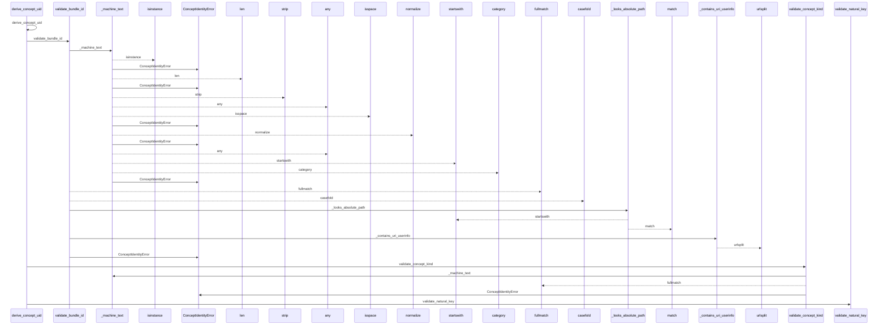
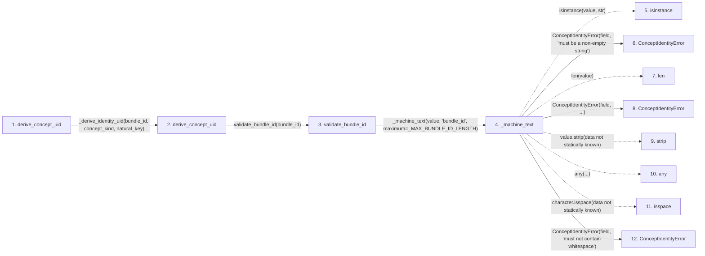

# derive_concept_uid

**Entry point:** `derive_concept_uid` (`api`)
**Source:** [knowledge_governance](../modules/knowledge_governance.md)
**Modules touched:** [concept_identity](../modules/concept_identity.md), [knowledge_governance](../modules/knowledge_governance.md)

## Call sequence

<!-- Auto-generated from static call edges. Dashed arrows are external or unresolved calls. Reviewed runtime conditions and side effects belong in Behavior. -->

> Call sequence diagram shows 30 of 79 interactions; 49 omitted to keep the visualization within the 30-interaction and generated-diagram limits.

## Data flow

<!-- Auto-generated static analysis. Treat values and boundaries as best-effort hints, not runtime proof. -->

### Step data

| Step | Inputs | Reads | Writes | Returns |
|---|---|---|---|---|
| `derive_concept_uid` | `bundle_id: str`, `concept_kind: str`, `natural_key: str` | `ConceptIdentityError` | - | `_derive_identity_uid(...)` |
| `derive_concept_uid` | `bundle_id: object`, `concept_kind: object`, `natural_key: object` | `CONCEPT_UID_HEX_LENGTH` | - | `...` |
| `validate_bundle_id` | `value: object` | `_MAX_BUNDLE_ID_LENGTH` | - | `text` |
| `_machine_text` | `value: object`, `field: str`, `maximum: int` | - | - | `value` |
| `isinstance` | - | - | - | - |
| `ConceptIdentityError` | - | - | - | - |
| `len` | - | - | - | - |
| `ConceptIdentityError` | - | - | - | - |
| `strip` | - | - | - | - |
| `any` | - | - | - | - |
| `isspace` | - | - | - | - |
| `ConceptIdentityError` | - | - | - | - |

### Call data

| From | To | Line | Call |
|---|---|---:|---|
| derive_concept_uid | derive_concept_uid | 407 | `_derive_identity_uid(bundle_id, concept_kind, natural_key)` |
| derive_concept_uid | validate_bundle_id | 504 | `validate_bundle_id(bundle_id)` |
| validate_bundle_id | _machine_text | 288 | `_machine_text(value, 'bundle_id', maximum=_MAX_BUNDLE_ID_LENGTH)` |
| _machine_text | isinstance | 912 | `isinstance(value, str)` |
| _machine_text | ConceptIdentityError | 913 | `ConceptIdentityError(field, 'must be a non-empty string')` |
| _machine_text | len | 914 | `len(value)` |
| _machine_text | ConceptIdentityError | 915 | `ConceptIdentityError(field, ...)` |
| _machine_text | strip | 916 | `value.strip(data not statically known)` |
| _machine_text | any | 916 | `any(...)` |
| _machine_text | isspace | 916 | `character.isspace(data not statically known)` |
| _machine_text | ConceptIdentityError | 917 | `ConceptIdentityError(field, 'must not contain whitespace')` |

### Boundary effects

*No boundary effects detected.*

### Static analysis gaps

| Kind | Step | Target | Line |
|---|---|---|---:|
| unresolved_call | `_machine_text` | `isinstance` | 912 |
| unresolved_call | `_machine_text` | `value.strip` | 916 |
| unresolved_call | `_machine_text` | `any` | 916 |
| unresolved_call | `_machine_text` | `character.isspace` | 916 |
| step_limit | `derive_concept_uid` | `first 12 steps` | 0 |

## Behavior

This flow starts at `derive_concept_uid` and is classified as `api`. The generated call and data-flow sections are bounded static projections; runtime conditions and side effects require source-level confirmation.
