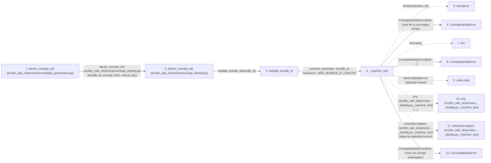

# derive_concept_uid

**Entry point:** `derive_concept_uid` (`api`)
**Source:** [knowledge_governance](../modules/knowledge_governance.md)
**Modules touched:** [concept_identity](../modules/concept_identity.md), [knowledge_governance](../modules/knowledge_governance.md)

## Call sequence

> Static overview in presentation order, not runtime execution order. Arrows retain captured callers; representative internal continuations and boundary examples precede repeated helper detail.

<!-- Auto-generated from static call edges. Dashed arrows are external or unresolved calls. Reviewed runtime conditions and side effects belong in Behavior. -->

```mermaid
sequenceDiagram
    participant p0 as derive_concept_uid (src/llm_wiki_cli/services/knowledge_governance.py)
    participant p1 as derive_concept_uid (src/llm_wiki_cli/services/concept_identity.py)
    participant p2 as GovernanceError
    participant p3 as validate_bundle_id
    participant p4 as validate_concept_kind
    participant p5 as validate_natural_key
    participant p6 as _machine_text
    participant p7 as _safe_decoded_coordinate
    participant p8 as _uid_tag
    participant p9 as ConceptIdentityError
    participant p10 as _looks_absolute_path
    participant p11 as _contains_uri_userinfo
    participant p12 as _contains_coordinate_userinfo
    participant p13 as json.dumps
    participant p14 as json.dumps(…).encode
    participant p15 as hashlib.sha256(…).hexdigest
    participant p16 as hashlib.sha256
    participant p17 as _UID_TAG_BY_KIND.get
    participant p18 as _BUNDLE_ID_RE.fullmatch
    participant p19 as _QUALIFIED_KIND_RE.fullmatch
    participant p20 as text.partition
    participant p21 as text.casefold
    participant p22 as _NATURAL_KEY_PREFIX_RE.fullmatch
    participant p23 as _NATURAL_KEY_PAYLOAD_RE.fullmatch
    participant p24 as _INVALID_PERCENT_RE.search
    participant p25 as _PERCENT_ESCAPE_RE.finditer
    participant p26 as match.group
    participant p27 as match.group(…).upper
    participant p28 as unquote
    participant p29 as quote
    p0->>p1: derive_concept_uid (src/llm_wiki_cli/services/concept_identity.py)
    p0->>p2: GovernanceError
    p1->>p3: validate_bundle_id
    p1->>p4: validate_concept_kind
    p1->>p5: validate_natural_key
    p3->>p6: _machine_text
    p5->>p7: _safe_decoded_coordinate
    p1->>p8: _uid_tag
    p4->>p9: ConceptIdentityError
    p3->>p10: _looks_absolute_path
    p3->>p11: _contains_uri_userinfo
    p5->>p12: _contains_coordinate_userinfo
    p1-->>p13: json.dumps({...}, ensure_ascii=False, separators=(...), sort_keys=True, allow_nan=False)
    p1-->>p14: json.dumps(…).encode('utf-8')
    p1-->>p15: hashlib.sha256(…).hexdigest
    p1-->>p16: hashlib.sha256(encoded)
    p8-->>p17: _UID_TAG_BY_KIND.get(concept_kind, 'concept')
    p3-->>p18: _BUNDLE_ID_RE.fullmatch(text)
    p4-->>p19: _QUALIFIED_KIND_RE.fullmatch(text)
    p5-->>p20: text.partition(':')
    p3-->>p21: text.casefold
    p5-->>p22: _NATURAL_KEY_PREFIX_RE.fullmatch(prefix)
    p5-->>p23: _NATURAL_KEY_PAYLOAD_RE.fullmatch(payload)
    p5-->>p24: _INVALID_PERCENT_RE.search(payload)
    p5-->>p25: _PERCENT_ESCAPE_RE.finditer(payload)
    p5-->>p26: match.group(1)
    p5-->>p27: match.group(…).upper
    p5-->>p26: match.group(1)
    p5-->>p28: unquote(payload, encoding='utf-8', errors='strict')
    p5-->>p29: quote(decoded, safe=_NATURAL_KEY_QUOTE_SAFE)
```

> Call sequence diagram shows 30 of 79 interactions; 49 omitted to keep the visualization within the 30-interaction and generated-diagram limits, with uncertain identities omitted rather than inferred.

> Captured boundary calls: external 4 of 16 (12 omitted); unresolved 14 of 28 (14 omitted). These counts cover the captured static trace.

Omitted captured detail, grouped by actual caller occurrence and target module:

| Caller | Parent step | Target module | Kind | Omitted interactions |
| --- | --- | --- | --- | --- |
| `src/llm_wiki_cli/services/concept_identity.py:_machine_text` | 4 | - | external | 6 |
| `src/llm_wiki_cli/services/concept_identity.py:_machine_text` | 4 | [src/llm_wiki_cli/services/concept_identity.py](../modules/concept_identity.md) | internal | 5 |
| `src/llm_wiki_cli/services/concept_identity.py:_machine_text` | 4 | - | unresolved | 3 |
| `src/llm_wiki_cli/services/concept_identity.py:_looks_absolute_path` | 21 | - | unresolved | 2 |
| `src/llm_wiki_cli/services/concept_identity.py:_contains_uri_userinfo` | 24 | - | external | 1 |
| `src/llm_wiki_cli/services/concept_identity.py:validate_bundle_id` | 3 | [src/llm_wiki_cli/services/concept_identity.py](../modules/concept_identity.md) | internal | 1 |
| `src/llm_wiki_cli/services/concept_identity.py:validate_concept_kind` | 27 | [src/llm_wiki_cli/services/concept_identity.py](../modules/concept_identity.md) | internal | 1 |
| `src/llm_wiki_cli/services/concept_identity.py:validate_natural_key` | 31 | [src/llm_wiki_cli/services/concept_identity.py](../modules/concept_identity.md) | internal | 13 |
> Omission summary shows 8 of 15 groups; 7 further groups are not expanded here. Counts above include all omitted interactions.
> Detailed flow queries retain their own coverage and limits; omitted paths may execute at runtime.

## Data flow

<!-- Auto-generated static analysis. Treat values and boundaries as best-effort hints, not runtime proof. -->

### Analysis coverage

**Effect analysis partially available.** Flow assembly and source effect analysis are separate; empty observations do not prove an empty handler body.

Source steps: 36; effect analysis evaluated: 15, partial: 0, unavailable: 21. Counts include steps omitted from the displayed trace.

- Callable record unavailable; the selected entry symbol has no represented callable body.
- Effect collector totals unavailable; observed counts cover captured records only.

| Step | Callable record | Effect analysis | Collector totals |
|---|---|---|---|
| `derive_concept_uid (src/llm_wiki_cli/services/knowledge_governance.py)` | `available` | `evaluated` | `available` |
| `derive_concept_uid (src/llm_wiki_cli/services/concept_identity.py)` | `available` | `evaluated` | `available` |
| `validate_bundle_id` | `available` | `evaluated` | `available` |
| `_machine_text` | `available` | `evaluated` | `available` |
| `isinstance` | `not_applicable` | `not_applicable` | `not_applicable` |
| `ConceptIdentityError` | `unavailable` | `unavailable` | `unavailable` |
| `len` | `not_applicable` | `not_applicable` | `not_applicable` |
| `ConceptIdentityError` | `unavailable` | `unavailable` | `unavailable` |
| `value.strip` | `not_applicable` | `not_applicable` | `not_applicable` |
| `any (src/llm_wiki_cli/services…_identity.py:_machine_text)` | `not_applicable` | `not_applicable` | `not_applicable` |
| `character.isspace (src/llm_wiki_cli/services…_identity.py:_machine_text)` | `not_applicable` | `not_applicable` | `not_applicable` |
| `ConceptIdentityError` | `unavailable` | `unavailable` | `unavailable` |

```mermaid
flowchart LR
    s1["1. derive_concept_uid (src/llm_wiki_cli/services/knowledge_governance.py)"]
    s2["2. derive_concept_uid (src/llm_wiki_cli/services/concept_identity.py)"]
    s3["3. validate_bundle_id"]
    s4["4. _machine_text"]
    s5["5. isinstance"]
    s6["6. ConceptIdentityError"]
    s7["7. len"]
    s8["8. ConceptIdentityError"]
    s9["9. value.strip"]
    s10["10. any (src/llm_wiki_cli/services…_identity.py:_machine_text)"]
    s11["11. character.isspace (src/llm_wiki_cli/services…_identity.py:_machine_text)"]
    s12["12. ConceptIdentityError"]
    s1 -->|"derive_concept_uid (src/llm_wiki_cli/services/concept_identity.py)(bundle_id, concept_kind, natural_key)"| s2
    s2 -->|"validate_bundle_id(bundle_id)"| s3
    s3 -->|"_machine_text(value, 'bundle_id', maximum=_MAX_BUNDLE_ID_LENGTH)"| s4
    s4 -. "isinstance(value, str)" .-> s5
    s4 -->|"ConceptIdentityError(field, 'must be a non-empty string')"| s6
    s4 -. "len(value)" .-> s7
    s4 -->|"ConceptIdentityError(field, ...)"| s8
    s4 -. "value.strip(data not statically known)" .-> s9
    s4 -. "any (src/llm_wiki_cli/services…_identity.py:_machine_text)(...)" .-> s10
    s4 -. "character.isspace (src/llm_wiki_cli/services…_identity.py:_machine_text)(data not statically known)" .-> s11
    s4 -->|"ConceptIdentityError(field, 'must not contain whitespace')"| s12
    click s1 "../modules/knowledge_governance.md"
    click s2 "../modules/concept_identity.md"
    click s3 "../modules/concept_identity.md"
    click s4 "../modules/concept_identity.md"
    click s6 "../modules/concept_identity.md"
    click s8 "../modules/concept_identity.md"
    click s12 "../modules/concept_identity.md"
```

### Step data

| Step | Inputs | Reads | Writes | Returns |
|---|---|---|---|---|
| `derive_concept_uid (src/llm_wiki_cli/services/knowledge_governance.py)` | `bundle_id: str`, `concept_kind: str`, `natural_key: str` | `ConceptIdentityError` | - | `_derive_identity_uid(...)` |
| `derive_concept_uid (src/llm_wiki_cli/services/concept_identity.py)` | `bundle_id: object`, `concept_kind: object`, `natural_key: object` | `CONCEPT_UID_HEX_LENGTH` | - | `...` |
| `validate_bundle_id` | `value: object` | `_MAX_BUNDLE_ID_LENGTH` | - | `text` |
| `_machine_text` | `value: object`, `field: str`, `maximum: int` | - | - | `value` |
| `isinstance` | - | - | - | - |
| `ConceptIdentityError` | - | - | - | - |
| `len` | - | - | - | - |
| `ConceptIdentityError` | - | - | - | - |
| `value.strip` | - | - | - | - |
| `any (src/llm_wiki_cli/services…_identity.py:_machine_text)` | - | - | - | - |
| `character.isspace (src/llm_wiki_cli/services…_identity.py:_machine_text)` | - | - | - | - |
| `ConceptIdentityError` | - | - | - | - |

### Call data

| From | To | Line | Call |
|---|---|---:|---|
| derive_concept_uid (src/llm_wiki_cli/services/knowledge_governance.py) | derive_concept_uid (src/llm_wiki_cli/services/concept_identity.py) | 410 | `_derive_identity_uid(bundle_id, concept_kind, natural_key)` |
| derive_concept_uid (src/llm_wiki_cli/services/concept_identity.py) | validate_bundle_id | 534 | `validate_bundle_id(bundle_id)` |
| validate_bundle_id | _machine_text | 289 | `_machine_text(value, 'bundle_id', maximum=_MAX_BUNDLE_ID_LENGTH)` |
| _machine_text | isinstance | 942 | `isinstance(value, str)` |
| _machine_text | ConceptIdentityError | 943 | `ConceptIdentityError(field, 'must be a non-empty string')` |
| _machine_text | len | 944 | `len(value)` |
| _machine_text | ConceptIdentityError | 945 | `ConceptIdentityError(field, ...)` |
| _machine_text | value.strip | 946 | `value.strip(data not statically known)` |
| _machine_text | any (src/llm_wiki_cli/services…_identity.py:_machine_text) | 946 | `any(...)` |
| _machine_text | character.isspace (src/llm_wiki_cli/services…_identity.py:_machine_text) | 946 | `character.isspace(data not statically known)` |
| _machine_text | ConceptIdentityError | 947 | `ConceptIdentityError(field, 'must not contain whitespace')` |

### Boundary effects

*No boundary-effect observations were captured in this static trace.*

### Static analysis gaps

| Kind | Step | Target | Line |
|---|---|---|---:|
| external_call | `_machine_text` | `isinstance` | 942 |
| unresolved_call | `_machine_text` | `value.strip` | 946 |
| external_call | `_machine_text` | `any` | 946 |
| unresolved_call | `_machine_text` | `character.isspace` | 946 |
| step_limit | `derive_concept_uid` | `first 12 steps` | 0 |

## Behavior

This flow starts at `derive_concept_uid` and is classified as `api`. The generated call and data-flow sections are bounded static projections; runtime conditions and side effects require source-level confirmation.
