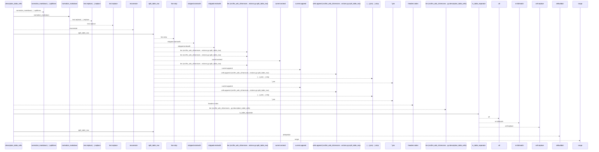
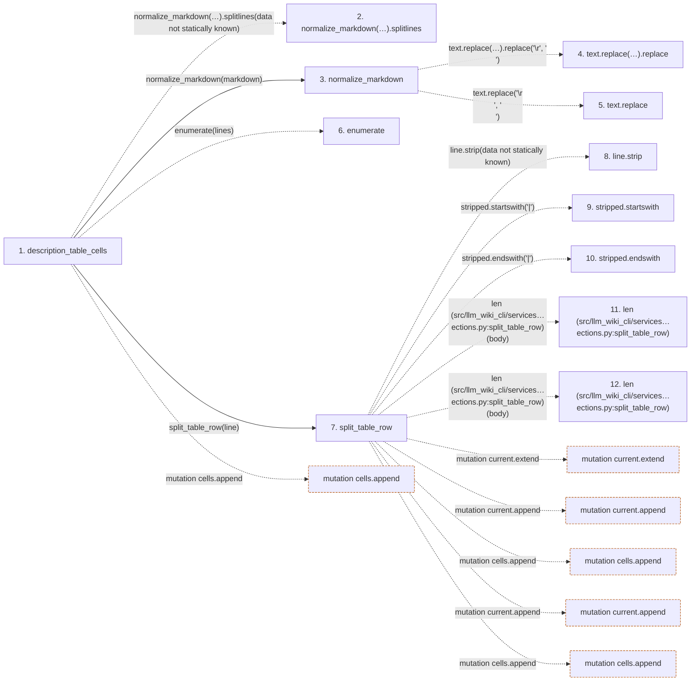

# description_table_cells

**Entry point:** `description_table_cells` (`api`)
**Source:** [markdown_sections](../modules/markdown_sections.md)
**Modules touched:** [markdown_sections](../modules/markdown_sections.md)

## Call sequence

<!-- Auto-generated from static call edges. Dashed arrows are external or unresolved calls. Reviewed runtime conditions and side effects belong in Behavior. -->

> Call sequence diagram shows 30 of 44 interactions; 14 omitted to keep the visualization within the 30-interaction and generated-diagram limits.

## Data flow

<!-- Auto-generated static analysis. Treat values and boundaries as best-effort hints, not runtime proof. -->

### Step data

| Step | Inputs | Reads | Writes | Returns |
|---|---|---|---|---|
| `description_table_cells` | `markdown: str` | - | `occurrences[...]` | `tuple(...)`, `(...)` |
| `normalize_markdown(…).splitlines` | - | - | - | - |
| `normalize_markdown` | `text: str` | - | - | `...` |
| `text.replace(…).replace` | - | - | - | - |
| `text.replace` | - | - | - | - |
| `enumerate` | - | - | - | - |
| `split_table_row` | `line: str` | - | - | `[...]`, `cells` |
| `line.strip` | - | - | - | - |
| `stripped.startswith` | - | - | - | - |
| `stripped.endswith` | - | - | - | - |
| `len (src/llm_wiki_cli/services…ections.py:split_table_row)` | - | - | - | - |
| `len (src/llm_wiki_cli/services…ections.py:split_table_row)` | - | - | - | - |

### Call data

| From | To | Line | Call |
|---|---|---:|---|
| description_table_cells | normalize_markdown(…).splitlines | 558 | `normalize_markdown(markdown).splitlines(data not statically known)` |
| description_table_cells | normalize_markdown | 558 | `normalize_markdown(markdown)` |
| normalize_markdown | text.replace(…).replace | 81 | `text.replace('\r\n', '\n').replace('\r', '\n')` |
| normalize_markdown | text.replace | 81 | `text.replace('\r\n', '\n')` |
| description_table_cells | enumerate | 559 | `enumerate(lines)` |
| description_table_cells | split_table_row | 560 | `split_table_row(line)` |
| split_table_row | line.strip | 467 | `line.strip(data not statically known)` |
| split_table_row | stripped.startswith | 468 | `stripped.startswith('\|')` |
| split_table_row | stripped.endswith | 468 | `stripped.endswith('\|')` |
| split_table_row | len (src/llm_wiki_cli/services…ections.py:split_table_row) | 475 | `len(body)` |
| split_table_row | len (src/llm_wiki_cli/services…ections.py:split_table_row) | 477 | `len(body)` |

### Boundary effects

| Kind | Target | Step | Line |
|---|---|---|---:|
| mutation | `cells.append` | `description_table_cells` | 581 |
| mutation | `current.extend` | `split_table_row` | 478 |
| mutation | `current.append` | `split_table_row` | 486 |
| mutation | `cells.append` | `split_table_row` | 494 |
| mutation | `current.append` | `split_table_row` | 497 |
| mutation | `cells.append` | `split_table_row` | 499 |

### Static analysis gaps

| Kind | Step | Target | Line |
|---|---|---|---:|
| unresolved_call | `description_table_cells` | `normalize_markdown(markdown).splitlines` | 558 |
| unresolved_call | `normalize_markdown` | `text.replace('\r\n', '\n').replace` | 81 |
| unresolved_call | `normalize_markdown` | `text.replace` | 81 |
| external_call | `description_table_cells` | `enumerate` | 559 |
| unresolved_call | `split_table_row` | `line.strip` | 467 |
| unresolved_call | `split_table_row` | `stripped.startswith` | 468 |
| unresolved_call | `split_table_row` | `stripped.endswith` | 468 |
| step_limit | `description_table_cells` | `first 12 steps` | 0 |

## Behavior

This flow starts at `description_table_cells` and is classified as `api`. The generated call and data-flow sections are bounded static projections; runtime conditions and side effects require source-level confirmation.
