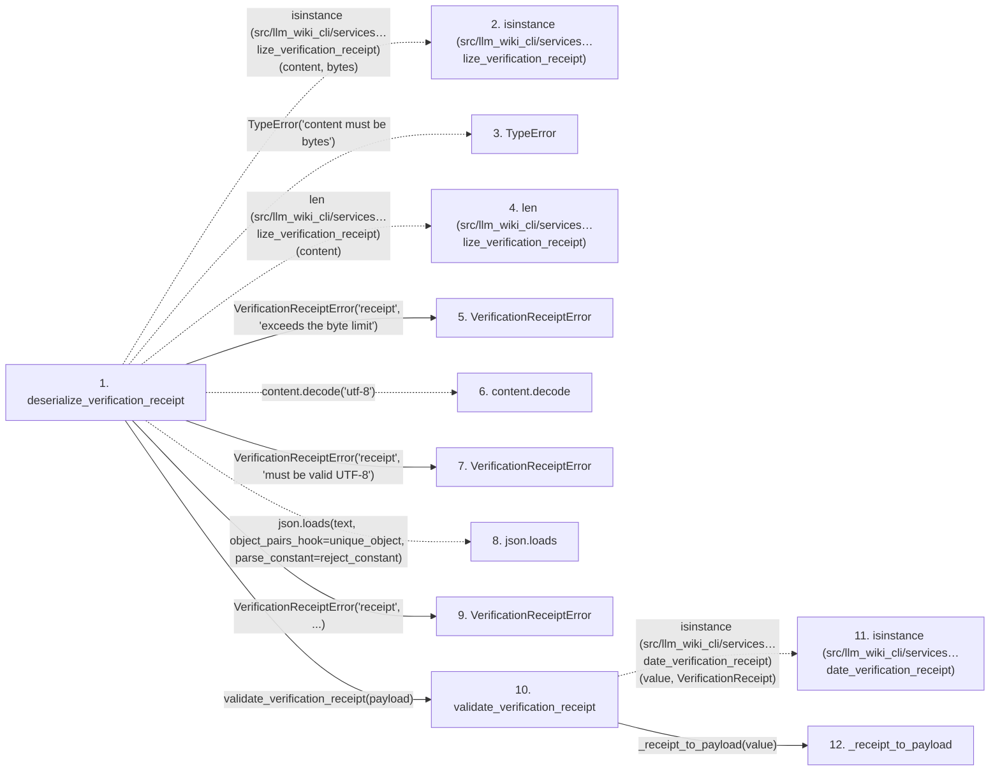

# deserialize_verification_receipt

**Entry point:** `deserialize_verification_receipt` (`api`)
**Source:** [verification_contracts](../modules/verification_contracts.md)
**Modules touched:** [knowledge_evidence](../modules/knowledge_evidence.md), [validation](../modules/validation.md), [verification_contracts](../modules/verification_contracts.md)

## Call sequence

```mermaid
sequenceDiagram
    participant p0 as deserialize_verification_receipt
    participant p1 as isinstance (src/llm_wiki_cli/services…lize_verification_receipt)
    participant p2 as TypeError
    participant p3 as len (src/llm_wiki_cli/services…lize_verification_receipt)
    participant p4 as VerificationReceiptError
    participant p5 as content.decode
    participant p6 as json.loads
    participant p7 as validate_verification_receipt
    participant p8 as isinstance (src/llm_wiki_cli/services…date_verification_receipt)
    participant p9 as _receipt_to_payload
    participant p10 as dict (src/llm_wiki_cli/services…ts.py:_receipt_to_payload)
    participant p11 as check.to_payload
    participant p12 as _object
    participant p13 as require_mapping
    participant p14 as isinstance (src/llm_wiki_cli/services…dation.py:require_mapping)
    participant p15 as key.encode
    participant p16 as _exact_fields
    participant p17 as set (src/llm_wiki_cli/services…ontracts.py:_exact_fields)
    participant p18 as require_exact_fields
    participant p19 as isinstance (src/llm_wiki_cli/services…n.py:require_exact_fields)
    participant p20 as str (src/llm_wiki_cli/services…n.py:require_exact_fields)
    participant p21 as set (src/llm_wiki_cli/services…n.py:require_exact_fields)
    participant p22 as tuple (src/llm_wiki_cli/services…n.py:require_exact_fields)
    p0-->>p1: isinstance (src/llm_wiki_cli/services…lize_verification_receipt)
    p0-->>p2: TypeError
    p0-->>p3: len (src/llm_wiki_cli/services…lize_verification_receipt)
    p0->>p4: VerificationReceiptError
    p0-->>p5: content.decode
    p0->>p4: VerificationReceiptError
    p0-->>p6: json.loads
    p0->>p4: VerificationReceiptError
    p0->>p7: validate_verification_receipt
    p7-->>p8: isinstance (src/llm_wiki_cli/services…date_verification_receipt)
    p7->>p9: _receipt_to_payload
    p9-->>p10: dict (src/llm_wiki_cli/services…ts.py:_receipt_to_payload)
    p9-->>p10: dict (src/llm_wiki_cli/services…ts.py:_receipt_to_payload)
    p9-->>p11: check.to_payload
    p7->>p12: _object
    p12->>p13: require_mapping
    p13-->>p14: isinstance (src/llm_wiki_cli/services…dation.py:require_mapping)
    p13-->>p14: isinstance (src/llm_wiki_cli/services…dation.py:require_mapping)
    p13-->>p15: key.encode
    p12->>p4: VerificationReceiptError
    p12->>p4: VerificationReceiptError
    p7->>p16: _exact_fields
    p16-->>p17: set (src/llm_wiki_cli/services…ontracts.py:_exact_fields)
    p16->>p18: require_exact_fields
    p18-->>p19: isinstance (src/llm_wiki_cli/services…n.py:require_exact_fields)
    p18-->>p20: str (src/llm_wiki_cli/services…n.py:require_exact_fields)
    p18-->>p21: set (src/llm_wiki_cli/services…n.py:require_exact_fields)
    p18-->>p21: set (src/llm_wiki_cli/services…n.py:require_exact_fields)
    p18-->>p21: set (src/llm_wiki_cli/services…n.py:require_exact_fields)
    p18-->>p22: tuple (src/llm_wiki_cli/services…n.py:require_exact_fields)
```

<!-- Auto-generated from static call edges. Dashed arrows are external or unresolved calls. Reviewed runtime conditions and side effects belong in Behavior. -->

> Call sequence diagram shows 30 of 182 interactions; 152 omitted to keep the visualization within the 30-interaction and generated-diagram limits.

> Trace truncated at the depth limit; deeper calls are omitted.

## Data flow

<!-- Auto-generated static analysis. Treat values and boundaries as best-effort hints, not runtime proof. -->

### Step data

| Step | Inputs | Reads | Writes | Returns |
|---|---|---|---|---|
| `deserialize_verification_receipt` | `content: bytes` | `MAX_RECEIPT_BYTES`, `VerificationReceiptError` | - | `receipt` |
| `isinstance (src/llm_wiki_cli/services…lize_verification_receipt)` | - | - | - | - |
| `TypeError` | - | - | - | - |
| `len (src/llm_wiki_cli/services…lize_verification_receipt)` | - | - | - | - |
| `VerificationReceiptError` | - | - | - | - |
| `content.decode` | - | - | - | - |
| `VerificationReceiptError` | - | - | - | - |
| `json.loads` | - | - | - | - |
| `VerificationReceiptError` | - | - | - | - |
| `validate_verification_receipt` | `value: VerificationReceipt \| object` | `VerificationReceipt`, `VERIFICATION_RECEIPT_SCHEMA_VERSION`, `VERIFICATION_RECEIPT_SCHEMA_VERSION`, `VerificationContractError`, `MAX_CHECKS_PER_RECEIPT` | - | `VerificationReceipt(...)` |
| `isinstance (src/llm_wiki_cli/services…date_verification_receipt)` | - | - | - | - |
| `_receipt_to_payload` | `receipt: VerificationReceipt` | - | - | `{...}` |

### Call data

| From | To | Line | Call |
|---|---|---:|---|
| deserialize_verification_receipt | isinstance (src/llm_wiki_cli/services…lize_verification_receipt) | 894 | `isinstance(content, bytes)` |
| deserialize_verification_receipt | TypeError | 895 | `TypeError('content must be bytes')` |
| deserialize_verification_receipt | len (src/llm_wiki_cli/services…lize_verification_receipt) | 896 | `len(content)` |
| deserialize_verification_receipt | VerificationReceiptError | 897 | `VerificationReceiptError('receipt', 'exceeds the byte limit')` |
| deserialize_verification_receipt | content.decode | 899 | `content.decode('utf-8')` |
| deserialize_verification_receipt | VerificationReceiptError | 901 | `VerificationReceiptError('receipt', 'must be valid UTF-8')` |
| deserialize_verification_receipt | json.loads | 921 | `json.loads(text, object_pairs_hook=unique_object, parse_constant=reject_constant)` |
| deserialize_verification_receipt | VerificationReceiptError | 929 | `VerificationReceiptError('receipt', ...)` |
| deserialize_verification_receipt | validate_verification_receipt | 933 | `validate_verification_receipt(payload)` |
| validate_verification_receipt | isinstance (src/llm_wiki_cli/services…date_verification_receipt) | 806 | `isinstance(value, VerificationReceipt)` |
| validate_verification_receipt | _receipt_to_payload | 805 | `_receipt_to_payload(value)` |

### Boundary effects

*No boundary effects detected.*

### Static analysis gaps

| Kind | Step | Target | Line |
|---|---|---|---:|
| external_call | `deserialize_verification_receipt` | `isinstance` | 894 |
| external_call | `deserialize_verification_receipt` | `TypeError` | 895 |
| unresolved_call | `deserialize_verification_receipt` | `content.decode` | 899 |
| external_call | `deserialize_verification_receipt` | `json.loads` | 921 |
| external_call | `validate_verification_receipt` | `isinstance` | 806 |
| step_limit | `deserialize_verification_receipt` | `first 12 steps` | 0 |
| truncated_flow | `deserialize_verification_receipt` | `depth limit` | 0 |

## Behavior

This flow starts at `deserialize_verification_receipt` and is classified as `api`. The generated call and data-flow sections are bounded static projections; runtime conditions and side effects require source-level confirmation.
