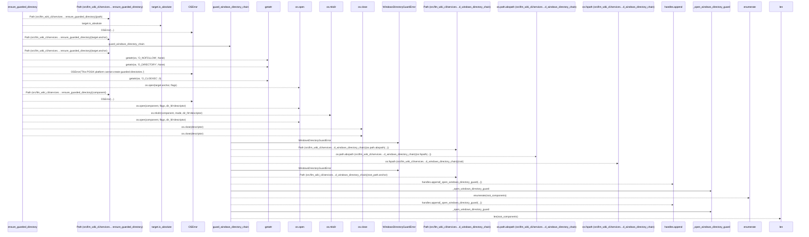
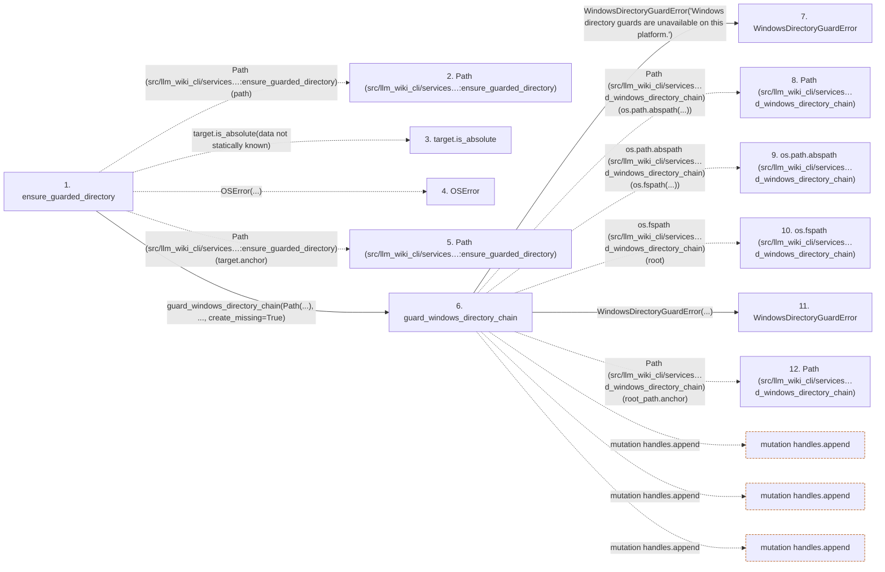

# ensure_guarded_directory

**Entry point:** `ensure_guarded_directory` (`api`)
**Source:** [filesystem_guard](../modules/filesystem_guard.md)
**Modules touched:** [filesystem_guard](../modules/filesystem_guard.md)

## Call sequence

> Static overview in presentation order, not runtime execution order. Arrows retain captured callers; siblings are shown before deeper helper detail.

<!-- Auto-generated from static call edges. Dashed arrows are external or unresolved calls. Reviewed runtime conditions and side effects belong in Behavior. -->

```mermaid
sequenceDiagram
    participant p0 as ensure_guarded_directory
    participant p1 as Path (src/llm_wiki_cli/services…:ensure_guarded_directory)
    participant p2 as target.is_absolute
    participant p3 as OSError
    participant p4 as guard_windows_directory_chain
    participant p5 as getattr
    participant p6 as os.open
    participant p7 as os.mkdir
    participant p8 as os.close
    participant p9 as WindowsDirectoryGuardError
    participant p10 as Path (src/llm_wiki_cli/services…d_windows_directory_chain)
    participant p11 as os.path.abspath (src/llm_wiki_cli/services…d_windows_directory_chain)
    participant p12 as os.fspath (src/llm_wiki_cli/services…d_windows_directory_chain)
    participant p13 as handles.append
    participant p14 as _open_windows_directory_guard
    participant p15 as enumerate
    participant p16 as len
    p0-->>p1: Path (src/llm_wiki_cli/services…:ensure_guarded_directory)(path)
    p0-->>p2: target.is_absolute
    p0-->>p3: OSError(...)
    p0-->>p1: Path (src/llm_wiki_cli/services…:ensure_guarded_directory)(target.anchor)
    p0->>p4: guard_windows_directory_chain
    p0-->>p1: Path (src/llm_wiki_cli/services…:ensure_guarded_directory)(target.anchor)
    p0-->>p5: getattr(os, 'O_NOFOLLOW', None)
    p0-->>p5: getattr(os, 'O_DIRECTORY', None)
    p0-->>p3: OSError('This POSIX platform cannot create guarded directories.')
    p0-->>p5: getattr(os, 'O_CLOEXEC', 0)
    p0-->>p6: os.open(target.anchor, flags)
    p0-->>p1: Path (src/llm_wiki_cli/services…:ensure_guarded_directory)(component)
    p0-->>p3: OSError(...)
    p0-->>p6: os.open(component, flags, dir_fd=descriptor)
    p0-->>p7: os.mkdir(component, mode, dir_fd=descriptor)
    p0-->>p6: os.open(component, flags, dir_fd=descriptor)
    p0-->>p8: os.close(descriptor)
    p0-->>p8: os.close(descriptor)
    p4->>p9: WindowsDirectoryGuardError
    p4-->>p10: Path (src/llm_wiki_cli/services…d_windows_directory_chain)(os.path.abspath(...))
    p4-->>p11: os.path.abspath (src/llm_wiki_cli/services…d_windows_directory_chain)(os.fspath(...))
    p4-->>p12: os.fspath (src/llm_wiki_cli/services…d_windows_directory_chain)(root)
    p4->>p9: WindowsDirectoryGuardError
    p4-->>p10: Path (src/llm_wiki_cli/services…d_windows_directory_chain)(root_path.anchor)
    p4-->>p13: handles.append(_open_windows_directory_guard(...))
    p4->>p14: _open_windows_directory_guard
    p4-->>p15: enumerate(root_components)
    p4-->>p13: handles.append(_open_windows_directory_guard(...))
    p4->>p14: _open_windows_directory_guard
    p4-->>p16: len(root_components)
```

> Call sequence diagram shows 30 of 230 interactions; 200 omitted to keep the visualization within the 30-interaction and generated-diagram limits, with uncertain identities omitted rather than inferred.

> Captured boundary calls: external 22 of 144 (122 omitted); unresolved 3 of 28 (25 omitted). These counts cover the captured static trace.

Omitted captured detail, grouped by actual caller occurrence and target module:

| Caller | Parent step | Target module | Kind | Omitted interactions |
| --- | --- | --- | --- | --- |
| `src/llm_wiki_cli/services/filesystem_guard.py:_open_windows_directory_guard` | 14 | - | external | 14 |
| `src/llm_wiki_cli/services/filesystem_guard.py:_open_windows_directory_guard` | 14 | - | unresolved | 3 |
| `src/llm_wiki_cli/services/filesystem_guard.py:_open_windows_directory_guard` | 14 | [src/llm_wiki_cli/services/filesystem_guard.py](../modules/filesystem_guard.md) | internal | 9 |
| `src/llm_wiki_cli/services/filesystem_guard.py:_windows_api_path` | 17 | - | external | 2 |
| `src/llm_wiki_cli/services/filesystem_guard.py:_windows_api_path` | 17 | - | unresolved | 2 |
| `src/llm_wiki_cli/services/filesystem_guard.py:_close_windows_handle` | 32 | - | external | 2 |
| `src/llm_wiki_cli/services/filesystem_guard.py:_close_windows_handle` | 32 | - | unresolved | 1 |
| `src/llm_wiki_cli/services/filesystem_guard.py:_verify_windows_handle_restrictive_dacl` | 42 | - | external | 50 |
> Omission summary shows 8 of 28 groups; 20 further groups are not expanded here. Counts above include all omitted interactions.
> Detailed flow queries retain their own coverage and limits; omitted paths may execute at runtime.

## Data flow

<!-- Auto-generated static analysis. Treat values and boundaries as best-effort hints, not runtime proof. -->

```mermaid
flowchart LR
    s1["1. ensure_guarded_directory"]
    s2["2. Path (src/llm_wiki_cli/services…:ensure_guarded_directory)"]
    s3["3. target.is_absolute"]
    s4["4. OSError"]
    s5["5. Path (src/llm_wiki_cli/services…:ensure_guarded_directory)"]
    s6["6. guard_windows_directory_chain"]
    s7["7. WindowsDirectoryGuardError"]
    s8["8. Path (src/llm_wiki_cli/services…d_windows_directory_chain)"]
    s9["9. os.path.abspath (src/llm_wiki_cli/services…d_windows_directory_chain)"]
    s10["10. os.fspath (src/llm_wiki_cli/services…d_windows_directory_chain)"]
    s11["11. WindowsDirectoryGuardError"]
    s12["12. Path (src/llm_wiki_cli/services…d_windows_directory_chain)"]
    s1 -. "Path (src/llm_wiki_cli/services…:ensure_guarded_directory)(path)" .-> s2
    s1 -. "target.is_absolute(data not statically known)" .-> s3
    s1 -. "OSError(...)" .-> s4
    s1 -. "Path (src/llm_wiki_cli/services…:ensure_guarded_directory)(target.anchor)" .-> s5
    s1 -->|"guard_windows_directory_chain(Path(...), ..., create_missing=True)"| s6
    s6 -->|"WindowsDirectoryGuardError('Windows directory guards are unavailable on this platform.')"| s7
    s6 -. "Path (src/llm_wiki_cli/services…d_windows_directory_chain)(os.path.abspath(...))" .-> s8
    s6 -. "os.path.abspath (src/llm_wiki_cli/services…d_windows_directory_chain)(os.fspath(...))" .-> s9
    s6 -. "os.fspath (src/llm_wiki_cli/services…d_windows_directory_chain)(root)" .-> s10
    s6 -->|"WindowsDirectoryGuardError(...)"| s11
    s6 -. "Path (src/llm_wiki_cli/services…d_windows_directory_chain)(root_path.anchor)" .-> s12
    b0["mutation handles.append"]
    s6 -. "mutation handles.append" .-> b0
    b1["mutation handles.append"]
    s6 -. "mutation handles.append" .-> b1
    b2["mutation handles.append"]
    s6 -. "mutation handles.append" .-> b2
    click s1 "../modules/filesystem_guard.md"
    click s6 "../modules/filesystem_guard.md"
    click s7 "../modules/filesystem_guard.md"
    click s11 "../modules/filesystem_guard.md"
    classDef boundary stroke:#b45309,stroke-dasharray: 4 2
    class b0 boundary
    class b1 boundary
    class b2 boundary
```

### Step data

| Step | Inputs | Reads | Writes | Returns |
|---|---|---|---|---|
| `ensure_guarded_directory` | `path: Path`, `mode: int` | `os`, `os`, `os`, `os` | - | `target`, `target`, `target` |
| `Path (src/llm_wiki_cli/services…:ensure_guarded_directory)` | - | - | - | - |
| `target.is_absolute` | - | - | - | - |
| `OSError` | - | - | - | - |
| `Path (src/llm_wiki_cli/services…:ensure_guarded_directory)` | - | - | - | - |
| `guard_windows_directory_chain` | `root: Path`, `relative_components: Sequence[str]`, `create_missing: bool`, `require_restrictive_dacl: bool` | `os`, `WindowsDurabilityError` | - | - |
| `WindowsDirectoryGuardError` | - | - | - | - |
| `Path (src/llm_wiki_cli/services…d_windows_directory_chain)` | - | - | - | - |
| `os.path.abspath (src/llm_wiki_cli/services…d_windows_directory_chain)` | - | - | - | - |
| `os.fspath (src/llm_wiki_cli/services…d_windows_directory_chain)` | - | - | - | - |
| `WindowsDirectoryGuardError` | - | - | - | - |
| `Path (src/llm_wiki_cli/services…d_windows_directory_chain)` | - | - | - | - |

### Call data

| From | To | Line | Call |
|---|---|---:|---|
| ensure_guarded_directory | Path (src/llm_wiki_cli/services…:ensure_guarded_directory) | 1647 | `Path(path)` |
| ensure_guarded_directory | target.is_absolute | 1648 | `target.is_absolute(data not statically known)` |
| ensure_guarded_directory | OSError | 1649 | `OSError(...)` |
| ensure_guarded_directory | Path (src/llm_wiki_cli/services…:ensure_guarded_directory) | 1650 | `Path(target.anchor)` |
| ensure_guarded_directory | guard_windows_directory_chain | 1653 | `guard_windows_directory_chain(Path(...), ..., create_missing=True)` |
| guard_windows_directory_chain | WindowsDirectoryGuardError | 170 | `WindowsDirectoryGuardError('Windows directory guards are unavailable on this platform.')` |
| guard_windows_directory_chain | Path (src/llm_wiki_cli/services…d_windows_directory_chain) | 174 | `Path(os.path.abspath(...))` |
| guard_windows_directory_chain | os.path.abspath (src/llm_wiki_cli/services…d_windows_directory_chain) | 174 | `os.path.abspath(os.fspath(...))` |
| guard_windows_directory_chain | os.fspath (src/llm_wiki_cli/services…d_windows_directory_chain) | 174 | `os.fspath(root)` |
| guard_windows_directory_chain | WindowsDirectoryGuardError | 176 | `WindowsDirectoryGuardError(...)` |
| guard_windows_directory_chain | Path (src/llm_wiki_cli/services…d_windows_directory_chain) | 179 | `Path(root_path.anchor)` |

### Boundary effects

| Kind | Target | Step | Line |
|---|---|---|---:|
| mutation | `handles.append` | `guard_windows_directory_chain` | 182 |
| mutation | `handles.append` | `guard_windows_directory_chain` | 189 |
| mutation | `handles.append` | `guard_windows_directory_chain` | 216 |

### Static analysis gaps

| Kind | Step | Target | Line |
|---|---|---|---:|
| unresolved_call | `ensure_guarded_directory` | `target.is_absolute` | 1648 |
| external_call | `ensure_guarded_directory` | `OSError` | 1649 |
| external_call | `guard_windows_directory_chain` | `os.path.abspath` | 174 |
| external_call | `guard_windows_directory_chain` | `os.fspath` | 174 |
| step_limit | `ensure_guarded_directory` | `first 12 steps` | 0 |

## Behavior

This flow starts at `ensure_guarded_directory` and is classified as `api`. The generated call and data-flow sections are bounded static projections; runtime conditions and side effects require source-level confirmation.
