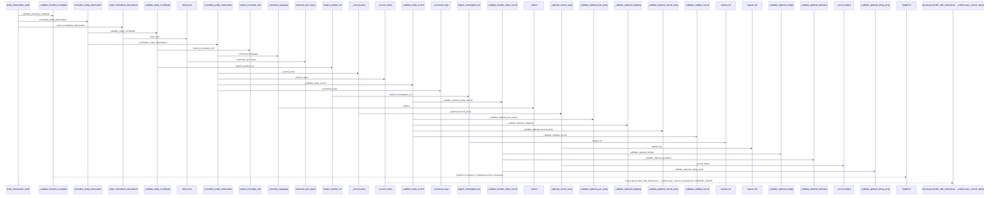
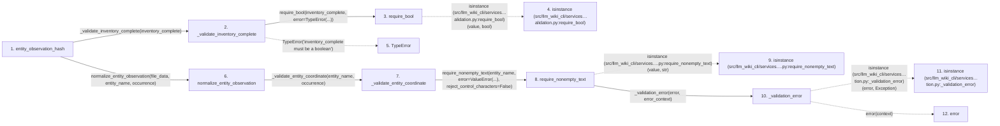

# entity_observation_hash

**Entry point:** `entity_observation_hash` (`api`)
**Source:** [knowledge_evidence](../modules/knowledge_evidence.md)
**Modules touched:** [knowledge_evidence](../modules/knowledge_evidence.md), [validation](../modules/validation.md)

## Call sequence

> Static overview in presentation order, not runtime execution order. Arrows retain captured callers; representative internal continuations and boundary examples precede repeated helper detail.

<!-- Auto-generated from static call edges. Dashed arrows are external or unresolved calls. Reviewed runtime conditions and side effects belong in Behavior. -->

```mermaid
sequenceDiagram
    participant p0 as entity_observation_hash
    participant p1 as _validate_inventory_complete
    participant p2 as normalize_entity_observation
    participant p3 as _hash_normalized_observation
    participant p4 as _validate_entity_coordinate
    participant p5 as hash_json
    participant p6 as _normalize_entity_observation
    participant p7 as require_nonempty_text
    participant p8 as _inventory_language
    participant p9 as canonical_json_bytes
    participant p10 as require_positive_int
    participant p11 as _record_array
    participant p12 as _record_name
    participant p13 as _validate_entity_record
    participant p14 as _structural_copy
    participant p15 as require_nonnegative_int
    participant p16 as _validate_module_entity_record
    participant p17 as _failure
    participant p18 as _optional_record_array
    participant p19 as _validate_optional_json_array
    participant p20 as _validate_optional_mapping
    participant p21 as _validate_optional_record_array
    participant p22 as _validate_callable_record
    participant p23 as require_int
    participant p24 as require_list
    participant p25 as _validate_optional_strings
    participant p26 as _validate_optional_booleans
    participant p27 as _record_object
    participant p28 as _validate_optional_string_array
    participant p29 as TypeError
    participant p30 as record.get (src/llm_wiki_cli/services…_evidence.py:_record_name)
    p0->>p1: _validate_inventory_complete
    p0->>p2: normalize_entity_observation
    p0->>p3: _hash_normalized_observation
    p2->>p4: _validate_entity_coordinate
    p3->>p5: hash_json
    p2->>p6: _normalize_entity_observation
    p4->>p7: require_nonempty_text
    p6->>p8: _inventory_language
    p5->>p9: canonical_json_bytes
    p4->>p10: require_positive_int
    p6->>p11: _record_array
    p6->>p12: _record_name
    p6->>p13: _validate_entity_record
    p6->>p14: _structural_copy
    p10->>p15: require_nonnegative_int
    p13->>p16: _validate_module_entity_record
    p8->>p17: _failure
    p11->>p18: _optional_record_array
    p13->>p19: _validate_optional_json_array
    p13->>p20: _validate_optional_mapping
    p13->>p21: _validate_optional_record_array
    p13->>p22: _validate_callable_record
    p15->>p23: require_int
    p18->>p24: require_list
    p16->>p25: _validate_optional_strings
    p16->>p26: _validate_optional_booleans
    p18->>p27: _record_object
    p16->>p28: _validate_optional_string_array
    p1-->>p29: TypeError('inventory_complete must be a boolean')
    p12-->>p30: record.get (src/llm_wiki_cli/services…_evidence.py:_record_name)('name', MISSING_VALUE)
```

> Call sequence diagram shows 30 of 208 interactions; 178 omitted to keep the visualization within the 30-interaction and generated-diagram limits, with uncertain identities omitted rather than inferred.

> Captured boundary calls: external 1 of 40 (39 omitted); unresolved 1 of 31 (30 omitted). These counts cover the captured static trace.

Omitted captured detail, grouped by actual caller occurrence and target module:

| Caller | Parent step | Target module | Kind | Omitted interactions |
| --- | --- | --- | --- | --- |
| `src/llm_wiki_cli/services/knowledge_evidence.py:_validate_inventory_complete` | 2 | [src/llm_wiki_cli/services/validation.py](../modules/validation.md) | internal | 1 |
| `src/llm_wiki_cli/services/validation.py:require_bool` | 3 | - | external | 1 |
| `src/llm_wiki_cli/services/validation.py:require_nonempty_text` | 8 | - | external | 1 |
| `src/llm_wiki_cli/services/validation.py:require_nonempty_text` | 8 | [src/llm_wiki_cli/services/validation.py](../modules/validation.md) | internal | 5 |
| `src/llm_wiki_cli/services/validation.py:_validation_error` | 10 | - | external | 1 |
| `src/llm_wiki_cli/services/validation.py:_validation_error` | 10 | - | unresolved | 1 |
| `src/llm_wiki_cli/services/validation.py:require_nonempty_text` | 8 | - | unresolved | 1 |
| `src/llm_wiki_cli/services/validation.py:contains_control_character` | 16 | - | unresolved | 1 |
> Omission summary shows 8 of 61 groups; 53 further groups are not expanded here. Counts above include all omitted interactions.
> Detailed flow queries retain their own coverage and limits; omitted paths may execute at runtime.

> Trace truncated at the depth limit; deeper calls are omitted.

## Data flow

<!-- Auto-generated static analysis. Treat values and boundaries as best-effort hints, not runtime proof. -->

### Analysis coverage

**Effect analysis partially available.** Flow assembly and source effect analysis are separate; empty observations do not prove an empty handler body.

Source steps: 138; effect analysis evaluated: 137, partial: 0, unavailable: 1. Counts include steps omitted from the displayed trace.

Collector observations for 137 source steps with known totals: observed: 625, emitted: 625, omitted: 0. Unavailable totals are excluded.

- Callable record unavailable for one or more source steps; those steps have no represented callable body.
- Effect collector totals unavailable; observed counts cover captured records only.

| Step | Callable record | Effect analysis | Collector totals | Observed | Emitted | Omitted |
|---|---|---|---|---:|---:|---:|
| `entity_observation_hash` | `available` | `evaluated` | `available` | `6` | `6` | `0` |
| `_validate_inventory_complete` | `available` | `evaluated` | `available` | `1` | `1` | `0` |
| `require_bool` | `available` | `evaluated` | `available` | `3` | `3` | `0` |
| `isinstance (src/llm_wiki_cli/services…alidation.py:require_bool)` | `not_applicable` | `not_applicable` | `not_applicable` | — | — | — |
| `TypeError` | `not_applicable` | `not_applicable` | `not_applicable` | — | — | — |
| `normalize_entity_observation` | `available` | `evaluated` | `available` | `6` | `6` | `0` |
| `_validate_entity_coordinate` | `available` | `evaluated` | `available` | `2` | `2` | `0` |
| `require_nonempty_text` | `available` | `evaluated` | `available` | `9` | `9` | `0` |
| `isinstance (src/llm_wiki_cli/services….py:require_nonempty_text)` | `not_applicable` | `not_applicable` | `not_applicable` | — | — | — |
| `_validation_error` | `available` | `evaluated` | `available` | `3` | `3` | `0` |
| `isinstance (src/llm_wiki_cli/services…tion.py:_validation_error)` | `not_applicable` | `not_applicable` | `not_applicable` | — | — | — |
| `error` | `not_applicable` | `not_applicable` | `not_applicable` | — | — | — |

```mermaid
flowchart LR
    s1["1. entity_observation_hash"]
    s2["2. _validate_inventory_complete"]
    s3["3. require_bool"]
    s4["4. isinstance (src/llm_wiki_cli/services…alidation.py:require_bool)"]
    s5["5. TypeError"]
    s6["6. normalize_entity_observation"]
    s7["7. _validate_entity_coordinate"]
    s8["8. require_nonempty_text"]
    s9["9. isinstance (src/llm_wiki_cli/services….py:require_nonempty_text)"]
    s10["10. _validation_error"]
    s11["11. isinstance (src/llm_wiki_cli/services…tion.py:_validation_error)"]
    s12["12. error"]
    s1 -->|"_validate_inventory_complete(inventory_complete)"| s2
    s2 -->|"require_bool(inventory_complete, error=TypeError(...))"| s3
    s3 -. "isinstance (src/llm_wiki_cli/services…alidation.py:require_bool)(value, bool)" .-> s4
    s2 -. "TypeError('inventory_complete must be a boolean')" .-> s5
    s1 -->|"normalize_entity_observation(file_data, entity_name, occurrence)"| s6
    s6 -->|"_validate_entity_coordinate(entity_name, occurrence)"| s7
    s7 -->|"require_nonempty_text(entity_name, error=ValueError(...), reject_control_characters=False)"| s8
    s8 -. "isinstance (src/llm_wiki_cli/services….py:require_nonempty_text)(value, str)" .-> s9
    s8 -->|"_validation_error(error, error_context)"| s10
    s10 -. "isinstance (src/llm_wiki_cli/services…tion.py:_validation_error)(error, Exception)" .-> s11
    s10 -. "error(context)" .-> s12
    click s1 "../modules/knowledge_evidence.md"
    click s2 "../modules/knowledge_evidence.md"
    click s3 "../modules/validation.md"
    click s6 "../modules/knowledge_evidence.md"
    click s7 "../modules/knowledge_evidence.md"
    click s8 "../modules/validation.md"
    click s10 "../modules/validation.md"
```

### Step data

| Step | Inputs | Reads | Writes | Returns |
|---|---|---|---|---|
| `entity_observation_hash` | `file_data: Mapping[str, Any]`, `entity_name: str`, `occurrence: int`, `inventory_complete: bool` | - | - | `None`, `_hash_normalized_observation(...)` |
| `_validate_inventory_complete` | `inventory_complete: object` | - | - | - |
| `require_bool` | `value: object`, `error: Exception` | - | - | `value` |
| `isinstance (src/llm_wiki_cli/services…alidation.py:require_bool)` | - | - | - | - |
| `TypeError` | - | - | - | - |
| `normalize_entity_observation` | `file_data: Mapping[str, Any]`, `entity_name: str`, `occurrence: int` | `_InventoryNormalizationError` | - | `_normalize_entity_observation(...)`, `None` |
| `_validate_entity_coordinate` | `entity_name: object`, `occurrence: object` | - | - | - |
| `require_nonempty_text` | `value: object`, `error: _ValidationError`, `trim_error: _ValidationError \| None`, `error_context: str`, `normalize: bool`, `require_trimmed: bool`, `reject_control_characters: bool`, `reject_delete_character: bool` | - | - | `parsed` |
| `isinstance (src/llm_wiki_cli/services….py:require_nonempty_text)` | - | - | - | - |
| `_validation_error` | `error: _ValidationError`, `context: str` | - | - | `...` |
| `isinstance (src/llm_wiki_cli/services…tion.py:_validation_error)` | - | - | - | - |
| `error` | - | - | - | - |

### Call data

| From | To | Line | Call |
|---|---|---:|---|
| entity_observation_hash | _validate_inventory_complete | 294 | `_validate_inventory_complete(inventory_complete)` |
| _validate_inventory_complete | require_bool | 847 | `require_bool(inventory_complete, error=TypeError(...))` |
| require_bool | isinstance (src/llm_wiki_cli/services…alidation.py:require_bool) | 828 | `isinstance(value, bool)` |
| _validate_inventory_complete | TypeError | 849 | `TypeError('inventory_complete must be a boolean')` |
| entity_observation_hash | normalize_entity_observation | 297 | `normalize_entity_observation(file_data, entity_name, occurrence)` |
| normalize_entity_observation | _validate_entity_coordinate | 260 | `_validate_entity_coordinate(entity_name, occurrence)` |
| _validate_entity_coordinate | require_nonempty_text | 903 | `require_nonempty_text(entity_name, error=ValueError(...), reject_control_characters=False)` |
| require_nonempty_text | isinstance (src/llm_wiki_cli/services….py:require_nonempty_text) | 637 | `isinstance(value, str)` |
| require_nonempty_text | _validation_error | 638 | `_validation_error(error, error_context)` |
| _validation_error | isinstance (src/llm_wiki_cli/services…tion.py:_validation_error) | 95 | `isinstance(error, Exception)` |
| _validation_error | error | 95 | `error(context)` |

### Boundary effects

*No boundary-effect observations were captured in this static trace.*

### Static analysis gaps

| Kind | Step | Target | Line |
|---|---|---|---:|
| external_call | `require_bool` | `isinstance` | 828 |
| external_call | `_validate_inventory_complete` | `TypeError` | 849 |
| external_call | `require_nonempty_text` | `isinstance` | 637 |
| external_call | `_validation_error` | `isinstance` | 95 |
| unresolved_call | `_validation_error` | `error` | 95 |
| step_limit | `entity_observation_hash` | `first 12 steps` | 0 |
| truncated_flow | `entity_observation_hash` | `depth limit` | 0 |

## Behavior

This flow starts at `entity_observation_hash` and is classified as `api`. The generated call and data-flow sections are bounded static projections; runtime conditions and side effects require source-level confirmation.
