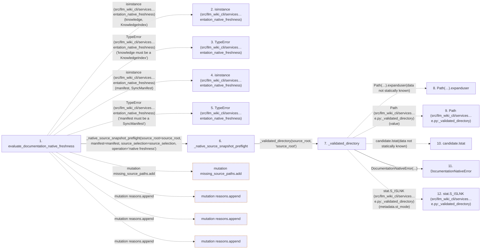

# evaluate_documentation_native_freshness

**Entry point:** `evaluate_documentation_native_freshness` (`api`)
**Source:** [documentation_native](../modules/documentation_native.md)
**Modules touched:** [common](../modules/common.md), [concept_identity](../modules/concept_identity.md), [config](../modules/config.md), [data_flow](../modules/data_flow.md), and 30 more

**Complete modules touched:**

- [common](../modules/common.md)
- [concept_identity](../modules/concept_identity.md)
- [config](../modules/config.md)
- [data_flow](../modules/data_flow.md)
- [documentation_native](../modules/documentation_native.md)
- [extraction_jobs](../modules/extraction_jobs.md)
- [extraction_service](../modules/extraction_service.md)
- [imports](../modules/imports.md)
- [infrastructure_inventory](../modules/infrastructure_inventory.md)
- [infrastructure_sync](../modules/infrastructure_sync.md)
- [inventory_cache](../modules/inventory_cache.md)
- [knowledge_artifacts](../modules/knowledge_artifacts.md)
- [knowledge_envelope](../modules/knowledge_envelope.md)
- [knowledge_evidence](../modules/knowledge_evidence.md)
- [knowledge_freshness](../modules/knowledge_freshness.md)
- [knowledge_generation](../modules/knowledge_generation.md)
- [knowledge_governance](../modules/knowledge_governance.md)
- [knowledge_graph](../modules/knowledge_graph.md)
- [knowledge_model](../modules/knowledge_model.md)
- [knowledge_orchestration](../modules/knowledge_orchestration.md)
- [knowledge_reuse](../modules/knowledge_reuse.md)
- [markdown_sections](../modules/markdown_sections.md)
- [packages](../modules/packages.md)
- [plugins](../modules/plugins.md)
- [progress](../modules/progress.md)
- [python_contracts](../modules/python_contracts.md)
- [python_observations](../modules/python_observations.md)
- [resource_diagnostics](../modules/resource_diagnostics.md)
- [section_ownership](../modules/section_ownership.md)
- [source_selection](../modules/source_selection.md)
- [source_snapshot](../modules/source_snapshot.md)
- [validation](../modules/validation.md)
- [wiki_media](../modules/wiki_media.md)
- [wiki_surface](../modules/wiki_surface.md)

## Call sequence

```mermaid
sequenceDiagram
    participant p0 as evaluate_documentation_native_freshness
    participant p1 as isinstance (src/llm_wiki_cli/services…entation_native_freshness)
    participant p2 as TypeError (src/llm_wiki_cli/services…entation_native_freshness)
    participant p3 as _native_source_snapshot_preflight
    participant p4 as _validated_directory
    participant p5 as Path(…).expanduser
    participant p6 as Path (src/llm_wiki_cli/services…e.py:_validated_directory)
    participant p7 as candidate.lstat
    participant p8 as DocumentationNativeError
    participant p9 as stat.S_ISLNK (src/llm_wiki_cli/services…e.py:_validated_directory)
    participant p10 as stat.S_ISDIR (src/llm_wiki_cli/services…e.py:_validated_directory)
    participant p11 as candidate.resolve (src/llm_wiki_cli/services…e.py:_validated_directory)
    participant p12 as resolve_source_selection
    participant p13 as Path(…).resolve (src/llm_wiki_cli/services…:resolve_source_selection)
    participant p14 as Path (src/llm_wiki_cli/services…:resolve_source_selection)
    participant p15 as SourceSelectionError
    participant p16 as _override_text
    participant p17 as os.fspath
    participant p18 as isinstance (src/llm_wiki_cli/services…lection.py:_override_text)
    participant p19 as _selection_path
    participant p20 as _require_selection_path
    participant p21 as require_repository_relative_path
    p0-->>p1: isinstance (src/llm_wiki_cli/services…entation_native_freshness)
    p0-->>p2: TypeError (src/llm_wiki_cli/services…entation_native_freshness)
    p0-->>p1: isinstance (src/llm_wiki_cli/services…entation_native_freshness)
    p0-->>p2: TypeError (src/llm_wiki_cli/services…entation_native_freshness)
    p0->>p3: _native_source_snapshot_preflight
    p3->>p4: _validated_directory
    p4-->>p5: Path(…).expanduser
    p4-->>p6: Path (src/llm_wiki_cli/services…e.py:_validated_directory)
    p4-->>p7: candidate.lstat
    p4->>p8: DocumentationNativeError
    p4-->>p9: stat.S_ISLNK (src/llm_wiki_cli/services…e.py:_validated_directory)
    p4-->>p10: stat.S_ISDIR (src/llm_wiki_cli/services…e.py:_validated_directory)
    p4->>p8: DocumentationNativeError
    p4-->>p11: candidate.resolve (src/llm_wiki_cli/services…e.py:_validated_directory)
    p3->>p12: resolve_source_selection
    p12-->>p13: Path(…).resolve (src/llm_wiki_cli/services…:resolve_source_selection)
    p12-->>p14: Path (src/llm_wiki_cli/services…:resolve_source_selection)
    p12->>p15: SourceSelectionError
    p12->>p16: _override_text
    p16-->>p17: os.fspath
    p16->>p15: SourceSelectionError
    p16-->>p18: isinstance (src/llm_wiki_cli/services…lection.py:_override_text)
    p16->>p15: SourceSelectionError
    p16->>p19: _selection_path
    p19->>p20: _require_selection_path
    p20->>p21: require_repository_relative_path
    p20->>p15: SourceSelectionError
    p20->>p15: SourceSelectionError
    p20->>p15: SourceSelectionError
    p20->>p15: SourceSelectionError
```

<!-- Auto-generated from static call edges. Dashed arrows are external or unresolved calls. Reviewed runtime conditions and side effects belong in Behavior. -->

> Call sequence diagram shows 30 of 2938 interactions; 2908 omitted to keep the visualization within the 30-interaction and generated-diagram limits.

> Trace truncated at the depth limit; deeper calls are omitted.

## Data flow

<!-- Auto-generated static analysis. Treat values and boundaries as best-effort hints, not runtime proof. -->

### Step data

| Step | Inputs | Reads | Writes | Returns |
|---|---|---|---|---|
| `evaluate_documentation_native_freshness` | `knowledge: KnowledgeIndex`, `manifest: SyncManifest`, `source_root: str \| Path`, `trust_source_plugins: bool`, `helper_cache_dir: str \| Path \| None`, `source_selection: str \| Path \| None` | `KnowledgeIndex`, `SyncManifest`, `ObservationScope`, `RUNTIME_GENERATION_OPTION_DEFAULTS`, `RUNTIME_GENERATION_OPTION_DEFAULTS`, `PageKind`, `ComputedFreshness` | - | `DocumentationNativeFreshness(...)` |
| `isinstance (src/llm_wiki_cli/services…entation_native_freshness)` | - | - | - | - |
| `TypeError (src/llm_wiki_cli/services…entation_native_freshness)` | - | - | - | - |
| `isinstance (src/llm_wiki_cli/services…entation_native_freshness)` | - | - | - | - |
| `TypeError (src/llm_wiki_cli/services…entation_native_freshness)` | - | - | - | - |
| `_native_source_snapshot_preflight` | `source_root: str \| Path`, `manifest: SyncManifest`, `source_selection: str \| Path \| None`, `operation: str`, `allow_same_path_identity_update: bool` | `SourceSelectionError`, `SourceSnapshotError` | - | `(...)` |
| `_validated_directory` | `value: str \| Path`, `field_name: str` | - | - | `candidate.resolve(...)` |
| `Path(…).expanduser` | - | - | - | - |
| `Path (src/llm_wiki_cli/services…e.py:_validated_directory)` | - | - | - | - |
| `candidate.lstat` | - | - | - | - |
| `DocumentationNativeError` | - | - | - | - |
| `stat.S_ISLNK (src/llm_wiki_cli/services…e.py:_validated_directory)` | - | - | - | - |

### Call data

| From | To | Line | Call |
|---|---|---:|---|
| evaluate_documentation_native_freshness | isinstance (src/llm_wiki_cli/services…entation_native_freshness) | 202 | `isinstance(knowledge, KnowledgeIndex)` |
| evaluate_documentation_native_freshness | TypeError (src/llm_wiki_cli/services…entation_native_freshness) | 203 | `TypeError('knowledge must be a KnowledgeIndex')` |
| evaluate_documentation_native_freshness | isinstance (src/llm_wiki_cli/services…entation_native_freshness) | 204 | `isinstance(manifest, SyncManifest)` |
| evaluate_documentation_native_freshness | TypeError (src/llm_wiki_cli/services…entation_native_freshness) | 205 | `TypeError('manifest must be a SyncManifest')` |
| evaluate_documentation_native_freshness | _native_source_snapshot_preflight | 206 | `_native_source_snapshot_preflight(source_root=source_root, manifest=manifest, source_selection=source_selection, operation='native freshness')` |
| _native_source_snapshot_preflight | _validated_directory | 155 | `_validated_directory(source_root, 'source_root')` |
| _validated_directory | Path(…).expanduser | 1078 | `Path(value).expanduser(data not statically known)` |
| _validated_directory | Path (src/llm_wiki_cli/services…e.py:_validated_directory) | 1078 | `Path(value)` |
| _validated_directory | candidate.lstat | 1080 | `candidate.lstat(data not statically known)` |
| _validated_directory | DocumentationNativeError | 1082 | `DocumentationNativeError(...)` |
| _validated_directory | stat.S_ISLNK (src/llm_wiki_cli/services…e.py:_validated_directory) | 1085 | `stat.S_ISLNK(metadata.st_mode)` |

### Boundary effects

| Kind | Target | Step | Line |
|---|---|---|---:|
| mutation | `missing_source_paths.add` | `evaluate_documentation_native_freshness` | 242 |
| mutation | `reasons.append` | `evaluate_documentation_native_freshness` | 281 |
| mutation | `reasons.append` | `evaluate_documentation_native_freshness` | 283 |
| mutation | `reasons.append` | `evaluate_documentation_native_freshness` | 293 |

### Static analysis gaps

| Kind | Step | Target | Line |
|---|---|---|---:|
| external_call | `evaluate_documentation_native_freshness` | `isinstance` | 202 |
| external_call | `evaluate_documentation_native_freshness` | `TypeError` | 203 |
| external_call | `evaluate_documentation_native_freshness` | `isinstance` | 204 |
| external_call | `evaluate_documentation_native_freshness` | `TypeError` | 205 |
| unresolved_call | `_validated_directory` | `Path(value).expanduser` | 1078 |
| unresolved_call | `_validated_directory` | `candidate.lstat` | 1080 |
| external_call | `_validated_directory` | `stat.S_ISLNK` | 1085 |
| step_limit | `evaluate_documentation_native_freshness` | `first 12 steps` | 0 |
| truncated_flow | `evaluate_documentation_native_freshness` | `depth limit` | 0 |

## Behavior

This flow starts at `evaluate_documentation_native_freshness` and is classified as `api`. The generated call and data-flow sections are bounded static projections; runtime conditions and side effects require source-level confirmation.
