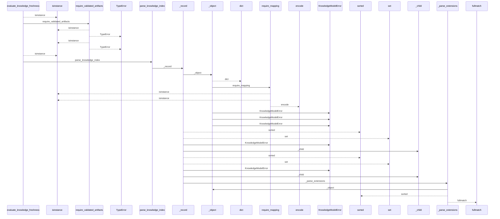
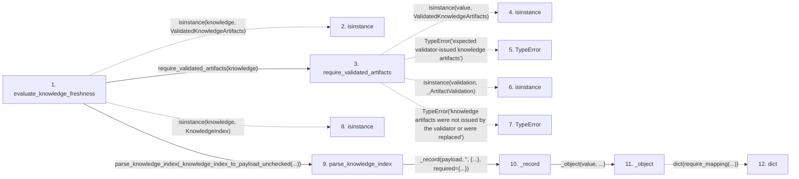

# evaluate_knowledge_freshness

**Entry point:** `evaluate_knowledge_freshness` (`api`)
**Source:** [knowledge_freshness](../modules/knowledge_freshness.md)
**Modules touched:** [concept_identity](../modules/concept_identity.md), [knowledge_artifacts](../modules/knowledge_artifacts.md), [knowledge_evidence](../modules/knowledge_evidence.md), and 10 more

**Complete modules touched:**

- [concept_identity](../modules/concept_identity.md)
- [knowledge_artifacts](../modules/knowledge_artifacts.md)
- [knowledge_evidence](../modules/knowledge_evidence.md)
- [knowledge_freshness](../modules/knowledge_freshness.md)
- [knowledge_governance](../modules/knowledge_governance.md)
- [knowledge_graph](../modules/knowledge_graph.md)
- [knowledge_model](../modules/knowledge_model.md)
- [knowledge_reuse](../modules/knowledge_reuse.md)
- [markdown_sections](../modules/markdown_sections.md)
- [section_ownership](../modules/section_ownership.md)
- [validation](../modules/validation.md)
- [wiki_media](../modules/wiki_media.md)
- [wiki_surface](../modules/wiki_surface.md)

## Call sequence

<!-- Auto-generated from static call edges. Dashed arrows are external or unresolved calls. Reviewed runtime conditions and side effects belong in Behavior. -->

> Call sequence diagram shows 30 of 1648 interactions; 1618 omitted to keep the visualization within the 30-interaction and generated-diagram limits.

> Trace truncated at the depth limit; deeper calls are omitted.

## Data flow

<!-- Auto-generated static analysis. Treat values and boundaries as best-effort hints, not runtime proof. -->

### Step data

| Step | Inputs | Reads | Writes | Returns |
|---|---|---|---|---|
| `evaluate_knowledge_freshness` | `knowledge: KnowledgeIndex \| object`, `live: LiveKnowledgeEvaluation \| None` | `KnowledgeIndex`, `KnowledgeModelError` | - | `_evaluate_model_freshness(...)` |
| `isinstance` | - | - | - | - |
| `require_validated_artifacts` | `value: object` | `ValidatedKnowledgeArtifacts`, `_ArtifactValidation` | - | `value` |
| `isinstance` | - | - | - | - |
| `TypeError` | - | - | - | - |
| `isinstance` | - | - | - | - |
| `TypeError` | - | - | - | - |
| `isinstance` | - | - | - | - |
| `parse_knowledge_index` | `payload: object` | `KNOWLEDGE_SCHEMA_VERSION`, `KNOWLEDGE_SCHEMA_VERSION` | - | `model` |
| `_record` | `value: object`, `path: str`, `fields: AbstractSet[str]`, `required: AbstractSet[str]` | - | - | `(...)` |
| `_object` | `value: object`, `path: str` | - | - | `dict(...)` |
| `dict` | - | - | - | - |

### Call data

| From | To | Line | Call |
|---|---|---:|---|
| evaluate_knowledge_freshness | isinstance | 235 | `isinstance(knowledge, ValidatedKnowledgeArtifacts)` |
| evaluate_knowledge_freshness | require_validated_artifacts | 234 | `require_validated_artifacts(knowledge)` |
| require_validated_artifacts | isinstance | 152 | `isinstance(value, ValidatedKnowledgeArtifacts)` |
| require_validated_artifacts | TypeError | 153 | `TypeError('expected validator-issued knowledge artifacts')` |
| require_validated_artifacts | isinstance | 156 | `isinstance(validation, _ArtifactValidation)` |
| require_validated_artifacts | TypeError | 167 | `TypeError('knowledge artifacts were not issued by the validator or were replaced')` |
| evaluate_knowledge_freshness | isinstance | 237 | `isinstance(knowledge, KnowledgeIndex)` |
| evaluate_knowledge_freshness | parse_knowledge_index | 236 | `parse_knowledge_index(_knowledge_index_to_payload_unchecked(...))` |
| parse_knowledge_index | _record | 526 | `_record(payload, '', {...}, required={...})` |
| _record | _object | 1581 | `_object(value, ...)` |
| _object | dict | 1667 | `dict(require_mapping(...))` |

### Boundary effects

*No boundary effects detected.*

### Static analysis gaps

| Kind | Step | Target | Line |
|---|---|---|---:|
| unresolved_call | `evaluate_knowledge_freshness` | `isinstance` | 235 |
| unresolved_call | `require_validated_artifacts` | `isinstance` | 152 |
| unresolved_call | `require_validated_artifacts` | `TypeError` | 153 |
| unresolved_call | `require_validated_artifacts` | `isinstance` | 156 |
| unresolved_call | `require_validated_artifacts` | `TypeError` | 167 |
| unresolved_call | `evaluate_knowledge_freshness` | `isinstance` | 237 |
| step_limit | `evaluate_knowledge_freshness` | `first 12 steps` | 0 |
| truncated_flow | `evaluate_knowledge_freshness` | `depth limit` | 0 |

## Behavior

This flow starts at `evaluate_knowledge_freshness` and is classified as `api`. The generated call and data-flow sections are bounded static projections; runtime conditions and side effects require source-level confirmation.
