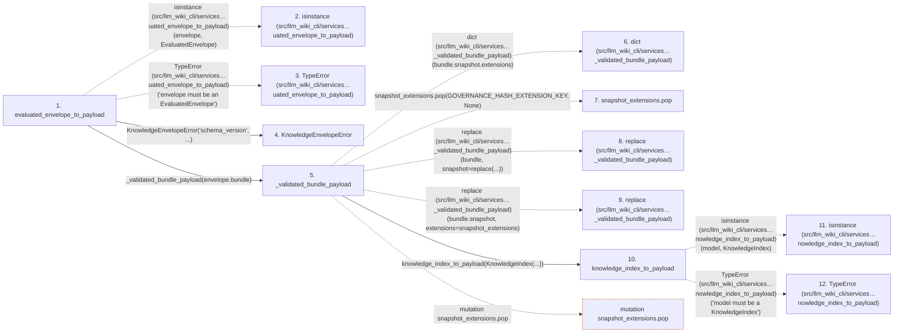

# evaluated_envelope_to_payload

**Entry point:** `evaluated_envelope_to_payload` (`api`)
**Source:** [knowledge_envelope](../modules/knowledge_envelope.md)
**Modules touched:** [concept_identity](../modules/concept_identity.md), [knowledge_envelope](../modules/knowledge_envelope.md), [knowledge_evidence](../modules/knowledge_evidence.md), and 7 more

**Complete modules touched:**

- [concept_identity](../modules/concept_identity.md)
- [knowledge_envelope](../modules/knowledge_envelope.md)
- [knowledge_evidence](../modules/knowledge_evidence.md)
- [knowledge_governance](../modules/knowledge_governance.md)
- [knowledge_graph](../modules/knowledge_graph.md)
- [knowledge_model](../modules/knowledge_model.md)
- [knowledge_reuse](../modules/knowledge_reuse.md)
- [section_ownership](../modules/section_ownership.md)
- [validation](../modules/validation.md)
- [wiki_surface](../modules/wiki_surface.md)

## Call sequence

```mermaid
sequenceDiagram
    participant p0 as evaluated_envelope_to_payload
    participant p1 as isinstance (src/llm_wiki_cli/services…uated_envelope_to_payload)
    participant p2 as TypeError (src/llm_wiki_cli/services…uated_envelope_to_payload)
    participant p3 as KnowledgeEnvelopeError
    participant p4 as _validated_bundle_payload
    participant p5 as dict (src/llm_wiki_cli/services…_validated_bundle_payload)
    participant p6 as snapshot_extensions.pop
    participant p7 as replace (src/llm_wiki_cli/services…_validated_bundle_payload)
    participant p8 as knowledge_index_to_payload
    participant p9 as isinstance (src/llm_wiki_cli/services…nowledge_index_to_payload)
    participant p10 as TypeError (src/llm_wiki_cli/services…nowledge_index_to_payload)
    participant p11 as _emit_extensions
    participant p12 as isinstance (src/llm_wiki_cli/services…model.py:_emit_extensions)
    participant p13 as _parse_extensions
    participant p14 as _object (src/llm_wiki_cli/services/knowledge_model.py)
    participant p15 as dict (src/llm_wiki_cli/services…nowledge_model.py:_object)
    participant p16 as require_mapping
    participant p17 as KnowledgeModelError
    participant p18 as sorted (src/llm_wiki_cli/services…odel.py:_parse_extensions)
    participant p19 as _QUALIFIED_NAME_RE.fullmatch (src/llm_wiki_cli/services…odel.py:_parse_extensions)
    participant p20 as _child
    participant p21 as _normalize_json_value
    participant p22 as _normalize_json_value_inner
    participant p23 as set (src/llm_wiki_cli/services….py:_normalize_json_value)
    p0-->>p1: isinstance (src/llm_wiki_cli/services…uated_envelope_to_payload)
    p0-->>p2: TypeError (src/llm_wiki_cli/services…uated_envelope_to_payload)
    p0->>p3: KnowledgeEnvelopeError
    p0->>p4: _validated_bundle_payload
    p4-->>p5: dict (src/llm_wiki_cli/services…_validated_bundle_payload)
    p4-->>p6: snapshot_extensions.pop
    p4-->>p7: replace (src/llm_wiki_cli/services…_validated_bundle_payload)
    p4-->>p7: replace (src/llm_wiki_cli/services…_validated_bundle_payload)
    p4->>p8: knowledge_index_to_payload
    p8-->>p9: isinstance (src/llm_wiki_cli/services…nowledge_index_to_payload)
    p8-->>p10: TypeError (src/llm_wiki_cli/services…nowledge_index_to_payload)
    p8->>p11: _emit_extensions
    p11-->>p12: isinstance (src/llm_wiki_cli/services…model.py:_emit_extensions)
    p11->>p13: _parse_extensions
    p13->>p14: _object (src/llm_wiki_cli/services/knowledge_model.py)
    p14-->>p15: dict (src/llm_wiki_cli/services…nowledge_model.py:_object)
    p14->>p16: require_mapping
    p14->>p17: KnowledgeModelError
    p14->>p17: KnowledgeModelError
    p14->>p17: KnowledgeModelError
    p13-->>p18: sorted (src/llm_wiki_cli/services…odel.py:_parse_extensions)
    p13-->>p19: _QUALIFIED_NAME_RE.fullmatch (src/llm_wiki_cli/services…odel.py:_parse_extensions)
    p13->>p17: KnowledgeModelError
    p13->>p20: _child
    p13->>p21: _normalize_json_value
    p21->>p22: _normalize_json_value_inner
    p21-->>p23: set (src/llm_wiki_cli/services….py:_normalize_json_value)
    p13->>p20: _child
    p13->>p17: KnowledgeModelError
    p13->>p20: _child
```

<!-- Auto-generated from static call edges. Dashed arrows are external or unresolved calls. Reviewed runtime conditions and side effects belong in Behavior. -->

> Call sequence diagram shows 30 of 699 interactions; 669 omitted to keep the visualization within the 30-interaction and generated-diagram limits.

> Trace truncated at the depth limit; deeper calls are omitted.

## Data flow

<!-- Auto-generated static analysis. Treat values and boundaries as best-effort hints, not runtime proof. -->

### Step data

| Step | Inputs | Reads | Writes | Returns |
|---|---|---|---|---|
| `evaluated_envelope_to_payload` | `envelope: EvaluatedEnvelope` | `EvaluatedEnvelope`, `EVALUATED_ENVELOPE_VERSION`, `EVALUATED_ENVELOPE_VERSION`, `INVENTORY_HASH_EXTENSION`, `INVENTORY_HASH_EXTENSION` | - | `{...}` |
| `isinstance (src/llm_wiki_cli/services…uated_envelope_to_payload)` | - | - | - | - |
| `TypeError (src/llm_wiki_cli/services…uated_envelope_to_payload)` | - | - | - | - |
| `KnowledgeEnvelopeError` | - | - | - | - |
| `_validated_bundle_payload` | `bundle: BundleRecord` | `GOVERNANCE_HASH_EXTENSION_KEY`, `KNOWLEDGE_SCHEMA_VERSION`, `KnowledgeModelError` | - | `payload[...]` |
| `dict (src/llm_wiki_cli/services…_validated_bundle_payload)` | - | - | - | - |
| `snapshot_extensions.pop` | - | - | - | - |
| `replace (src/llm_wiki_cli/services…_validated_bundle_payload)` | - | - | - | - |
| `replace (src/llm_wiki_cli/services…_validated_bundle_payload)` | - | - | - | - |
| `knowledge_index_to_payload` | `model: KnowledgeIndex` | `KnowledgeIndex`, `KnowledgeModelError` | - | `_knowledge_index_to_payload_unchecked(...)` |
| `isinstance (src/llm_wiki_cli/services…nowledge_index_to_payload)` | - | - | - | - |
| `TypeError (src/llm_wiki_cli/services…nowledge_index_to_payload)` | - | - | - | - |

### Call data

| From | To | Line | Call |
|---|---|---:|---|
| evaluated_envelope_to_payload | isinstance (src/llm_wiki_cli/services…uated_envelope_to_payload) | 1141 | `isinstance(envelope, EvaluatedEnvelope)` |
| evaluated_envelope_to_payload | TypeError (src/llm_wiki_cli/services…uated_envelope_to_payload) | 1142 | `TypeError('envelope must be an EvaluatedEnvelope')` |
| evaluated_envelope_to_payload | KnowledgeEnvelopeError | 1144 | `KnowledgeEnvelopeError('schema_version', ...)` |
| evaluated_envelope_to_payload | _validated_bundle_payload | 1148 | `_validated_bundle_payload(envelope.bundle)` |
| _validated_bundle_payload | dict (src/llm_wiki_cli/services…_validated_bundle_payload) | 1942 | `dict(bundle.snapshot.extensions)` |
| _validated_bundle_payload | snapshot_extensions.pop | 1943 | `snapshot_extensions.pop(GOVERNANCE_HASH_EXTENSION_KEY, None)` |
| _validated_bundle_payload | replace (src/llm_wiki_cli/services…_validated_bundle_payload) | 1944 | `replace(bundle, snapshot=replace(...))` |
| _validated_bundle_payload | replace (src/llm_wiki_cli/services…_validated_bundle_payload) | 1946 | `replace(bundle.snapshot, extensions=snapshot_extensions)` |
| _validated_bundle_payload | knowledge_index_to_payload | 1952 | `knowledge_index_to_payload(KnowledgeIndex(...))` |
| knowledge_index_to_payload | isinstance (src/llm_wiki_cli/services…nowledge_index_to_payload) | 651 | `isinstance(model, KnowledgeIndex)` |
| knowledge_index_to_payload | TypeError (src/llm_wiki_cli/services…nowledge_index_to_payload) | 652 | `TypeError('model must be a KnowledgeIndex')` |

### Boundary effects

| Kind | Target | Step | Line |
|---|---|---|---:|
| mutation | `snapshot_extensions.pop` | `_validated_bundle_payload` | 1943 |

### Static analysis gaps

| Kind | Step | Target | Line |
|---|---|---|---:|
| external_call | `evaluated_envelope_to_payload` | `isinstance` | 1141 |
| external_call | `evaluated_envelope_to_payload` | `TypeError` | 1142 |
| external_call | `_validated_bundle_payload` | `replace` | 1944 |
| external_call | `_validated_bundle_payload` | `replace` | 1946 |
| external_call | `knowledge_index_to_payload` | `isinstance` | 651 |
| external_call | `knowledge_index_to_payload` | `TypeError` | 652 |
| step_limit | `evaluated_envelope_to_payload` | `first 12 steps` | 0 |
| truncated_flow | `evaluated_envelope_to_payload` | `depth limit` | 0 |

## Behavior

This flow starts at `evaluated_envelope_to_payload` and is classified as `api`. The generated call and data-flow sections are bounded static projections; runtime conditions and side effects require source-level confirmation.
