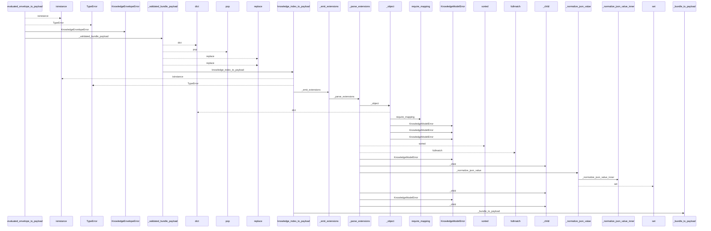
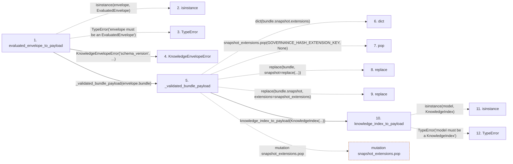

# evaluated_envelope_to_payload

**Entry point:** `evaluated_envelope_to_payload` (`api`)
**Source:** [knowledge_envelope](../modules/knowledge_envelope.md)
**Modules touched:** [concept_identity](../modules/concept_identity.md), [knowledge_envelope](../modules/knowledge_envelope.md), [knowledge_evidence](../modules/knowledge_evidence.md), and 6 more

**Complete modules touched:**

- [concept_identity](../modules/concept_identity.md)
- [knowledge_envelope](../modules/knowledge_envelope.md)
- [knowledge_evidence](../modules/knowledge_evidence.md)
- [knowledge_governance](../modules/knowledge_governance.md)
- [knowledge_graph](../modules/knowledge_graph.md)
- [knowledge_model](../modules/knowledge_model.md)
- [section_ownership](../modules/section_ownership.md)
- [validation](../modules/validation.md)
- [wiki_surface](../modules/wiki_surface.md)

## Call sequence

<!-- Auto-generated from static call edges. Dashed arrows are external or unresolved calls. Reviewed runtime conditions and side effects belong in Behavior. -->

> Call sequence diagram shows 30 of 685 interactions; 655 omitted to keep the visualization within the 30-interaction and generated-diagram limits.

> Trace truncated at the depth limit; deeper calls are omitted.

## Data flow

<!-- Auto-generated static analysis. Treat values and boundaries as best-effort hints, not runtime proof. -->

### Step data

| Step | Inputs | Reads | Writes | Returns |
|---|---|---|---|---|
| `evaluated_envelope_to_payload` | `envelope: EvaluatedEnvelope` | `EvaluatedEnvelope`, `EVALUATED_ENVELOPE_VERSION`, `EVALUATED_ENVELOPE_VERSION`, `INVENTORY_HASH_EXTENSION`, `INVENTORY_HASH_EXTENSION` | - | `{...}` |
| `isinstance` | - | - | - | - |
| `TypeError` | - | - | - | - |
| `KnowledgeEnvelopeError` | - | - | - | - |
| `_validated_bundle_payload` | `bundle: BundleRecord` | `GOVERNANCE_HASH_EXTENSION_KEY`, `KNOWLEDGE_SCHEMA_VERSION`, `KnowledgeModelError` | - | `payload[...]` |
| `dict` | - | - | - | - |
| `pop` | - | - | - | - |
| `replace` | - | - | - | - |
| `replace` | - | - | - | - |
| `knowledge_index_to_payload` | `model: KnowledgeIndex` | `KnowledgeIndex`, `KnowledgeModelError` | - | `_knowledge_index_to_payload_unchecked(...)` |
| `isinstance` | - | - | - | - |
| `TypeError` | - | - | - | - |

### Call data

| From | To | Line | Call |
|---|---|---:|---|
| evaluated_envelope_to_payload | isinstance | 1138 | `isinstance(envelope, EvaluatedEnvelope)` |
| evaluated_envelope_to_payload | TypeError | 1139 | `TypeError('envelope must be an EvaluatedEnvelope')` |
| evaluated_envelope_to_payload | KnowledgeEnvelopeError | 1141 | `KnowledgeEnvelopeError('schema_version', ...)` |
| evaluated_envelope_to_payload | _validated_bundle_payload | 1145 | `_validated_bundle_payload(envelope.bundle)` |
| _validated_bundle_payload | dict | 1927 | `dict(bundle.snapshot.extensions)` |
| _validated_bundle_payload | pop | 1928 | `snapshot_extensions.pop(GOVERNANCE_HASH_EXTENSION_KEY, None)` |
| _validated_bundle_payload | replace | 1929 | `replace(bundle, snapshot=replace(...))` |
| _validated_bundle_payload | replace | 1931 | `replace(bundle.snapshot, extensions=snapshot_extensions)` |
| _validated_bundle_payload | knowledge_index_to_payload | 1937 | `knowledge_index_to_payload(KnowledgeIndex(...))` |
| knowledge_index_to_payload | isinstance | 641 | `isinstance(model, KnowledgeIndex)` |
| knowledge_index_to_payload | TypeError | 642 | `TypeError('model must be a KnowledgeIndex')` |

### Boundary effects

| Kind | Target | Step | Line |
|---|---|---|---:|
| mutation | `snapshot_extensions.pop` | `_validated_bundle_payload` | 1928 |

### Static analysis gaps

| Kind | Step | Target | Line |
|---|---|---|---:|
| unresolved_call | `evaluated_envelope_to_payload` | `isinstance` | 1138 |
| unresolved_call | `evaluated_envelope_to_payload` | `TypeError` | 1139 |
| external_call | `_validated_bundle_payload` | `replace` | 1929 |
| external_call | `_validated_bundle_payload` | `replace` | 1931 |
| unresolved_call | `knowledge_index_to_payload` | `isinstance` | 641 |
| unresolved_call | `knowledge_index_to_payload` | `TypeError` | 642 |
| step_limit | `evaluated_envelope_to_payload` | `first 12 steps` | 0 |
| truncated_flow | `evaluated_envelope_to_payload` | `depth limit` | 0 |

## Behavior

This flow starts at `evaluated_envelope_to_payload` and is classified as `api`. The generated call and data-flow sections are bounded static projections; runtime conditions and side effects require source-level confirmation.
