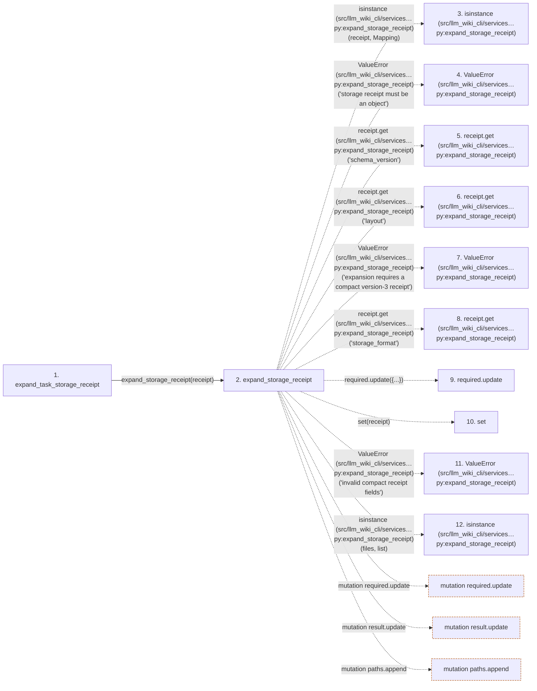

# expand_task_storage_receipt

**Entry point:** `expand_task_storage_receipt` (`api`)
**Source:** [api](../modules/api.md)
**Modules touched:** [api](../modules/api.md), [knowledge_packs](../modules/knowledge_packs.md), [knowledge_storage](../modules/knowledge_storage.md), [storage_receipts](../modules/storage_receipts.md), and 1 more

**Complete modules touched:**

- [api](../modules/api.md)
- [knowledge_packs](../modules/knowledge_packs.md)
- [knowledge_storage](../modules/knowledge_storage.md)
- [storage_receipts](../modules/storage_receipts.md)
- [validation](../modules/validation.md)

## Call sequence

```mermaid
sequenceDiagram
    participant p0 as expand_task_storage_receipt
    participant p1 as expand_storage_receipt
    participant p2 as isinstance (src/llm_wiki_cli/services…py:expand_storage_receipt)
    participant p3 as ValueError (src/llm_wiki_cli/services…py:expand_storage_receipt)
    participant p4 as receipt.get (src/llm_wiki_cli/services…py:expand_storage_receipt)
    participant p5 as required.update
    participant p6 as set
    participant p7 as len (src/llm_wiki_cli/services…py:expand_storage_receipt)
    participant p8 as receipt.items (src/llm_wiki_cli/services…py:expand_storage_receipt)
    participant p9 as result.update
    participant p10 as type (src/llm_wiki_cli/services…py:expand_storage_receipt)
    participant p11 as _decode_hash
    participant p12 as isinstance (src/llm_wiki_cli/services…_receipts.py:_decode_hash)
    participant p13 as re.fullmatch (src/llm_wiki_cli/services…_receipts.py:_decode_hash)
    participant p14 as ValueError (src/llm_wiki_cli/services…_receipts.py:_decode_hash)
    participant p15 as base64.b64decode
    participant p16 as raw.hex
    participant p17 as _encode_hash
    participant p18 as isinstance (src/llm_wiki_cli/services…_receipts.py:_encode_hash)
    participant p19 as commitment.startswith (src/llm_wiki_cli/services…_receipts.py:_encode_hash)
    p0->>p1: expand_storage_receipt
    p1-->>p2: isinstance (src/llm_wiki_cli/services…py:expand_storage_receipt)
    p1-->>p3: ValueError (src/llm_wiki_cli/services…py:expand_storage_receipt)
    p1-->>p4: receipt.get (src/llm_wiki_cli/services…py:expand_storage_receipt)
    p1-->>p4: receipt.get (src/llm_wiki_cli/services…py:expand_storage_receipt)
    p1-->>p3: ValueError (src/llm_wiki_cli/services…py:expand_storage_receipt)
    p1-->>p4: receipt.get (src/llm_wiki_cli/services…py:expand_storage_receipt)
    p1-->>p5: required.update
    p1-->>p6: set
    p1-->>p3: ValueError (src/llm_wiki_cli/services…py:expand_storage_receipt)
    p1-->>p2: isinstance (src/llm_wiki_cli/services…py:expand_storage_receipt)
    p1-->>p7: len (src/llm_wiki_cli/services…py:expand_storage_receipt)
    p1-->>p3: ValueError (src/llm_wiki_cli/services…py:expand_storage_receipt)
    p1-->>p8: receipt.items (src/llm_wiki_cli/services…py:expand_storage_receipt)
    p1-->>p9: result.update
    p1-->>p2: isinstance (src/llm_wiki_cli/services…py:expand_storage_receipt)
    p1-->>p7: len (src/llm_wiki_cli/services…py:expand_storage_receipt)
    p1-->>p10: type (src/llm_wiki_cli/services…py:expand_storage_receipt)
    p1-->>p7: len (src/llm_wiki_cli/services…py:expand_storage_receipt)
    p1-->>p10: type (src/llm_wiki_cli/services…py:expand_storage_receipt)
    p1-->>p3: ValueError (src/llm_wiki_cli/services…py:expand_storage_receipt)
    p1->>p11: _decode_hash
    p11-->>p12: isinstance (src/llm_wiki_cli/services…_receipts.py:_decode_hash)
    p11-->>p13: re.fullmatch (src/llm_wiki_cli/services…_receipts.py:_decode_hash)
    p11-->>p14: ValueError (src/llm_wiki_cli/services…_receipts.py:_decode_hash)
    p11-->>p15: base64.b64decode
    p11-->>p16: raw.hex
    p11->>p17: _encode_hash
    p17-->>p18: isinstance (src/llm_wiki_cli/services…_receipts.py:_encode_hash)
    p17-->>p19: commitment.startswith (src/llm_wiki_cli/services…_receipts.py:_encode_hash)
```

<!-- Auto-generated from static call edges. Dashed arrows are external or unresolved calls. Reviewed runtime conditions and side effects belong in Behavior. -->

> Call sequence diagram shows 30 of 165 interactions; 135 omitted to keep the visualization within the 30-interaction and generated-diagram limits.

## Data flow

<!-- Auto-generated static analysis. Treat values and boundaries as best-effort hints, not runtime proof. -->

### Step data

| Step | Inputs | Reads | Writes | Returns |
|---|---|---|---|---|
| `expand_task_storage_receipt` | `receipt: Mapping[str, Any]` | - | - | `expand_storage_receipt(...)` |
| `expand_storage_receipt` | `receipt: Mapping[str, Any]` | `Mapping`, `RECEIPT_SCHEMA` | `result[...]` | `result` |
| `isinstance (src/llm_wiki_cli/services…py:expand_storage_receipt)` | - | - | - | - |
| `ValueError (src/llm_wiki_cli/services…py:expand_storage_receipt)` | - | - | - | - |
| `receipt.get (src/llm_wiki_cli/services…py:expand_storage_receipt)` | - | - | - | - |
| `receipt.get (src/llm_wiki_cli/services…py:expand_storage_receipt)` | - | - | - | - |
| `ValueError (src/llm_wiki_cli/services…py:expand_storage_receipt)` | - | - | - | - |
| `receipt.get (src/llm_wiki_cli/services…py:expand_storage_receipt)` | - | - | - | - |
| `required.update` | - | - | - | - |
| `set` | - | - | - | - |
| `ValueError (src/llm_wiki_cli/services…py:expand_storage_receipt)` | - | - | - | - |
| `isinstance (src/llm_wiki_cli/services…py:expand_storage_receipt)` | - | - | - | - |

### Call data

| From | To | Line | Call |
|---|---|---:|---|
| expand_task_storage_receipt | expand_storage_receipt | 1349 | `expand_storage_receipt(receipt)` |
| expand_storage_receipt | isinstance (src/llm_wiki_cli/services…py:expand_storage_receipt) | 94 | `isinstance(receipt, Mapping)` |
| expand_storage_receipt | ValueError (src/llm_wiki_cli/services…py:expand_storage_receipt) | 95 | `ValueError('storage receipt must be an object')` |
| expand_storage_receipt | receipt.get (src/llm_wiki_cli/services…py:expand_storage_receipt) | 96 | `receipt.get('schema_version')` |
| expand_storage_receipt | receipt.get (src/llm_wiki_cli/services…py:expand_storage_receipt) | 96 | `receipt.get('layout')` |
| expand_storage_receipt | ValueError (src/llm_wiki_cli/services…py:expand_storage_receipt) | 97 | `ValueError('expansion requires a compact version-3 receipt')` |
| expand_storage_receipt | receipt.get (src/llm_wiki_cli/services…py:expand_storage_receipt) | 98 | `receipt.get('storage_format')` |
| expand_storage_receipt | required.update | 103 | `required.update({...})` |
| expand_storage_receipt | set | 104 | `set(receipt)` |
| expand_storage_receipt | ValueError (src/llm_wiki_cli/services…py:expand_storage_receipt) | 105 | `ValueError('invalid compact receipt fields')` |
| expand_storage_receipt | isinstance (src/llm_wiki_cli/services…py:expand_storage_receipt) | 107 | `isinstance(files, list)` |

### Boundary effects

| Kind | Target | Step | Line |
|---|---|---|---:|
| mutation | `required.update` | `expand_storage_receipt` | 103 |
| mutation | `result.update` | `expand_storage_receipt` | 110 |
| mutation | `paths.append` | `expand_storage_receipt` | 135 |

### Static analysis gaps

| Kind | Step | Target | Line |
|---|---|---|---:|
| external_call | `expand_storage_receipt` | `isinstance` | 94 |
| external_call | `expand_storage_receipt` | `ValueError` | 95 |
| unresolved_call | `expand_storage_receipt` | `receipt.get` | 96 |
| external_call | `expand_storage_receipt` | `ValueError` | 97 |
| unresolved_call | `expand_storage_receipt` | `receipt.get` | 98 |
| external_call | `expand_storage_receipt` | `ValueError` | 105 |
| external_call | `expand_storage_receipt` | `isinstance` | 107 |
| step_limit | `expand_task_storage_receipt` | `first 12 steps` | 0 |

## Behavior

This flow starts at `expand_task_storage_receipt` and is classified as `api`. The generated call and data-flow sections are bounded static projections; runtime conditions and side effects require source-level confirmation.
