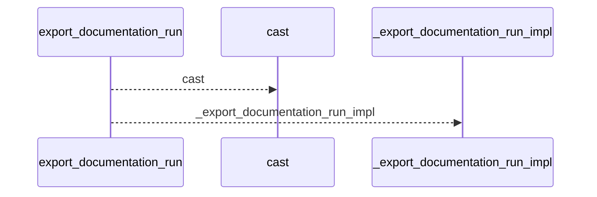
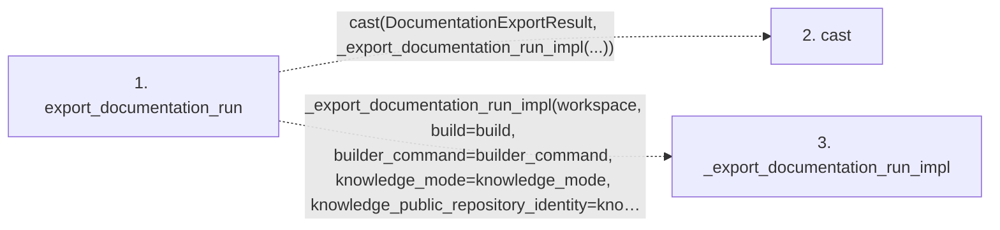

# export_documentation_run

**Entry point:** `export_documentation_run` (`api`)
**Source:** [api](../modules/api.md)
**Modules touched:** [api](../modules/api.md)

## Call sequence

<!-- Auto-generated from static call edges. Dashed arrows are external or unresolved calls. Reviewed runtime conditions and side effects belong in Behavior. -->

## Data flow

<!-- Auto-generated static analysis. Treat values and boundaries as best-effort hints, not runtime proof. -->

### Step data

| Step | Inputs | Reads | Writes | Returns |
|---|---|---|---|---|
| `export_documentation_run` | `workspace: str \| Path`, `build: bool`, `builder_command: Iterable[str] \| None`, `knowledge_mode: str \| None`, `knowledge_public_repository_identity: str \| None` | `DocumentationExportResult` | - | `cast(...)` |
| `cast` | - | - | - | - |
| `_export_documentation_run_impl` | - | - | - | - |

### Call data

| From | To | Line | Call |
|---|---|---:|---|
| export_documentation_run | cast | 1359 | `cast(DocumentationExportResult, _export_documentation_run_impl(...))` |
| export_documentation_run | _export_documentation_run_impl | 1361 | `_export_documentation_run_impl(workspace, build=build, builder_command=builder_command, knowledge_mode=knowledge_mode, knowledge_public_repository_identity=knowledge_public_repository_identity)` |

### Boundary effects

*No boundary effects detected.*

### Static analysis gaps

| Kind | Step | Target | Line |
|---|---|---|---:|
| external_call | `export_documentation_run` | `cast` | 1359 |
| unresolved_call | `export_documentation_run` | `_export_documentation_run_impl` | 1361 |

## Behavior

This flow starts at `export_documentation_run` and is classified as `api`. The generated call and data-flow sections are bounded static projections; runtime conditions and side effects require source-level confirmation.
