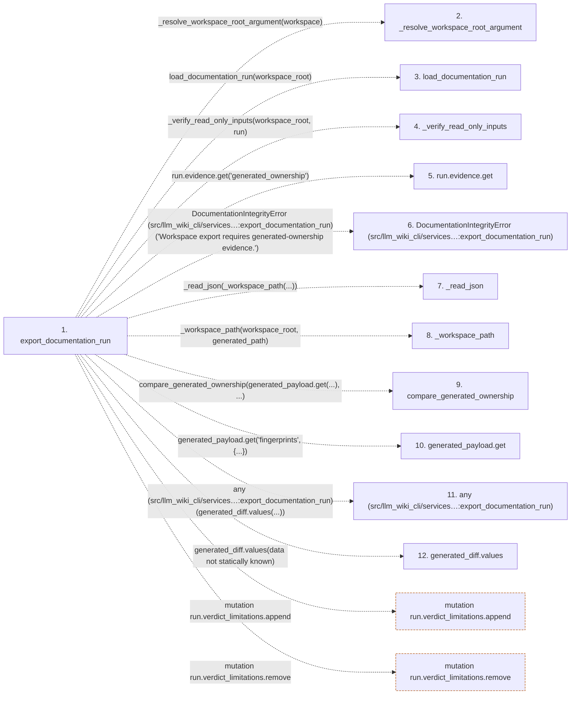

# export_documentation_run

**Entry point:** `export_documentation_run` (`api`)
**Source:** [export](../modules/export.md)
**Modules touched:** [concept_identity](../modules/concept_identity.md), [export](../modules/export.md), [filesystem_guard](../modules/filesystem_guard.md), [io](../modules/io.md), and 7 more

**Complete modules touched:**

- [concept_identity](../modules/concept_identity.md)
- [export](../modules/export.md)
- [filesystem_guard](../modules/filesystem_guard.md)
- [io](../modules/io.md)
- [knowledge_envelope](../modules/knowledge_envelope.md)
- [knowledge_projection](../modules/knowledge_projection.md)
- [site_export](../modules/site_export.md)
- [site_html_check](../modules/site_html_check.md)
- [validation](../modules/validation.md)
- [wiki_media](../modules/wiki_media.md)
- [wiki_surface](../modules/wiki_surface.md)

## Call sequence

```mermaid
sequenceDiagram
    participant p0 as export_documentation_run
    participant p1 as _resolve_workspace_root_argument
    participant p2 as load_documentation_run
    participant p3 as _verify_read_only_inputs
    participant p4 as run.evidence.get
    participant p5 as DocumentationIntegrityError (src/llm_wiki_cli/services…:export_documentation_run)
    participant p6 as _read_json
    participant p7 as _workspace_path
    participant p8 as compare_generated_ownership
    participant p9 as generated_payload.get
    participant p10 as any (src/llm_wiki_cli/services…:export_documentation_run)
    participant p11 as generated_diff.values
    participant p12 as DocumentationTransitionError
    participant p13 as _assert_documentation_export_projection_policy
    participant p14 as str (src/llm_wiki_cli/services…:export_documentation_run)
    participant p15 as _load_documentation_knowledge_projection
    participant p16 as export_site_mirror
    participant p17 as _validate_format
    participant p18 as ', '.join (src/llm_wiki_cli/services…xport.py:_validate_format)
    participant p19 as sorted (src/llm_wiki_cli/services…xport.py:_validate_format)
    participant p20 as SiteExportError
    participant p21 as _validate_file_friendly
    participant p22 as _validate_profile
    participant p23 as ', '.join (src/llm_wiki_cli/services…port.py:_validate_profile)
    participant p24 as sorted (src/llm_wiki_cli/services…port.py:_validate_profile)
    participant p25 as _validate_export_site_name
    participant p26 as site_name.strip (src/llm_wiki_cli/services…validate_export_site_name)
    p0-->>p1: _resolve_workspace_root_argument
    p0-->>p2: load_documentation_run
    p0-->>p3: _verify_read_only_inputs
    p0-->>p4: run.evidence.get
    p0-->>p5: DocumentationIntegrityError (src/llm_wiki_cli/services…:export_documentation_run)
    p0-->>p6: _read_json
    p0-->>p7: _workspace_path
    p0-->>p8: compare_generated_ownership
    p0-->>p9: generated_payload.get
    p0-->>p10: any (src/llm_wiki_cli/services…:export_documentation_run)
    p0-->>p11: generated_diff.values
    p0-->>p5: DocumentationIntegrityError (src/llm_wiki_cli/services…:export_documentation_run)
    p0-->>p12: DocumentationTransitionError
    p0-->>p13: _assert_documentation_export_projection_policy
    p0-->>p14: str (src/llm_wiki_cli/services…:export_documentation_run)
    p0-->>p14: str (src/llm_wiki_cli/services…:export_documentation_run)
    p0-->>p15: _load_documentation_knowledge_projection
    p0->>p16: export_site_mirror
    p16->>p17: _validate_format
    p17-->>p18: ', '.join (src/llm_wiki_cli/services…xport.py:_validate_format)
    p17-->>p19: sorted (src/llm_wiki_cli/services…xport.py:_validate_format)
    p17->>p20: SiteExportError
    p16->>p21: _validate_file_friendly
    p21->>p20: SiteExportError
    p16->>p22: _validate_profile
    p22-->>p23: ', '.join (src/llm_wiki_cli/services…port.py:_validate_profile)
    p22-->>p24: sorted (src/llm_wiki_cli/services…port.py:_validate_profile)
    p22->>p20: SiteExportError
    p16->>p25: _validate_export_site_name
    p25-->>p26: site_name.strip (src/llm_wiki_cli/services…validate_export_site_name)
```

<!-- Auto-generated from static call edges. Dashed arrows are external or unresolved calls. Reviewed runtime conditions and side effects belong in Behavior. -->

> Call sequence diagram shows 30 of 1743 interactions; 1713 omitted to keep the visualization within the 30-interaction and generated-diagram limits.

> Trace truncated at the depth limit; deeper calls are omitted.

## Data flow

<!-- Auto-generated static analysis. Treat values and boundaries as best-effort hints, not runtime proof. -->

### Step data

| Step | Inputs | Reads | Writes | Returns |
|---|---|---|---|---|
| `export_documentation_run` | `workspace: str \| Path`, `build: bool`, `builder_command: Iterable[str] \| None`, `knowledge_mode: str \| None`, `knowledge_public_repository_identity: str \| None` | - | `export_payload[...]`, `run.evidence[...]`, `run.evidence[...]`, `check_payload[...]`, `run.evidence[...]`, `run.evidence[...]` | `final_report` |
| `_resolve_workspace_root_argument` | - | - | - | - |
| `load_documentation_run` | - | - | - | - |
| `_verify_read_only_inputs` | - | - | - | - |
| `run.evidence.get` | - | - | - | - |
| `DocumentationIntegrityError (src/llm_wiki_cli/services…:export_documentation_run)` | - | - | - | - |
| `_read_json` | - | - | - | - |
| `_workspace_path` | - | - | - | - |
| `compare_generated_ownership` | - | - | - | - |
| `generated_payload.get` | - | - | - | - |
| `any (src/llm_wiki_cli/services…:export_documentation_run)` | - | - | - | - |
| `generated_diff.values` | - | - | - | - |

### Call data

| From | To | Line | Call |
|---|---|---:|---|
| export_documentation_run | _resolve_workspace_root_argument | 477 | `_resolve_workspace_root_argument(workspace)` |
| export_documentation_run | load_documentation_run | 478 | `load_documentation_run(workspace_root)` |
| export_documentation_run | _verify_read_only_inputs | 479 | `_verify_read_only_inputs(workspace_root, run)` |
| export_documentation_run | run.evidence.get | 480 | `run.evidence.get('generated_ownership')` |
| export_documentation_run | DocumentationIntegrityError (src/llm_wiki_cli/services…:export_documentation_run) | 482 | `DocumentationIntegrityError('Workspace export requires generated-ownership evidence.')` |
| export_documentation_run | _read_json | 485 | `_read_json(_workspace_path(...))` |
| export_documentation_run | _workspace_path | 485 | `_workspace_path(workspace_root, generated_path)` |
| export_documentation_run | compare_generated_ownership | 486 | `compare_generated_ownership(generated_payload.get(...), ...)` |
| export_documentation_run | generated_payload.get | 487 | `generated_payload.get('fingerprints', {...})` |
| export_documentation_run | any (src/llm_wiki_cli/services…:export_documentation_run) | 490 | `any(generated_diff.values(...))` |
| export_documentation_run | generated_diff.values | 490 | `generated_diff.values(data not statically known)` |

### Boundary effects

| Kind | Target | Step | Line |
|---|---|---|---:|
| mutation | `run.verdict_limitations.append` | `export_documentation_run` | 639 |
| mutation | `run.verdict_limitations.remove` | `export_documentation_run` | 641 |

### Static analysis gaps

| Kind | Step | Target | Line |
|---|---|---|---:|
| unresolved_call | `export_documentation_run` | `_resolve_workspace_root_argument` | 477 |
| unresolved_call | `export_documentation_run` | `load_documentation_run` | 478 |
| unresolved_call | `export_documentation_run` | `_verify_read_only_inputs` | 479 |
| unresolved_call | `export_documentation_run` | `run.evidence.get` | 480 |
| unresolved_call | `export_documentation_run` | `DocumentationIntegrityError` | 482 |
| unresolved_call | `export_documentation_run` | `_read_json` | 485 |
| unresolved_call | `export_documentation_run` | `_workspace_path` | 485 |
| unresolved_call | `export_documentation_run` | `compare_generated_ownership` | 486 |
| unresolved_call | `export_documentation_run` | `generated_payload.get` | 487 |
| unresolved_call | `export_documentation_run` | `any` | 490 |
| unresolved_call | `export_documentation_run` | `generated_diff.values` | 490 |
| step_limit | `export_documentation_run` | `first 12 steps` | 0 |

## Behavior

This flow starts at `export_documentation_run` and is classified as `api`. The generated call and data-flow sections are bounded static projections; runtime conditions and side effects require source-level confirmation.
