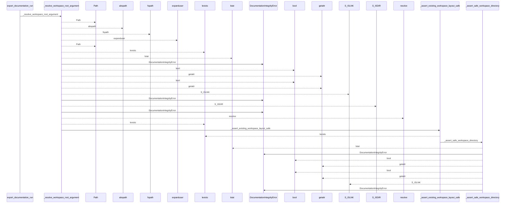
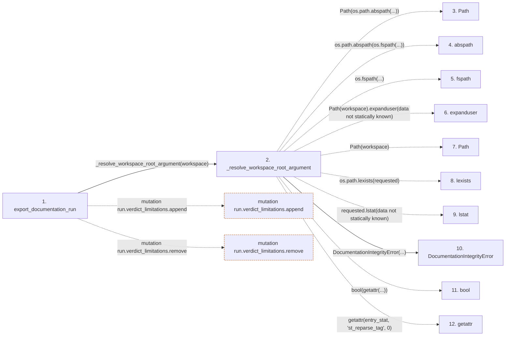

# export_documentation_run

**Entry point:** `export_documentation_run` (`api`)
**Source:** [export](../modules/export.md)
**Modules touched:** [common](../modules/common.md), [concept_identity](../modules/concept_identity.md), [config](../modules/config.md), [documentation_policy](../modules/documentation_policy.md), and 33 more

**Complete modules touched:**

- [common](../modules/common.md)
- [concept_identity](../modules/concept_identity.md)
- [config](../modules/config.md)
- [documentation_policy](../modules/documentation_policy.md)
- [documentation_review](../modules/documentation_review.md)
- [documentation_run_contracts](../modules/documentation_run_contracts.md)
- [documentation_run_schema](../modules/documentation_run_schema.md)
- [documentation_wiki_input](../modules/documentation_wiki_input.md)
- [export](../modules/export.md)
- [filesystem_guard](../modules/filesystem_guard.md)
- [integrity](../modules/integrity.md)
- [io](../modules/io.md)
- [knowledge_artifacts](../modules/knowledge_artifacts.md)
- [knowledge_consumption](../modules/knowledge_consumption.md)
- [knowledge_envelope](../modules/knowledge_envelope.md)
- [knowledge_evidence](../modules/knowledge_evidence.md)
- [knowledge_freshness](../modules/knowledge_freshness.md)
- [knowledge_governance](../modules/knowledge_governance.md)
- [knowledge_graph](../modules/knowledge_graph.md)
- [knowledge_index](../modules/knowledge_index.md)
- [knowledge_loader](../modules/knowledge_loader.md)
- [knowledge_model](../modules/knowledge_model.md)
- [knowledge_observability](../modules/knowledge_observability.md)
- [knowledge_projection](../modules/knowledge_projection.md)
- [knowledge_verification](../modules/knowledge_verification.md)
- [record](../modules/record.md)
- [section_ownership](../modules/section_ownership.md)
- [site_export](../modules/site_export.md)
- [site_html_check](../modules/site_html_check.md)
- [source_selection](../modules/source_selection.md)
- [source_snapshot](../modules/source_snapshot.md)
- [validation](../modules/validation.md)
- [verification_contracts](../modules/verification_contracts.md)
- [verify](../modules/verify.md)
- [wiki_media](../modules/wiki_media.md)
- [wiki_surface](../modules/wiki_surface.md)
- [workspace](../modules/workspace.md)

## Call sequence

<!-- Auto-generated from static call edges. Dashed arrows are external or unresolved calls. Reviewed runtime conditions and side effects belong in Behavior. -->

> Call sequence diagram shows 30 of 4515 interactions; 4485 omitted to keep the visualization within the 30-interaction and generated-diagram limits.

> Trace truncated at the depth limit; deeper calls are omitted.

## Data flow

<!-- Auto-generated static analysis. Treat values and boundaries as best-effort hints, not runtime proof. -->

### Step data

| Step | Inputs | Reads | Writes | Returns |
|---|---|---|---|---|
| `export_documentation_run` | `workspace: str \| Path`, `build: bool`, `builder_command: Iterable[str] \| None`, `knowledge_mode: str \| None`, `knowledge_public_repository_identity: str \| None` | - | `export_payload[...]`, `run.evidence[...]`, `run.evidence[...]`, `check_payload[...]`, `run.evidence[...]`, `run.evidence[...]` | `final_report` |
| `_resolve_workspace_root_argument` | `workspace: str \| Path` | - | - | `resolved` |
| `Path` | - | - | - | - |
| `abspath` | - | - | - | - |
| `fspath` | - | - | - | - |
| `expanduser` | - | - | - | - |
| `Path` | - | - | - | - |
| `lexists` | - | - | - | - |
| `lstat` | - | - | - | - |
| `DocumentationIntegrityError` | - | - | - | - |
| `bool` | - | - | - | - |
| `getattr` | - | - | - | - |

### Call data

| From | To | Line | Call |
|---|---|---:|---|
| export_documentation_run | _resolve_workspace_root_argument | 477 | `_resolve_workspace_root_argument(workspace)` |
| _resolve_workspace_root_argument | Path | 102 | `Path(os.path.abspath(...))` |
| _resolve_workspace_root_argument | abspath | 102 | `os.path.abspath(os.fspath(...))` |
| _resolve_workspace_root_argument | fspath | 102 | `os.fspath(...)` |
| _resolve_workspace_root_argument | expanduser | 102 | `Path(workspace).expanduser(data not statically known)` |
| _resolve_workspace_root_argument | Path | 102 | `Path(workspace)` |
| _resolve_workspace_root_argument | lexists | 103 | `os.path.lexists(requested)` |
| _resolve_workspace_root_argument | lstat | 105 | `requested.lstat(data not statically known)` |
| _resolve_workspace_root_argument | DocumentationIntegrityError | 107 | `DocumentationIntegrityError(...)` |
| _resolve_workspace_root_argument | bool | 110 | `bool(getattr(...))` |
| _resolve_workspace_root_argument | getattr | 110 | `getattr(entry_stat, 'st_reparse_tag', 0)` |

### Boundary effects

| Kind | Target | Step | Line |
|---|---|---|---:|
| mutation | `run.verdict_limitations.append` | `export_documentation_run` | 639 |
| mutation | `run.verdict_limitations.remove` | `export_documentation_run` | 641 |

### Static analysis gaps

| Kind | Step | Target | Line |
|---|---|---|---:|
| unresolved_call | `_resolve_workspace_root_argument` | `os.path.abspath` | 102 |
| unresolved_call | `_resolve_workspace_root_argument` | `os.fspath` | 102 |
| unresolved_call | `_resolve_workspace_root_argument` | `Path(workspace).expanduser` | 102 |
| unresolved_call | `_resolve_workspace_root_argument` | `os.path.lexists` | 103 |
| unresolved_call | `_resolve_workspace_root_argument` | `requested.lstat` | 105 |
| unresolved_call | `_resolve_workspace_root_argument` | `getattr` | 110 |
| step_limit | `export_documentation_run` | `first 12 steps` | 0 |
| truncated_flow | `export_documentation_run` | `depth limit` | 0 |

## Behavior

This flow starts at `export_documentation_run` and is classified as `api`. The generated call and data-flow sections are bounded static projections; runtime conditions and side effects require source-level confirmation.
