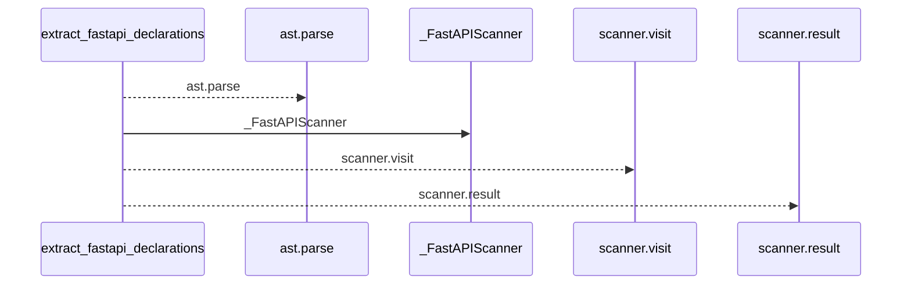
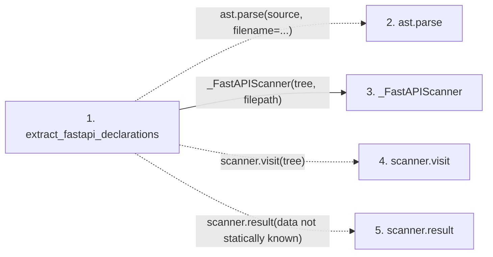

# extract_fastapi_declarations

**Entry point:** `extract_fastapi_declarations` (`api`)
**Source:** [fastapi_contracts](../modules/fastapi_contracts.md)
**Modules touched:** [fastapi_contracts](../modules/fastapi_contracts.md)

## Call sequence

<!-- Auto-generated from static call edges. Dashed arrows are external or unresolved calls. Reviewed runtime conditions and side effects belong in Behavior. -->

## Data flow

<!-- Auto-generated static analysis. Treat values and boundaries as best-effort hints, not runtime proof. -->

### Step data

| Step | Inputs | Reads | Writes | Returns |
|---|---|---|---|---|
| `extract_fastapi_declarations` | `source: str`, `filepath: str` | - | - | `{...}`, `scanner.result(...)` |
| `ast.parse` | - | - | - | - |
| `_FastAPIScanner` | - | - | - | - |
| `scanner.visit` | - | - | - | - |
| `scanner.result` | - | - | - | - |

### Call data

| From | To | Line | Call |
|---|---|---:|---|
| extract_fastapi_declarations | ast.parse | 474 | `ast.parse(source, filename=...)` |
| extract_fastapi_declarations | _FastAPIScanner | 477 | `_FastAPIScanner(tree, filepath)` |
| extract_fastapi_declarations | scanner.visit | 478 | `scanner.visit(tree)` |
| extract_fastapi_declarations | scanner.result | 479 | `scanner.result(data not statically known)` |

### Boundary effects

*No boundary effects detected.*

### Static analysis gaps

| Kind | Step | Target | Line |
|---|---|---|---:|
| external_call | `extract_fastapi_declarations` | `ast.parse` | 474 |
| unresolved_call | `extract_fastapi_declarations` | `scanner.visit` | 478 |
| unresolved_call | `extract_fastapi_declarations` | `scanner.result` | 479 |

## Behavior

This flow starts at `extract_fastapi_declarations` and is classified as `api`. The generated call and data-flow sections are bounded static projections; runtime conditions and side effects require source-level confirmation.
