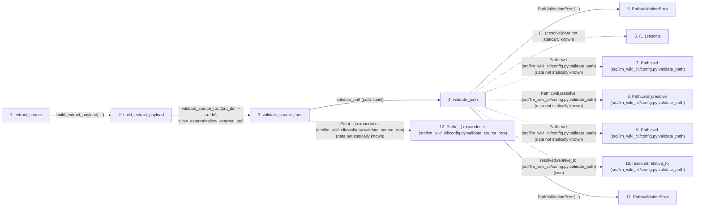

# extract_source

**Entry point:** `extract_source` (`api`)
**Source:** [api](../modules/api.md)
**Modules touched:** [api](../modules/api.md), [api_contracts](../modules/api_contracts.md), [common](../modules/common.md), [config](../modules/config.md), and 21 more

**Complete modules touched:**

- [api](../modules/api.md)
- [api_contracts](../modules/api_contracts.md)
- [common](../modules/common.md)
- [config](../modules/config.md)
- [data_flow](../modules/data_flow.md)
- [dependency_versions](../modules/dependency_versions.md)
- [entrypoints](../modules/entrypoints.md)
- [extraction_jobs](../modules/extraction_jobs.md)
- [extraction_service](../modules/extraction_service.md)
- [filesystem_guard](../modules/filesystem_guard.md)
- [imports](../modules/imports.md)
- [inventory_cache](../modules/inventory_cache.md)
- [io](../modules/io.md)
- [packages](../modules/packages.md)
- [plugins](../modules/plugins.md)
- [progress](../modules/progress.md)
- [python_calls](../modules/python_calls.md)
- [python_contracts](../modules/python_contracts.md)
- [python_imports](../modules/python_imports.md)
- [python_observations](../modules/python_observations.md)
- [resource_diagnostics](../modules/resource_diagnostics.md)
- [services_dependencies](../modules/services_dependencies.md)
- [source_selection](../modules/source_selection.md)
- [source_snapshot](../modules/source_snapshot.md)
- [validation](../modules/validation.md)

## Call sequence

```mermaid
sequenceDiagram
    participant p0 as extract_source
    participant p1 as build_extract_payload
    participant p2 as validate_source_root
    participant p3 as validate_path
    participant p4 as PathValidationError
    participant p5 as (…).resolve
    participant p6 as Path.cwd (src/llm_wiki_cli/config.py:validate_path)
    participant p7 as Path.cwd().resolve (src/llm_wiki_cli/config.py:validate_path)
    participant p8 as resolved.relative_to (src/llm_wiki_cli/config.py:validate_path)
    participant p9 as Path(…).expanduser (src/llm_wiki_cli/config.py:validate_source_root)
    participant p10 as Path (src/llm_wiki_cli/config.py:validate_source_root)
    participant p11 as candidate.is_absolute (src/llm_wiki_cli/config.py:validate_source_root)
    participant p12 as Path.cwd (src/llm_wiki_cli/config.py:validate_source_root)
    participant p13 as candidate.resolve (src/llm_wiki_cli/config.py:validate_source_root)
    participant p14 as resolved.is_dir
    participant p15 as os.path.abspath (src/llm_wiki_cli/config.py:validate_source_root)
    participant p16 as windows_current_user_sid
    participant p17 as WindowsSecurityGuardError
    participant p18 as _current_windows_user_sid
    participant p19 as ctypes.WinDLL (src/llm_wiki_cli/services…_current_windows_user_sid)
    participant p20 as ctypes.POINTER (src/llm_wiki_cli/services…_current_windows_user_sid)
    participant p21 as wintypes.HANDLE (src/llm_wiki_cli/services…_current_windows_user_sid)
    participant p22 as open_process_token
    participant p23 as get_current_process
    p0->>p1: build_extract_payload
    p1->>p2: validate_source_root
    p2->>p3: validate_path
    p3->>p4: PathValidationError
    p3-->>p5: (…).resolve
    p3-->>p6: Path.cwd (src/llm_wiki_cli/config.py:validate_path)
    p3-->>p7: Path.cwd().resolve (src/llm_wiki_cli/config.py:validate_path)
    p3-->>p6: Path.cwd (src/llm_wiki_cli/config.py:validate_path)
    p3-->>p8: resolved.relative_to (src/llm_wiki_cli/config.py:validate_path)
    p3->>p4: PathValidationError
    p2-->>p9: Path(…).expanduser (src/llm_wiki_cli/config.py:validate_source_root)
    p2-->>p10: Path (src/llm_wiki_cli/config.py:validate_source_root)
    p2-->>p11: candidate.is_absolute (src/llm_wiki_cli/config.py:validate_source_root)
    p2-->>p12: Path.cwd (src/llm_wiki_cli/config.py:validate_source_root)
    p2-->>p13: candidate.resolve (src/llm_wiki_cli/config.py:validate_source_root)
    p2->>p4: PathValidationError
    p2-->>p14: resolved.is_dir
    p2->>p4: PathValidationError
    p2-->>p10: Path (src/llm_wiki_cli/config.py:validate_source_root)
    p2-->>p15: os.path.abspath (src/llm_wiki_cli/config.py:validate_source_root)
    p2->>p16: windows_current_user_sid
    p16->>p17: WindowsSecurityGuardError
    p16->>p18: _current_windows_user_sid
    p18-->>p19: ctypes.WinDLL (src/llm_wiki_cli/services…_current_windows_user_sid)
    p18-->>p19: ctypes.WinDLL (src/llm_wiki_cli/services…_current_windows_user_sid)
    p18-->>p20: ctypes.POINTER (src/llm_wiki_cli/services…_current_windows_user_sid)
    p18-->>p20: ctypes.POINTER (src/llm_wiki_cli/services…_current_windows_user_sid)
    p18-->>p21: wintypes.HANDLE (src/llm_wiki_cli/services…_current_windows_user_sid)
    p18-->>p22: open_process_token
    p18-->>p23: get_current_process
```

<!-- Auto-generated from static call edges. Dashed arrows are external or unresolved calls. Reviewed runtime conditions and side effects belong in Behavior. -->

> Call sequence diagram shows 30 of 2594 interactions; 2564 omitted to keep the visualization within the 30-interaction and generated-diagram limits.

> Trace truncated at the depth limit; deeper calls are omitted.

## Data flow

<!-- Auto-generated static analysis. Treat values and boundaries as best-effort hints, not runtime proof. -->

### Step data

| Step | Inputs | Reads | Writes | Returns |
|---|---|---|---|---|
| `extract_source` | `src_dir: str`, `changed: bool`, `summary: bool`, `deep: bool`, `paths: list[str] \| None`, `package: str \| None`, `include_empty: bool`, `allow_external_src: bool` | `PathValidationError`, `extract_cmd`, `ExtractSourceResult` | - | `cast(...)` |
| `build_extract_payload` | `src_dir: str`, `changed: bool`, `summary: bool`, `deep: bool`, `paths: list[str] \| None`, `package_filter: str \| None`, `include_empty: bool`, `helper_cache_dir: str \| None` | `EXTRACT_SCHEMA_VERSION`, `DEFAULT_FLOW_DEPTH`, `EXTRACT_SCHEMA_VERSION` | `empty_output[...]`, `empty_output[...]`, `empty_output[...]`, `empty_output[...]`, `output[...]`, `output[...]`, `output[...]`, `output[...]` | `ExtractPayloadResult(...)`, `ExtractPayloadResult(...)` |
| `validate_source_root` | `path: str`, `label: str`, `allow_external: bool` | `sys`, `os`, `WindowsSecurityGuardError`, `sys` | - | `validate_path(...)`, `resolved` |
| `validate_path` | `path: str`, `label: str` | - | - | `resolved` |
| `PathValidationError` | - | - | - | - |
| `(…).resolve` | - | - | - | - |
| `Path.cwd (src/llm_wiki_cli/config.py:validate_path)` | - | - | - | - |
| `Path.cwd().resolve (src/llm_wiki_cli/config.py:validate_path)` | - | - | - | - |
| `Path.cwd (src/llm_wiki_cli/config.py:validate_path)` | - | - | - | - |
| `resolved.relative_to (src/llm_wiki_cli/config.py:validate_path)` | - | - | - | - |
| `PathValidationError` | - | - | - | - |
| `Path(…).expanduser (src/llm_wiki_cli/config.py:validate_source_root)` | - | - | - | - |

### Call data

| From | To | Line | Call |
|---|---|---:|---|
| extract_source | build_extract_payload | 704 | `extract_cmd.build_extract_payload(src_dir, changed=changed, summary=summary, deep=deep, paths=paths, package_filter=package, include_empty=include_empty, allow_external_src=allow_external_src, read_only=read_only, source_selection=source_selection)` |
| build_extract_payload | validate_source_root | 1985 | `validate_source_root(src_dir, '--src-dir', allow_external=allow_external_src)` |
| validate_source_root | validate_path | 158 | `validate_path(path, label)` |
| validate_path | PathValidationError | 132 | `PathValidationError(...)` |
| validate_path | (…).resolve | 133 | `(Path.cwd() / path).resolve(data not statically known)` |
| validate_path | Path.cwd (src/llm_wiki_cli/config.py:validate_path) | 133 | `Path.cwd(data not statically known)` |
| validate_path | Path.cwd().resolve (src/llm_wiki_cli/config.py:validate_path) | 134 | `Path.cwd().resolve(data not statically known)` |
| validate_path | Path.cwd (src/llm_wiki_cli/config.py:validate_path) | 134 | `Path.cwd(data not statically known)` |
| validate_path | resolved.relative_to (src/llm_wiki_cli/config.py:validate_path) | 136 | `resolved.relative_to(cwd)` |
| validate_path | PathValidationError | 138 | `PathValidationError(...)` |
| validate_source_root | Path(…).expanduser (src/llm_wiki_cli/config.py:validate_source_root) | 161 | `Path(path).expanduser(data not statically known)` |

### Boundary effects

*No boundary effects detected.*

### Static analysis gaps

| Kind | Step | Target | Line |
|---|---|---|---:|
| unresolved_call | `validate_path` | `(Path.cwd() / path).resolve` | 133 |
| external_call | `validate_path` | `Path.cwd` | 133 |
| unresolved_call | `validate_path` | `Path.cwd().resolve` | 134 |
| external_call | `validate_path` | `Path.cwd` | 134 |
| unresolved_call | `validate_path` | `resolved.relative_to` | 136 |
| unresolved_call | `validate_source_root` | `Path(path).expanduser` | 161 |
| step_limit | `extract_source` | `first 12 steps` | 0 |
| truncated_flow | `extract_source` | `depth limit` | 0 |

## Behavior

Returns the stable extraction payload directly instead of printing it. The API
supports changed, summary, deep, path, package, and source-selection controls
and defaults to a read-only source boundary. It maps invalid options, path
policy failures, and extractor/workspace failures to distinct public API error
types so callers need not parse command output.
