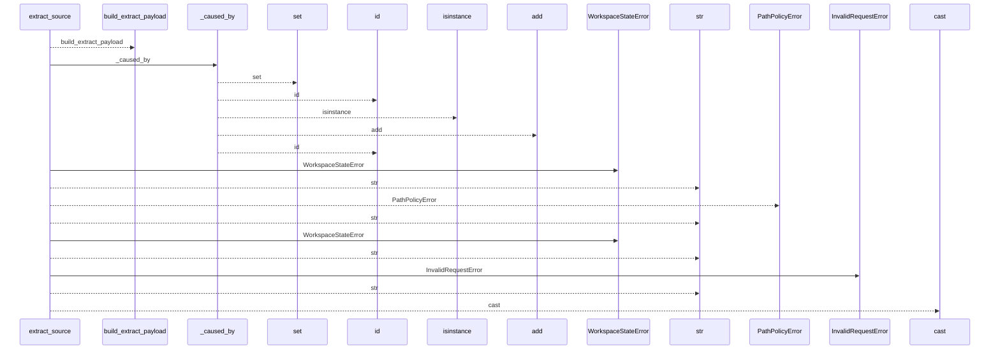
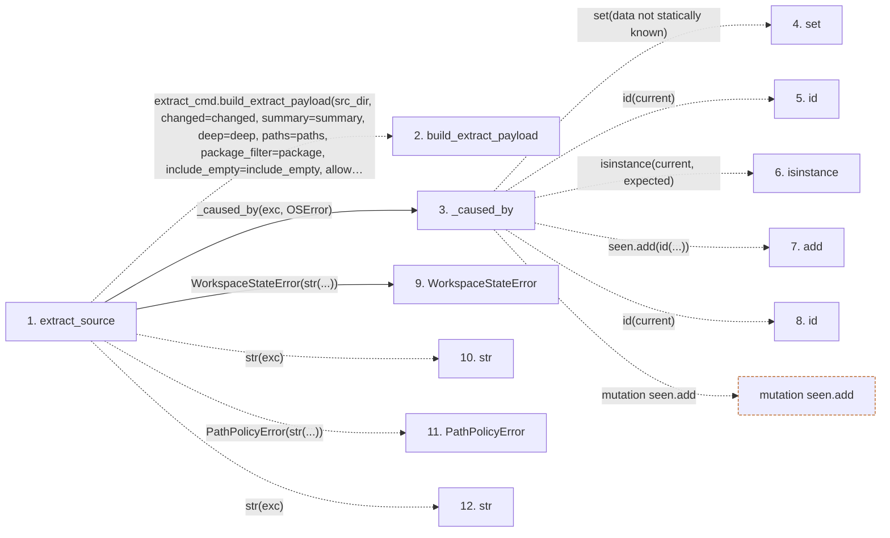

# extract_source

**Entry point:** `extract_source` (`api`)
**Source:** [api](../modules/api.md)
**Modules touched:** [api](../modules/api.md)

## Call sequence

<!-- Auto-generated from static call edges. Dashed arrows are external or unresolved calls. Reviewed runtime conditions and side effects belong in Behavior. -->

## Data flow

<!-- Auto-generated static analysis. Treat values and boundaries as best-effort hints, not runtime proof. -->

### Step data

| Step | Inputs | Reads | Writes | Returns |
|---|---|---|---|---|
| `extract_source` | `src_dir: str`, `changed: bool`, `summary: bool`, `deep: bool`, `paths: list[str] \| None`, `package: str \| None`, `include_empty: bool`, `allow_external_src: bool` | `PathValidationError`, `extract_cmd`, `ExtractSourceResult` | - | `cast(...)` |
| `build_extract_payload` | - | - | - | - |
| `_caused_by` | `exc: BaseException`, `expected: type[BaseException]` | - | - | `True`, `False` |
| `set` | - | - | - | - |
| `id` | - | - | - | - |
| `isinstance` | - | - | - | - |
| `add` | - | - | - | - |
| `id` | - | - | - | - |
| `WorkspaceStateError` | - | - | - | - |
| `str` | - | - | - | - |
| `PathPolicyError` | - | - | - | - |
| `str` | - | - | - | - |

### Call data

| From | To | Line | Call |
|---|---|---:|---|
| extract_source | build_extract_payload | 595 | `extract_cmd.build_extract_payload(src_dir, changed=changed, summary=summary, deep=deep, paths=paths, package_filter=package, include_empty=include_empty, allow_external_src=allow_external_src, read_only=read_only, source_selection=source_selection)` |
| extract_source | _caused_by | 608 | `_caused_by(exc, OSError)` |
| _caused_by | set | 382 | `set(data not statically known)` |
| _caused_by | id | 383 | `id(current)` |
| _caused_by | isinstance | 384 | `isinstance(current, expected)` |
| _caused_by | add | 386 | `seen.add(id(...))` |
| _caused_by | id | 386 | `id(current)` |
| extract_source | WorkspaceStateError | 609 | `WorkspaceStateError(str(...))` |
| extract_source | str | 609 | `str(exc)` |
| extract_source | PathPolicyError | 610 | `PathPolicyError(str(...))` |
| extract_source | str | 610 | `str(exc)` |

### Boundary effects

| Kind | Target | Step | Line |
|---|---|---|---:|
| mutation | `seen.add` | `_caused_by` | 386 |

### Static analysis gaps

| Kind | Step | Target | Line |
|---|---|---|---:|
| external_call | `extract_source` | `extract_cmd.build_extract_payload` | 595 |
| unresolved_call | `_caused_by` | `id` | 383 |
| unresolved_call | `_caused_by` | `isinstance` | 384 |
| unresolved_call | `extract_source` | `PathPolicyError` | 610 |
| step_limit | `extract_source` | `first 12 steps` | 0 |

## Behavior

Returns the stable extraction payload directly instead of printing it. The API
supports changed, summary, deep, path, package, and source-selection controls
and defaults to a read-only source boundary. It maps invalid options, path
policy failures, and extractor/workspace failures to distinct public API error
types so callers need not parse command output.
