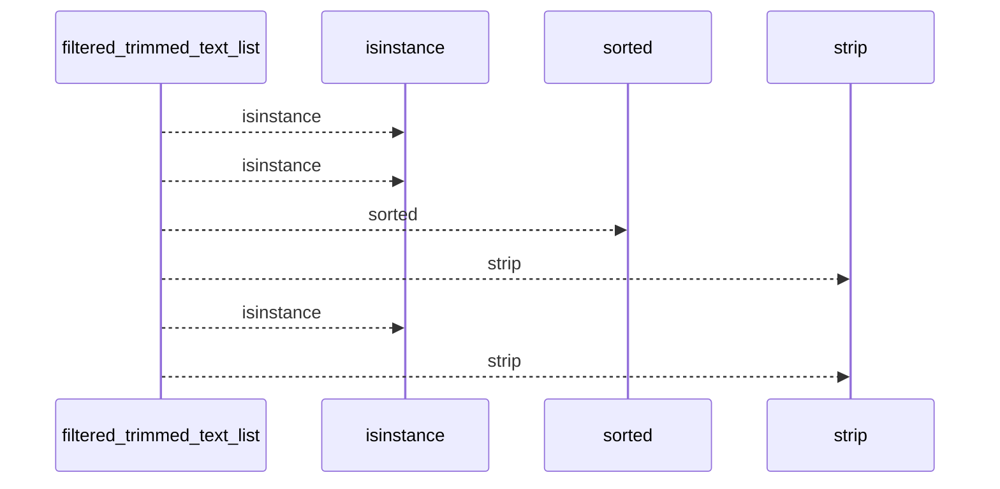
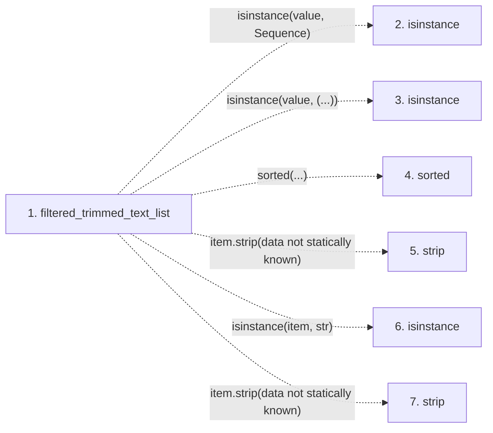

# filtered_trimmed_text_list

**Entry point:** `filtered_trimmed_text_list` (`api`)
**Source:** [validation](../modules/validation.md)
**Modules touched:** [validation](../modules/validation.md)

## Call sequence

<!-- Auto-generated from static call edges. Dashed arrows are external or unresolved calls. Reviewed runtime conditions and side effects belong in Behavior. -->

## Data flow

<!-- Auto-generated static analysis. Treat values and boundaries as best-effort hints, not runtime proof. -->

### Step data

| Step | Inputs | Reads | Writes | Returns |
|---|---|---|---|---|
| `filtered_trimmed_text_list` | `value: object`, `limit: int \| None` | `Sequence` | - | `[...]`, `...` |
| `isinstance` | - | - | - | - |
| `isinstance` | - | - | - | - |
| `sorted` | - | - | - | - |
| `strip` | - | - | - | - |
| `isinstance` | - | - | - | - |
| `strip` | - | - | - | - |

### Call data

| From | To | Line | Call |
|---|---|---:|---|
| filtered_trimmed_text_list | isinstance | 936 | `isinstance(value, Sequence)` |
| filtered_trimmed_text_list | isinstance | 936 | `isinstance(value, (...))` |
| filtered_trimmed_text_list | sorted | 938 | `sorted(...)` |
| filtered_trimmed_text_list | strip | 939 | `item.strip(data not statically known)` |
| filtered_trimmed_text_list | isinstance | 939 | `isinstance(item, str)` |
| filtered_trimmed_text_list | strip | 939 | `item.strip(data not statically known)` |

### Boundary effects

*No boundary effects detected.*

### Static analysis gaps

| Kind | Step | Target | Line |
|---|---|---|---:|
| unresolved_call | `filtered_trimmed_text_list` | `isinstance` | 936 |
| unresolved_call | `filtered_trimmed_text_list` | `sorted` | 938 |
| unresolved_call | `filtered_trimmed_text_list` | `item.strip` | 939 |
| unresolved_call | `filtered_trimmed_text_list` | `isinstance` | 939 |

## Behavior

This flow starts at `filtered_trimmed_text_list` and is classified as `api`. The generated call and data-flow sections are bounded static projections; runtime conditions and side effects require source-level confirmation.
