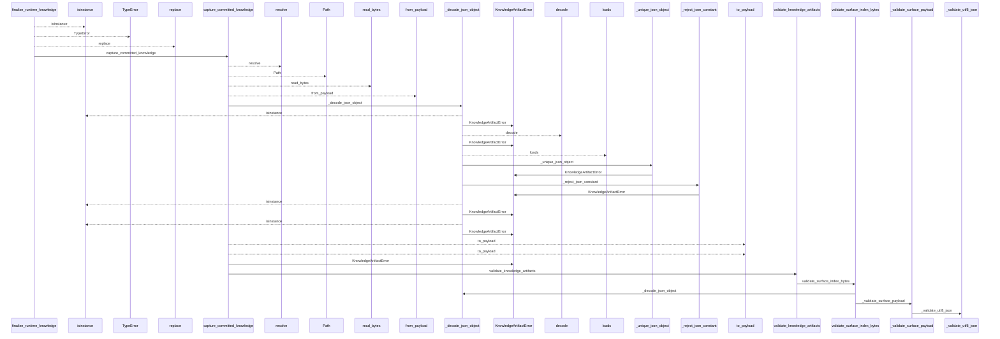
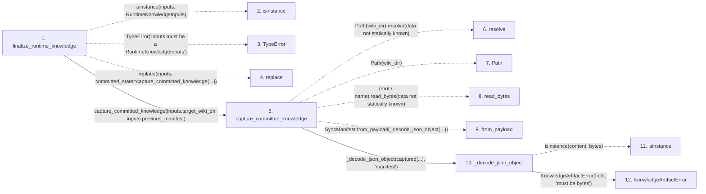

# finalize_runtime_knowledge

**Entry point:** `finalize_runtime_knowledge` (`api`)
**Source:** [knowledge_orchestration](../modules/knowledge_orchestration.md)
**Modules touched:** [concept_identity](../modules/concept_identity.md), [immutable](../modules/immutable.md), [infrastructure_sync](../modules/infrastructure_sync.md), [io](../modules/io.md), and 19 more

**Complete modules touched:**

- [concept_identity](../modules/concept_identity.md)
- [immutable](../modules/immutable.md)
- [infrastructure_sync](../modules/infrastructure_sync.md)
- [io](../modules/io.md)
- [knowledge_artifacts](../modules/knowledge_artifacts.md)
- [knowledge_envelope](../modules/knowledge_envelope.md)
- [knowledge_evidence](../modules/knowledge_evidence.md)
- [knowledge_generation](../modules/knowledge_generation.md)
- [knowledge_governance](../modules/knowledge_governance.md)
- [knowledge_graph](../modules/knowledge_graph.md)
- [knowledge_index](../modules/knowledge_index.md)
- [knowledge_links](../modules/knowledge_links.md)
- [knowledge_model](../modules/knowledge_model.md)
- [knowledge_orchestration](../modules/knowledge_orchestration.md)
- [knowledge_reuse](../modules/knowledge_reuse.md)
- [markdown_sections](../modules/markdown_sections.md)
- [progress](../modules/progress.md)
- [section_ownership](../modules/section_ownership.md)
- [source_selection](../modules/source_selection.md)
- [sync_manifest](../modules/sync_manifest.md)
- [validation](../modules/validation.md)
- [wiki_media](../modules/wiki_media.md)
- [wiki_surface](../modules/wiki_surface.md)

## Call sequence

<!-- Auto-generated from static call edges. Dashed arrows are external or unresolved calls. Reviewed runtime conditions and side effects belong in Behavior. -->

> Call sequence diagram shows 30 of 1993 interactions; 1963 omitted to keep the visualization within the 30-interaction and generated-diagram limits.

> Trace truncated at the depth limit; deeper calls are omitted.

## Data flow

<!-- Auto-generated static analysis. Treat values and boundaries as best-effort hints, not runtime proof. -->

### Step data

| Step | Inputs | Reads | Writes | Returns |
|---|---|---|---|---|
| `finalize_runtime_knowledge` | `inputs: RuntimeKnowledgeInputs`, `dry_run: bool`, `fault_injector: FaultInjector \| None` | `RuntimeKnowledgeInputs`, `GOVERNANCE_FILENAME`, `GOVERNANCE_FILENAME`, `GOVERNANCE_FILENAME`, `GOVERNANCE_FILENAME`, `GOVERNANCE_FILENAME` | - | `_commit_runtime_knowledge(...)`, `_commit_runtime_knowledge(...)`, `_commit_runtime_knowledge(...)` |
| `isinstance` | - | - | - | - |
| `TypeError` | - | - | - | - |
| `replace` | - | - | - | - |
| `capture_committed_knowledge` | `wiki_dir: str \| Path`, `manifest: SyncManifest \| None` | `SURFACE_INDEX_FILENAME`, `KNOWLEDGE_INDEX_FILENAME`, `MANIFEST_FILENAME`, `MANIFEST_FILENAME`, `SURFACE_INDEX_FILENAME`, `KNOWLEDGE_INDEX_FILENAME`, `KnowledgeArtifactError`, `_COMMITTED_STATE_TOKEN` | `captured[...]`, `captured[...]` | `state` |
| `resolve` | - | - | - | - |
| `Path` | - | - | - | - |
| `read_bytes` | - | - | - | - |
| `from_payload` | - | - | - | - |
| `_decode_json_object` | `content: bytes`, `field: str` | `KnowledgeArtifactError`, `Mapping` | - | `value` |
| `isinstance` | - | - | - | - |
| `KnowledgeArtifactError` | - | - | - | - |

### Call data

| From | To | Line | Call |
|---|---|---:|---|
| finalize_runtime_knowledge | isinstance | 769 | `isinstance(inputs, RuntimeKnowledgeInputs)` |
| finalize_runtime_knowledge | TypeError | 770 | `TypeError('inputs must be a RuntimeKnowledgeInputs')` |
| finalize_runtime_knowledge | replace | 772 | `replace(inputs, committed_state=capture_committed_knowledge(...))` |
| finalize_runtime_knowledge | capture_committed_knowledge | 774 | `capture_committed_knowledge(inputs.target_wiki_dir, inputs.previous_manifest)` |
| capture_committed_knowledge | resolve | 226 | `Path(wiki_dir).resolve(data not statically known)` |
| capture_committed_knowledge | Path | 226 | `Path(wiki_dir)` |
| capture_committed_knowledge | read_bytes | 230 | `(root / name).read_bytes(data not statically known)` |
| capture_committed_knowledge | from_payload | 237 | `SyncManifest.from_payload(_decode_json_object(...))` |
| capture_committed_knowledge | _decode_json_object | 238 | `_decode_json_object(captured[...], 'manifest')` |
| _decode_json_object | isinstance | 574 | `isinstance(content, bytes)` |
| _decode_json_object | KnowledgeArtifactError | 575 | `KnowledgeArtifactError(field, 'must be bytes')` |

### Boundary effects

*No boundary effects detected.*

### Static analysis gaps

| Kind | Step | Target | Line |
|---|---|---|---:|
| unresolved_call | `finalize_runtime_knowledge` | `isinstance` | 769 |
| unresolved_call | `finalize_runtime_knowledge` | `TypeError` | 770 |
| external_call | `finalize_runtime_knowledge` | `replace` | 772 |
| unresolved_call | `capture_committed_knowledge` | `Path(wiki_dir).resolve` | 226 |
| unresolved_call | `capture_committed_knowledge` | `(root / name).read_bytes` | 230 |
| external_call | `capture_committed_knowledge` | `SyncManifest.from_payload` | 237 |
| unresolved_call | `_decode_json_object` | `isinstance` | 574 |
| step_limit | `finalize_runtime_knowledge` | `first 12 steps` | 0 |
| truncated_flow | `finalize_runtime_knowledge` | `depth limit` | 0 |

## Behavior

This flow starts at `finalize_runtime_knowledge` and is classified as `api`. The generated call and data-flow sections are bounded static projections; runtime conditions and side effects require source-level confirmation.
