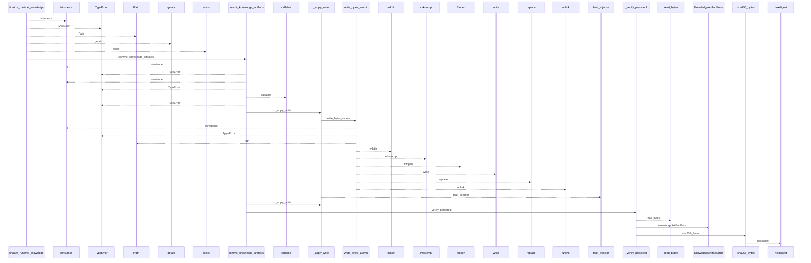
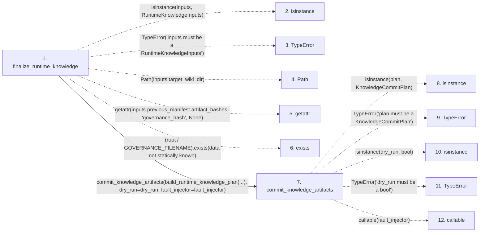

# finalize_runtime_knowledge

**Entry point:** `finalize_runtime_knowledge` (`api`)
**Source:** [knowledge_orchestration](../modules/knowledge_orchestration.md)
**Modules touched:** [concept_identity](../modules/concept_identity.md), [infrastructure_sync](../modules/infrastructure_sync.md), [io](../modules/io.md), [knowledge_artifacts](../modules/knowledge_artifacts.md), and 15 more

**Complete modules touched:**

- [concept_identity](../modules/concept_identity.md)
- [infrastructure_sync](../modules/infrastructure_sync.md)
- [io](../modules/io.md)
- [knowledge_artifacts](../modules/knowledge_artifacts.md)
- [knowledge_envelope](../modules/knowledge_envelope.md)
- [knowledge_evidence](../modules/knowledge_evidence.md)
- [knowledge_generation](../modules/knowledge_generation.md)
- [knowledge_governance](../modules/knowledge_governance.md)
- [knowledge_graph](../modules/knowledge_graph.md)
- [knowledge_index](../modules/knowledge_index.md)
- [knowledge_links](../modules/knowledge_links.md)
- [knowledge_model](../modules/knowledge_model.md)
- [knowledge_orchestration](../modules/knowledge_orchestration.md)
- [section_ownership](../modules/section_ownership.md)
- [source_selection](../modules/source_selection.md)
- [sync_manifest](../modules/sync_manifest.md)
- [validation](../modules/validation.md)
- [wiki_media](../modules/wiki_media.md)
- [wiki_surface](../modules/wiki_surface.md)

## Call sequence

<!-- Auto-generated from static call edges. Dashed arrows are external or unresolved calls. Reviewed runtime conditions and side effects belong in Behavior. -->

> Call sequence diagram shows 30 of 1161 interactions; 1131 omitted to keep the visualization within the 30-interaction and generated-diagram limits.

> Trace truncated at the depth limit; deeper calls are omitted.

## Data flow

<!-- Auto-generated static analysis. Treat values and boundaries as best-effort hints, not runtime proof. -->

### Step data

| Step | Inputs | Reads | Writes | Returns |
|---|---|---|---|---|
| `finalize_runtime_knowledge` | `inputs: RuntimeKnowledgeInputs`, `dry_run: bool`, `fault_injector: FaultInjector \| None` | `RuntimeKnowledgeInputs`, `GOVERNANCE_FILENAME`, `GOVERNANCE_FILENAME`, `GOVERNANCE_FILENAME`, `GOVERNANCE_FILENAME`, `GOVERNANCE_FILENAME` | - | `commit_knowledge_artifacts(...)`, `commit_knowledge_artifacts(...)`, `commit_knowledge_artifacts(...)` |
| `isinstance` | - | - | - | - |
| `TypeError` | - | - | - | - |
| `Path` | - | - | - | - |
| `getattr` | - | - | - | - |
| `exists` | - | - | - | - |
| `commit_knowledge_artifacts` | `plan: KnowledgeCommitPlan`, `dry_run: bool`, `fault_injector: FaultInjector \| None` | `KnowledgeCommitPlan`, `CommitStage`, `CommitStage`, `CommitStage` | - | `KnowledgeCommitResult(...)` |
| `isinstance` | - | - | - | - |
| `TypeError` | - | - | - | - |
| `isinstance` | - | - | - | - |
| `TypeError` | - | - | - | - |
| `callable` | - | - | - | - |

### Call data

| From | To | Line | Call |
|---|---|---:|---|
| finalize_runtime_knowledge | isinstance | 648 | `isinstance(inputs, RuntimeKnowledgeInputs)` |
| finalize_runtime_knowledge | TypeError | 649 | `TypeError('inputs must be a RuntimeKnowledgeInputs')` |
| finalize_runtime_knowledge | Path | 650 | `Path(inputs.target_wiki_dir)` |
| finalize_runtime_knowledge | getattr | 652 | `getattr(inputs.previous_manifest.artifact_hashes, 'governance_hash', None)` |
| finalize_runtime_knowledge | exists | 661 | `(root / GOVERNANCE_FILENAME).exists(data not statically known)` |
| finalize_runtime_knowledge | commit_knowledge_artifacts | 665 | `commit_knowledge_artifacts(build_runtime_knowledge_plan(...), dry_run=dry_run, fault_injector=fault_injector)` |
| commit_knowledge_artifacts | isinstance | 405 | `isinstance(plan, KnowledgeCommitPlan)` |
| commit_knowledge_artifacts | TypeError | 406 | `TypeError('plan must be a KnowledgeCommitPlan')` |
| commit_knowledge_artifacts | isinstance | 407 | `isinstance(dry_run, bool)` |
| commit_knowledge_artifacts | TypeError | 408 | `TypeError('dry_run must be a bool')` |
| commit_knowledge_artifacts | callable | 409 | `callable(fault_injector)` |

### Boundary effects

*No boundary effects detected.*

### Static analysis gaps

| Kind | Step | Target | Line |
|---|---|---|---:|
| unresolved_call | `finalize_runtime_knowledge` | `isinstance` | 648 |
| unresolved_call | `finalize_runtime_knowledge` | `TypeError` | 649 |
| unresolved_call | `finalize_runtime_knowledge` | `getattr` | 652 |
| unresolved_call | `finalize_runtime_knowledge` | `(root / GOVERNANCE_FILENAME).exists` | 661 |
| unresolved_call | `commit_knowledge_artifacts` | `isinstance` | 405 |
| unresolved_call | `commit_knowledge_artifacts` | `TypeError` | 406 |
| unresolved_call | `commit_knowledge_artifacts` | `isinstance` | 407 |
| unresolved_call | `commit_knowledge_artifacts` | `TypeError` | 408 |
| unresolved_call | `commit_knowledge_artifacts` | `callable` | 409 |
| step_limit | `finalize_runtime_knowledge` | `first 12 steps` | 0 |
| truncated_flow | `finalize_runtime_knowledge` | `depth limit` | 0 |

## Behavior

This flow starts at `finalize_runtime_knowledge` and is classified as `api`. The generated call and data-flow sections are bounded static projections; runtime conditions and side effects require source-level confirmation.
