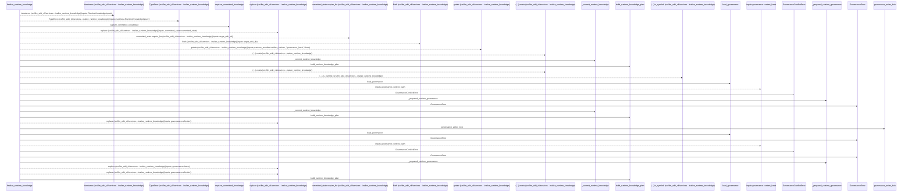
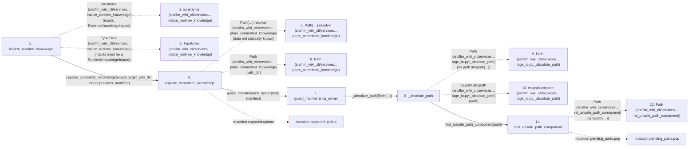

# finalize_runtime_knowledge

**Entry point:** `finalize_runtime_knowledge` (`api`)
**Source:** [knowledge_orchestration](../modules/knowledge_orchestration.md)
**Modules touched:** [analysis_capture](../modules/analysis_capture.md), [analysis_compatibility](../modules/analysis_compatibility.md), [common](../modules/common.md), [concept_identity](../modules/concept_identity.md), and 37 more

**Complete modules touched:**

- [analysis_capture](../modules/analysis_capture.md)
- [analysis_compatibility](../modules/analysis_compatibility.md)
- [common](../modules/common.md)
- [concept_identity](../modules/concept_identity.md)
- [config](../modules/config.md)
- [filesystem_guard](../modules/filesystem_guard.md)
- [immutable](../modules/immutable.md)
- [implementation_evidence](../modules/implementation_evidence.md)
- [infrastructure_sync](../modules/infrastructure_sync.md)
- [io](../modules/io.md)
- [knowledge_artifacts](../modules/knowledge_artifacts.md)
- [knowledge_envelope](../modules/knowledge_envelope.md)
- [knowledge_evidence](../modules/knowledge_evidence.md)
- [knowledge_generation](../modules/knowledge_generation.md)
- [knowledge_governance](../modules/knowledge_governance.md)
- [knowledge_graph](../modules/knowledge_graph.md)
- [knowledge_index](../modules/knowledge_index.md)
- [knowledge_links](../modules/knowledge_links.md)
- [knowledge_model](../modules/knowledge_model.md)
- [knowledge_orchestration](../modules/knowledge_orchestration.md)
- [knowledge_packs](../modules/knowledge_packs.md)
- [knowledge_reuse](../modules/knowledge_reuse.md)
- [knowledge_storage](../modules/knowledge_storage.md)
- [knowledge_storage_io](../modules/knowledge_storage_io.md)
- [maintenance_evidence](../modules/maintenance_evidence.md)
- [maintenance_projection](../modules/maintenance_projection.md)
- [maintenance_protocol](../modules/maintenance_protocol.md)
- [maintenance_shapes](../modules/maintenance_shapes.md)
- [maintenance_state](../modules/maintenance_state.md)
- [manifest_storage](../modules/manifest_storage.md)
- [markdown_sections](../modules/markdown_sections.md)
- [progress](../modules/progress.md)
- [python_implementation](../modules/python_implementation.md)
- [section_ownership](../modules/section_ownership.md)
- [source_selection](../modules/source_selection.md)
- [source_snapshot](../modules/source_snapshot.md)
- [sync_manifest](../modules/sync_manifest.md)
- [validation](../modules/validation.md)
- [wiki_media](../modules/wiki_media.md)
- [wiki_surface](../modules/wiki_surface.md)
- [wiki_write_basis](../modules/wiki_write_basis.md)

## Call sequence

> Static overview in presentation order, not runtime execution order. Arrows retain captured callers; siblings are shown before deeper helper detail.

<!-- Auto-generated from static call edges. Dashed arrows are external or unresolved calls. Reviewed runtime conditions and side effects belong in Behavior. -->

```mermaid
sequenceDiagram
    participant p0 as finalize_runtime_knowledge
    participant p1 as isinstance (src/llm_wiki_cli/services…inalize_runtime_knowledge)
    participant p2 as TypeError (src/llm_wiki_cli/services…inalize_runtime_knowledge)
    participant p3 as capture_committed_knowledge
    participant p4 as replace (src/llm_wiki_cli/services…inalize_runtime_knowledge)
    participant p5 as committed_state.require_for (src/llm_wiki_cli/services…inalize_runtime_knowledge)
    participant p6 as Path (src/llm_wiki_cli/services…inalize_runtime_knowledge)
    participant p7 as getattr (src/llm_wiki_cli/services…inalize_runtime_knowledge)
    participant p8 as (…).exists (src/llm_wiki_cli/services…inalize_runtime_knowledge)
    participant p9 as _commit_runtime_knowledge
    participant p10 as build_runtime_knowledge_plan
    participant p11 as (…).is_symlink (src/llm_wiki_cli/services…inalize_runtime_knowledge)
    participant p12 as load_governance
    participant p13 as inputs.governance.content_hash
    participant p14 as GovernanceConflictError
    participant p15 as _prepared_runtime_governance
    participant p16 as GovernanceError
    participant p17 as governance_writer_lock
    p0-->>p1: isinstance (src/llm_wiki_cli/services…inalize_runtime_knowledge)(inputs, RuntimeKnowledgeInputs)
    p0-->>p2: TypeError (src/llm_wiki_cli/services…inalize_runtime_knowledge)('inputs must be a RuntimeKnowledgeInputs')
    p0->>p3: capture_committed_knowledge
    p0-->>p4: replace (src/llm_wiki_cli/services…inalize_runtime_knowledge)(inputs, committed_state=committed_state)
    p0-->>p5: committed_state.require_for (src/llm_wiki_cli/services…inalize_runtime_knowledge)(inputs.target_wiki_dir)
    p0-->>p6: Path (src/llm_wiki_cli/services…inalize_runtime_knowledge)(inputs.target_wiki_dir)
    p0-->>p7: getattr (src/llm_wiki_cli/services…inalize_runtime_knowledge)(inputs.previous_manifest.artifact_hashes, 'governance_hash', None)
    p0-->>p8: (…).exists (src/llm_wiki_cli/services…inalize_runtime_knowledge)
    p0->>p9: _commit_runtime_knowledge
    p0->>p10: build_runtime_knowledge_plan
    p0-->>p8: (…).exists (src/llm_wiki_cli/services…inalize_runtime_knowledge)
    p0-->>p11: (…).is_symlink (src/llm_wiki_cli/services…inalize_runtime_knowledge)
    p0->>p12: load_governance
    p0-->>p13: inputs.governance.content_hash
    p0->>p14: GovernanceConflictError
    p0->>p15: _prepared_runtime_governance
    p0->>p16: GovernanceError
    p0->>p9: _commit_runtime_knowledge
    p0->>p10: build_runtime_knowledge_plan
    p0-->>p4: replace (src/llm_wiki_cli/services…inalize_runtime_knowledge)(inputs, governance=effective)
    p0->>p17: governance_writer_lock
    p0->>p12: load_governance
    p0->>p16: GovernanceError
    p0-->>p13: inputs.governance.content_hash
    p0->>p14: GovernanceConflictError
    p0->>p16: GovernanceError
    p0->>p15: _prepared_runtime_governance
    p0-->>p4: replace (src/llm_wiki_cli/services…inalize_runtime_knowledge)(inputs, governance=base)
    p0-->>p4: replace (src/llm_wiki_cli/services…inalize_runtime_knowledge)(inputs, governance=effective)
    p0->>p10: build_runtime_knowledge_plan
```

> Call sequence diagram shows 30 of 3390 interactions; 3360 omitted to keep the visualization within the 30-interaction and generated-diagram limits, with uncertain identities omitted rather than inferred.

> Captured boundary calls: external 8 of 1096 (1088 omitted); unresolved 6 of 749 (743 omitted). These counts cover the captured static trace.

Omitted captured detail, grouped by actual caller occurrence and target module:

| Caller | Parent step | Target module | Kind | Omitted interactions |
| --- | --- | --- | --- | --- |
| `src/llm_wiki_cli/services/knowledge_orchestration.py:capture_committed_knowledge` | 4 | - | unresolved | 7 |
| `src/llm_wiki_cli/services/knowledge_orchestration.py:capture_committed_knowledge` | 4 | - | external | 3 |
| `src/llm_wiki_cli/services/knowledge_orchestration.py:capture_committed_knowledge` | 4 | [src/llm_wiki_cli/services/maintenance_protocol.py](../modules/maintenance_protocol.md) | internal | 1 |
| `src/llm_wiki_cli/services/maintenance_protocol.py:guard_maintenance_owner` | 7 | [src/llm_wiki_cli/services/knowledge_storage_io.py](../modules/knowledge_storage_io.md) | internal | 1 |
| `src/llm_wiki_cli/services/knowledge_storage_io.py:_absolute_path` | 8 | - | external | 4 |
| `src/llm_wiki_cli/services/knowledge_storage_io.py:_absolute_path` | 8 | [src/llm_wiki_cli/services/io.py](../modules/io.md) | internal | 1 |
| `src/llm_wiki_cli/services/io.py:first_unsafe_path_component` | 11 | - | external | 20 |
| `src/llm_wiki_cli/services/io.py:first_unsafe_path_component` | 11 | - | unresolved | 5 |
> Omission summary shows 8 of 786 groups; 778 further groups are not expanded here. Counts above include all omitted interactions.
> Detailed flow queries retain their own coverage and limits; omitted paths may execute at runtime.

> Trace truncated at the depth limit; deeper calls are omitted.

## Data flow

<!-- Auto-generated static analysis. Treat values and boundaries as best-effort hints, not runtime proof. -->

```mermaid
flowchart LR
    s1["1. finalize_runtime_knowledge"]
    s2["2. isinstance (src/llm_wiki_cli/services…inalize_runtime_knowledge)"]
    s3["3. TypeError (src/llm_wiki_cli/services…inalize_runtime_knowledge)"]
    s4["4. capture_committed_knowledge"]
    s5["5. Path(…).resolve (src/llm_wiki_cli/services…pture_committed_knowledge)"]
    s6["6. Path (src/llm_wiki_cli/services…pture_committed_knowledge)"]
    s7["7. guard_maintenance_owner"]
    s8["8. _absolute_path"]
    s9["9. Path (src/llm_wiki_cli/services…rage_io.py:_absolute_path)"]
    s10["10. os.path.abspath (src/llm_wiki_cli/services…rage_io.py:_absolute_path)"]
    s11["11. first_unsafe_path_component"]
    s12["12. Path (src/llm_wiki_cli/services…rst_unsafe_path_component)"]
    s1 -. "isinstance (src/llm_wiki_cli/services…inalize_runtime_knowledge)(inputs, RuntimeKnowledgeInputs)" .-> s2
    s1 -. "TypeError (src/llm_wiki_cli/services…inalize_runtime_knowledge)('inputs must be a RuntimeKnowledgeInputs')" .-> s3
    s1 -->|"capture_committed_knowledge(inputs.target_wiki_dir, inputs.previous_manifest)"| s4
    s4 -. "Path(…).resolve (src/llm_wiki_cli/services…pture_committed_knowledge)(data not statically known)" .-> s5
    s4 -. "Path (src/llm_wiki_cli/services…pture_committed_knowledge)(wiki_dir)" .-> s6
    s4 -->|"guard_maintenance_owner(root, manifest)"| s7
    s7 -->|"_absolute_path(Path(...))"| s8
    s8 -. "Path (src/llm_wiki_cli/services…rage_io.py:_absolute_path)(os.path.abspath(...))" .-> s9
    s8 -. "os.path.abspath (src/llm_wiki_cli/services…rage_io.py:_absolute_path)(path)" .-> s10
    s8 -->|"first_unsafe_path_component(path)"| s11
    s11 -. "Path (src/llm_wiki_cli/services…rst_unsafe_path_component)(os.fspath(...))" .-> s12
    b0["mutation captured.update"]
    s4 -. "mutation captured.update" .-> b0
    b1["mutation pending_parts.pop"]
    s11 -. "mutation pending_parts.pop" .-> b1
    click s1 "../modules/knowledge_orchestration.md"
    click s4 "../modules/knowledge_orchestration.md"
    click s7 "../modules/maintenance_protocol.md"
    click s8 "../modules/knowledge_storage_io.md"
    click s11 "../modules/io.md"
    classDef boundary stroke:#b45309,stroke-dasharray: 4 2
    class b0 boundary
    class b1 boundary
```

### Step data

| Step | Inputs | Reads | Writes | Returns |
|---|---|---|---|---|
| `finalize_runtime_knowledge` | `inputs: RuntimeKnowledgeInputs`, `dry_run: bool`, `fault_injector: FaultInjector \| None` | `RuntimeKnowledgeInputs`, `GOVERNANCE_FILENAME`, `GOVERNANCE_FILENAME`, `GOVERNANCE_FILENAME`, `GOVERNANCE_FILENAME`, `GOVERNANCE_FILENAME` | - | `_commit_runtime_knowledge(...)`, `_commit_runtime_knowledge(...)`, `_commit_runtime_knowledge(...)` |
| `isinstance (src/llm_wiki_cli/services…inalize_runtime_knowledge)` | - | - | - | - |
| `TypeError (src/llm_wiki_cli/services…inalize_runtime_knowledge)` | - | - | - | - |
| `capture_committed_knowledge` | `wiki_dir: str \| Path`, `manifest: SyncManifest \| None` | `SURFACE_INDEX_FILENAME`, `KNOWLEDGE_INDEX_FILENAME`, `MANIFEST_FILENAME`, `MANIFEST_FILENAME`, `SURFACE_INDEX_FILENAME`, `KNOWLEDGE_INDEX_FILENAME`, `KnowledgeArtifactError`, `KnowledgeArtifactError` | `captured[...]`, `captured[...]` | `state` |
| `Path(…).resolve (src/llm_wiki_cli/services…pture_committed_knowledge)` | - | - | - | - |
| `Path (src/llm_wiki_cli/services…pture_committed_knowledge)` | - | - | - | - |
| `guard_maintenance_owner` | `wiki_dir: str \| Path`, `manifest` | - | - | `None`, `None`, `marker` |
| `_absolute_path` | `path: Path` | - | - | `path` |
| `Path (src/llm_wiki_cli/services…rage_io.py:_absolute_path)` | - | - | - | - |
| `os.path.abspath (src/llm_wiki_cli/services…rage_io.py:_absolute_path)` | - | - | - | - |
| `first_unsafe_path_component` | `path: str \| Path`, `trusted_symlink_uids: Set[int] \| None`, `trusted_symlink_owner: Callable[[Path], bool] \| None` | `stat`, `os` | - | `lexical`, `None`, `current`, `current`, `current`, `current`, `current`, `None` |
| `Path (src/llm_wiki_cli/services…rst_unsafe_path_component)` | - | - | - | - |

### Call data

| From | To | Line | Call |
|---|---|---:|---|
| finalize_runtime_knowledge | isinstance (src/llm_wiki_cli/services…inalize_runtime_knowledge) | 851 | `isinstance(inputs, RuntimeKnowledgeInputs)` |
| finalize_runtime_knowledge | TypeError (src/llm_wiki_cli/services…inalize_runtime_knowledge) | 852 | `TypeError('inputs must be a RuntimeKnowledgeInputs')` |
| finalize_runtime_knowledge | capture_committed_knowledge | 855 | `capture_committed_knowledge(inputs.target_wiki_dir, inputs.previous_manifest)` |
| capture_committed_knowledge | Path(…).resolve (src/llm_wiki_cli/services…pture_committed_knowledge) | 235 | `Path(wiki_dir).resolve(data not statically known)` |
| capture_committed_knowledge | Path (src/llm_wiki_cli/services…pture_committed_knowledge) | 235 | `Path(wiki_dir)` |
| capture_committed_knowledge | guard_maintenance_owner | 238 | `guard_maintenance_owner(root, manifest)` |
| guard_maintenance_owner | _absolute_path | 104 | `_absolute_path(Path(...))` |
| _absolute_path | Path (src/llm_wiki_cli/services…rage_io.py:_absolute_path) | 49 | `Path(os.path.abspath(...))` |
| _absolute_path | os.path.abspath (src/llm_wiki_cli/services…rage_io.py:_absolute_path) | 49 | `os.path.abspath(path)` |
| _absolute_path | first_unsafe_path_component | 50 | `first_unsafe_path_component(path)` |
| first_unsafe_path_component | Path (src/llm_wiki_cli/services…rst_unsafe_path_component) | 51 | `Path(os.fspath(...))` |

### Boundary effects

| Kind | Target | Step | Line |
|---|---|---|---:|
| mutation | `captured.update` | `capture_committed_knowledge` | 264 |
| mutation | `pending_parts.pop` | `first_unsafe_path_component` | 71 |

### Static analysis gaps

| Kind | Step | Target | Line |
|---|---|---|---:|
| external_call | `finalize_runtime_knowledge` | `isinstance` | 851 |
| external_call | `finalize_runtime_knowledge` | `TypeError` | 852 |
| unresolved_call | `capture_committed_knowledge` | `Path(wiki_dir).resolve` | 235 |
| external_call | `_absolute_path` | `os.path.abspath` | 49 |
| step_limit | `finalize_runtime_knowledge` | `first 12 steps` | 0 |
| truncated_flow | `finalize_runtime_knowledge` | `depth limit` | 0 |

## Behavior

This flow starts at `finalize_runtime_knowledge` and is classified as `api`. The generated call and data-flow sections are bounded static projections; runtime conditions and side effects require source-level confirmation.
