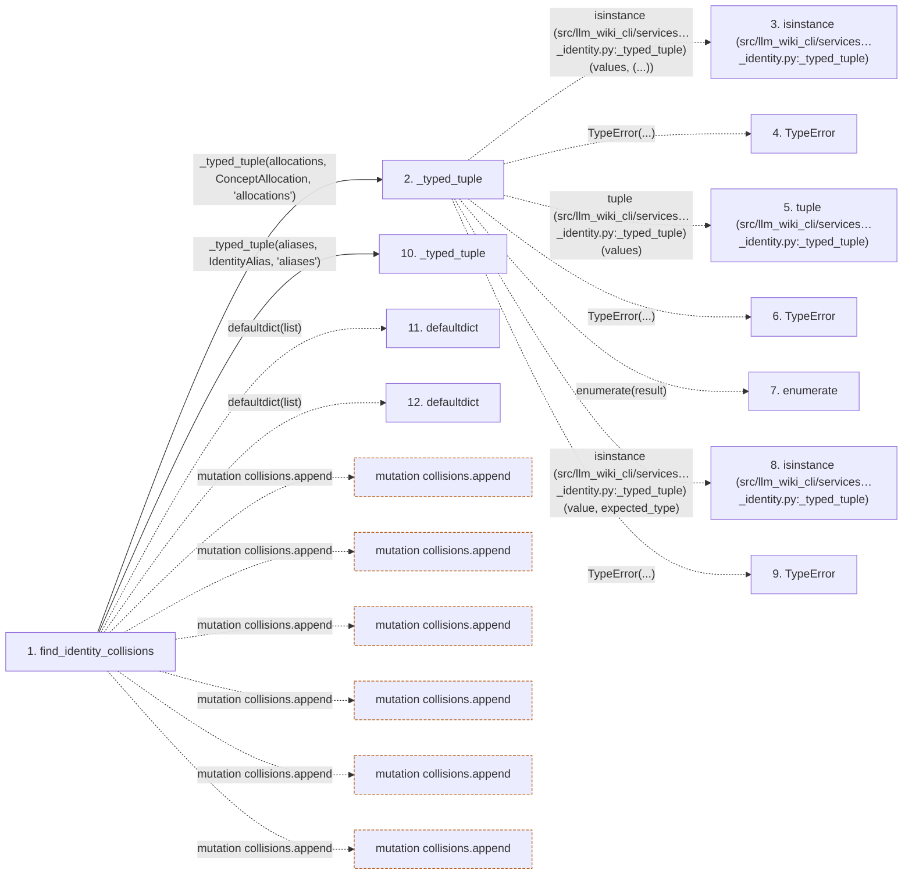

# find_identity_collisions

**Entry point:** `find_identity_collisions` (`api`)
**Source:** [concept_identity](../modules/concept_identity.md)
**Modules touched:** [concept_identity](../modules/concept_identity.md), [wiki_surface](../modules/wiki_surface.md)

## Call sequence

```mermaid
sequenceDiagram
    participant p0 as find_identity_collisions
    participant p1 as _typed_tuple
    participant p2 as isinstance (src/llm_wiki_cli/services…_identity.py:_typed_tuple)
    participant p3 as TypeError
    participant p4 as tuple (src/llm_wiki_cli/services…_identity.py:_typed_tuple)
    participant p5 as enumerate
    participant p6 as defaultdict
    participant p7 as allocations_by_uid[…].append
    participant p8 as current_coordinates[…][…].append (src/llm_wiki_cli/services…nd_identity_collisions, 1)
    participant p9 as current_coordinates[…][…].append (src/llm_wiki_cli/services…:find_identity_collisions)
    participant p10 as identity_coordinate_key
    participant p11 as validate_alias_type
    participant p12 as isinstance (src/llm_wiki_cli/services…ty.py:validate_alias_type)
    participant p13 as AliasType
    participant p14 as ConceptIdentityError
    participant p15 as validate_alias_value
    participant p16 as validate_locator
    participant p17 as _machine_text
    participant p18 as isinstance (src/llm_wiki_cli/services…identity.py:_machine_text)
    participant p19 as len (src/llm_wiki_cli/services…identity.py:_machine_text)
    participant p20 as value.strip (src/llm_wiki_cli/services…identity.py:_machine_text)
    participant p21 as any (src/llm_wiki_cli/services…identity.py:_machine_text)
    p0->>p1: _typed_tuple
    p1-->>p2: isinstance (src/llm_wiki_cli/services…_identity.py:_typed_tuple)
    p1-->>p3: TypeError
    p1-->>p4: tuple (src/llm_wiki_cli/services…_identity.py:_typed_tuple)
    p1-->>p3: TypeError
    p1-->>p5: enumerate
    p1-->>p2: isinstance (src/llm_wiki_cli/services…_identity.py:_typed_tuple)
    p1-->>p3: TypeError
    p0->>p1: _typed_tuple
    p0-->>p6: defaultdict
    p0-->>p6: defaultdict
    p0-->>p6: defaultdict
    p0-->>p7: allocations_by_uid[…].append
    p0-->>p8: current_coordinates[…][…].append (src/llm_wiki_cli/services…nd_identity_collisions, 1)
    p0-->>p9: current_coordinates[…][…].append (src/llm_wiki_cli/services…:find_identity_collisions)
    p0->>p10: identity_coordinate_key
    p10->>p11: validate_alias_type
    p11-->>p12: isinstance (src/llm_wiki_cli/services…ty.py:validate_alias_type)
    p11->>p13: AliasType
    p11->>p14: ConceptIdentityError
    p10->>p15: validate_alias_value
    p15->>p11: validate_alias_type
    p15->>p16: validate_locator
    p16->>p17: _machine_text
    p17-->>p18: isinstance (src/llm_wiki_cli/services…identity.py:_machine_text)
    p17->>p14: ConceptIdentityError
    p17-->>p19: len (src/llm_wiki_cli/services…identity.py:_machine_text)
    p17->>p14: ConceptIdentityError
    p17-->>p20: value.strip (src/llm_wiki_cli/services…identity.py:_machine_text)
    p17-->>p21: any (src/llm_wiki_cli/services…identity.py:_machine_text)
```

<!-- Auto-generated from static call edges. Dashed arrows are external or unresolved calls. Reviewed runtime conditions and side effects belong in Behavior. -->

> Call sequence diagram shows 30 of 167 interactions; 137 omitted to keep the visualization within the 30-interaction and generated-diagram limits.

> Trace truncated at the depth limit; deeper calls are omitted.

## Data flow

<!-- Auto-generated static analysis. Treat values and boundaries as best-effort hints, not runtime proof. -->

### Step data

| Step | Inputs | Reads | Writes | Returns |
|---|---|---|---|---|
| `find_identity_collisions` | `allocations: Iterable[ConceptAllocation]`, `aliases: Iterable[IdentityAlias]` | `ConceptAllocation`, `IdentityAlias`, `AliasType`, `AliasType`, `AliasType` | - | `tuple(...)` |
| `_typed_tuple` | `values: Iterable[_RecordT]`, `expected_type: type[_RecordT]`, `field: str` | - | - | `result` |
| `isinstance (src/llm_wiki_cli/services…_identity.py:_typed_tuple)` | - | - | - | - |
| `TypeError` | - | - | - | - |
| `tuple (src/llm_wiki_cli/services…_identity.py:_typed_tuple)` | - | - | - | - |
| `TypeError` | - | - | - | - |
| `enumerate` | - | - | - | - |
| `isinstance (src/llm_wiki_cli/services…_identity.py:_typed_tuple)` | - | - | - | - |
| `TypeError` | - | - | - | - |
| `_typed_tuple` | `values: Iterable[_RecordT]`, `expected_type: type[_RecordT]`, `field: str` | - | - | `result` |
| `defaultdict` | - | - | - | - |
| `defaultdict` | - | - | - | - |

### Call data

| From | To | Line | Call |
|---|---|---:|---|
| find_identity_collisions | _typed_tuple | 615 | `_typed_tuple(allocations, ConceptAllocation, 'allocations')` |
| _typed_tuple | isinstance (src/llm_wiki_cli/services…_identity.py:_typed_tuple) | 983 | `isinstance(values, (...))` |
| _typed_tuple | TypeError | 984 | `TypeError(...)` |
| _typed_tuple | tuple (src/llm_wiki_cli/services…_identity.py:_typed_tuple) | 986 | `tuple(values)` |
| _typed_tuple | TypeError | 988 | `TypeError(...)` |
| _typed_tuple | enumerate | 991 | `enumerate(result)` |
| _typed_tuple | isinstance (src/llm_wiki_cli/services…_identity.py:_typed_tuple) | 992 | `isinstance(value, expected_type)` |
| _typed_tuple | TypeError | 993 | `TypeError(...)` |
| find_identity_collisions | _typed_tuple | 620 | `_typed_tuple(aliases, IdentityAlias, 'aliases')` |
| find_identity_collisions | defaultdict | 623 | `defaultdict(list)` |
| find_identity_collisions | defaultdict | 627 | `defaultdict(list)` |

### Boundary effects

| Kind | Target | Step | Line |
|---|---|---|---:|
| mutation | `collisions.append` | `find_identity_collisions` | 641 |
| mutation | `collisions.append` | `find_identity_collisions` | 653 |
| mutation | `collisions.append` | `find_identity_collisions` | 675 |
| mutation | `collisions.append` | `find_identity_collisions` | 687 |
| mutation | `collisions.append` | `find_identity_collisions` | 696 |
| mutation | `collisions.append` | `find_identity_collisions` | 710 |

### Static analysis gaps

| Kind | Step | Target | Line |
|---|---|---|---:|
| external_call | `_typed_tuple` | `isinstance` | 983 |
| external_call | `_typed_tuple` | `TypeError` | 984 |
| external_call | `_typed_tuple` | `TypeError` | 988 |
| external_call | `_typed_tuple` | `enumerate` | 991 |
| external_call | `_typed_tuple` | `isinstance` | 992 |
| external_call | `_typed_tuple` | `TypeError` | 993 |
| external_call | `find_identity_collisions` | `defaultdict` | 623 |
| external_call | `find_identity_collisions` | `defaultdict` | 627 |
| step_limit | `find_identity_collisions` | `first 12 steps` | 0 |
| truncated_flow | `find_identity_collisions` | `depth limit` | 0 |

## Behavior

This flow starts at `find_identity_collisions` and is classified as `api`. The generated call and data-flow sections are bounded static projections; runtime conditions and side effects require source-level confirmation.
