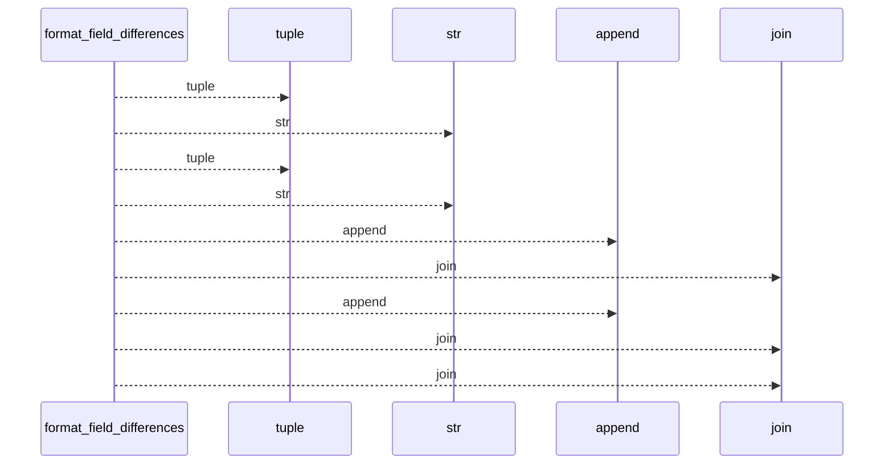
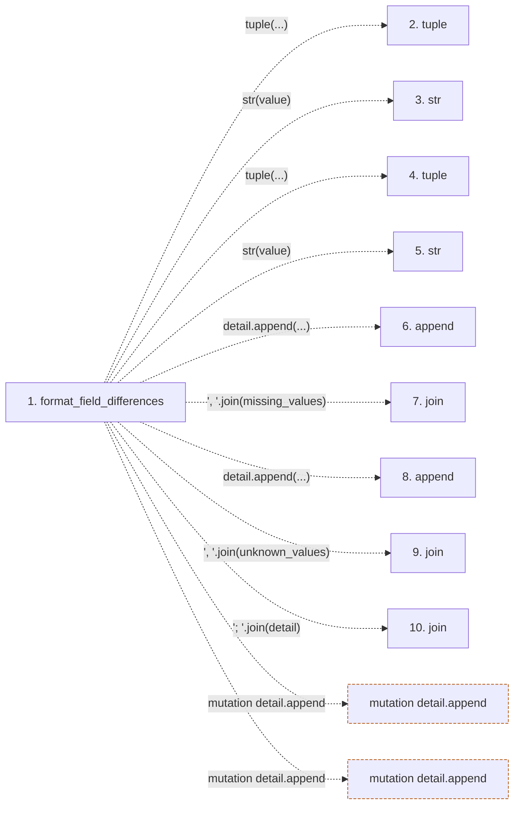

# format_field_differences

**Entry point:** `format_field_differences` (`api`)
**Source:** [validation](../modules/validation.md)
**Modules touched:** [validation](../modules/validation.md)

## Call sequence

<!-- Auto-generated from static call edges. Dashed arrows are external or unresolved calls. Reviewed runtime conditions and side effects belong in Behavior. -->

## Data flow

<!-- Auto-generated static analysis. Treat values and boundaries as best-effort hints, not runtime proof. -->

### Step data

| Step | Inputs | Reads | Writes | Returns |
|---|---|---|---|---|
| `format_field_differences` | `missing: Iterable[object]`, `unknown: Iterable[object]` | - | - | `...` |
| `tuple` | - | - | - | - |
| `str` | - | - | - | - |
| `tuple` | - | - | - | - |
| `str` | - | - | - | - |
| `append` | - | - | - | - |
| `join` | - | - | - | - |
| `append` | - | - | - | - |
| `join` | - | - | - | - |
| `join` | - | - | - | - |

### Call data

| From | To | Line | Call |
|---|---|---:|---|
| format_field_differences | tuple | 57 | `tuple(...)` |
| format_field_differences | str | 57 | `str(value)` |
| format_field_differences | tuple | 58 | `tuple(...)` |
| format_field_differences | str | 58 | `str(value)` |
| format_field_differences | append | 60 | `detail.append(...)` |
| format_field_differences | join | 60 | `', '.join(missing_values)` |
| format_field_differences | append | 62 | `detail.append(...)` |
| format_field_differences | join | 62 | `', '.join(unknown_values)` |
| format_field_differences | join | 63 | `'; '.join(detail)` |

### Boundary effects

| Kind | Target | Step | Line |
|---|---|---|---:|
| mutation | `detail.append` | `format_field_differences` | 60 |
| mutation | `detail.append` | `format_field_differences` | 62 |

### Static analysis gaps

| Kind | Step | Target | Line |
|---|---|---|---:|
| unresolved_call | `format_field_differences` | `'; '.join` | 63 |

## Behavior

This flow starts at `format_field_differences` and is classified as `api`. The generated call and data-flow sections are bounded static projections; runtime conditions and side effects require source-level confirmation.
