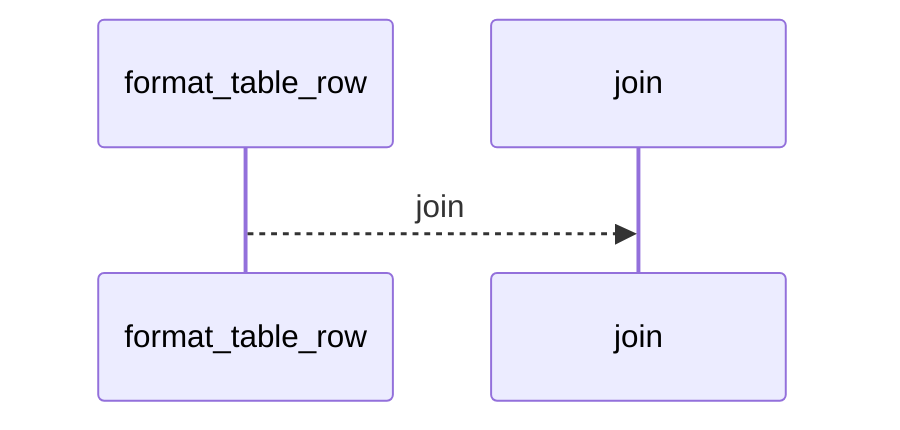

# format_table_row

**Entry point:** `format_table_row` (`api`)
**Source:** [markdown_sections](../modules/markdown_sections.md)
**Modules touched:** [markdown_sections](../modules/markdown_sections.md)

## Call sequence

<!-- Auto-generated from static call edges. Dashed arrows are external or unresolved calls. Reviewed runtime conditions and side effects belong in Behavior. -->

## Data flow

<!-- Auto-generated static analysis. Treat values and boundaries as best-effort hints, not runtime proof. -->

### Step data

| Step | Inputs | Reads | Writes | Returns |
|---|---|---|---|---|
| `format_table_row` | `cells: Iterable[str]` | - | - | `...` |
| `join` | - | - | - | - |

### Call data

| From | To | Line | Call |
|---|---|---:|---|
| format_table_row | join | 506 | `' \| '.join(cells)` |

### Boundary effects

*No boundary effects detected.*

### Static analysis gaps

| Kind | Step | Target | Line |
|---|---|---|---:|
| unresolved_call | `format_table_row` | `' \| '.join` | 506 |

## Behavior

This flow starts at `format_table_row` and is classified as `api`. The generated call and data-flow sections are bounded static projections; runtime conditions and side effects require source-level confirmation.
