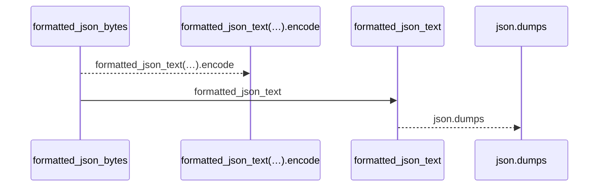
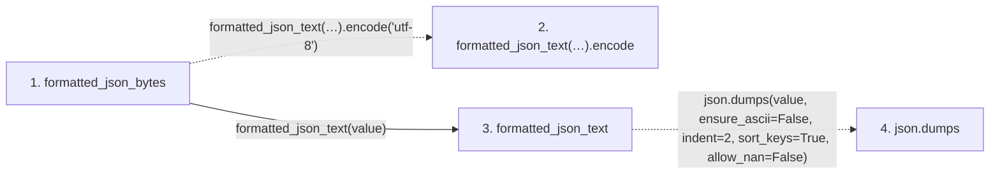

# formatted_json_bytes

**Entry point:** `formatted_json_bytes` (`api`)
**Source:** [knowledge_evidence](../modules/knowledge_evidence.md)
**Modules touched:** [knowledge_evidence](../modules/knowledge_evidence.md)

## Call sequence

<!-- Auto-generated from static call edges. Dashed arrows are external or unresolved calls. Reviewed runtime conditions and side effects belong in Behavior. -->

## Data flow

<!-- Auto-generated static analysis. Treat values and boundaries as best-effort hints, not runtime proof. -->

### Step data

| Step | Inputs | Reads | Writes | Returns |
|---|---|---|---|---|
| `formatted_json_bytes` | `value: Any` | - | - | `...` |
| `formatted_json_text(…).encode` | - | - | - | - |
| `formatted_json_text` | `value: Any` | - | - | `...` |
| `json.dumps` | - | - | - | - |

### Call data

| From | To | Line | Call |
|---|---|---:|---|
| formatted_json_bytes | formatted_json_text(…).encode | 192 | `formatted_json_text(value).encode('utf-8')` |
| formatted_json_bytes | formatted_json_text | 192 | `formatted_json_text(value)` |
| formatted_json_text | json.dumps | 178 | `json.dumps(value, ensure_ascii=False, indent=2, sort_keys=True, allow_nan=False)` |

### Boundary effects

*No boundary effects detected.*

### Static analysis gaps

| Kind | Step | Target | Line |
|---|---|---|---:|
| unresolved_call | `formatted_json_bytes` | `formatted_json_text(value).encode` | 192 |
| external_call | `formatted_json_text` | `json.dumps` | 178 |

## Behavior

This flow starts at `formatted_json_bytes` and is classified as `api`. The generated call and data-flow sections are bounded static projections; runtime conditions and side effects require source-level confirmation.
