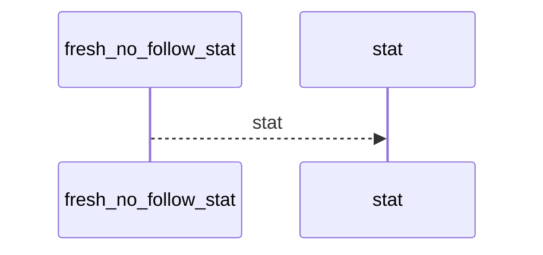
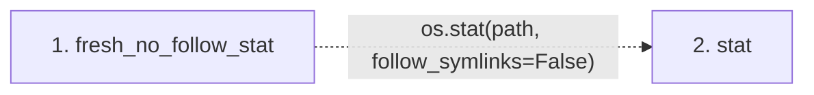

# fresh_no_follow_stat

**Entry point:** `fresh_no_follow_stat` (`api`)
**Source:** [filesystem_guard](../modules/filesystem_guard.md)
**Modules touched:** [filesystem_guard](../modules/filesystem_guard.md)

## Call sequence

<!-- Auto-generated from static call edges. Dashed arrows are external or unresolved calls. Reviewed runtime conditions and side effects belong in Behavior. -->

## Data flow

<!-- Auto-generated static analysis. Treat values and boundaries as best-effort hints, not runtime proof. -->

### Step data

| Step | Inputs | Reads | Writes | Returns |
|---|---|---|---|---|
| `fresh_no_follow_stat` | `path: str \| Path` | - | - | `os.stat(...)` |
| `stat` | - | - | - | - |

### Call data

| From | To | Line | Call |
|---|---|---:|---|
| fresh_no_follow_stat | stat | 88 | `os.stat(path, follow_symlinks=False)` |

### Boundary effects

*No boundary effects detected.*

### Static analysis gaps

| Kind | Step | Target | Line |
|---|---|---|---:|
| external_call | `fresh_no_follow_stat` | `os.stat` | 88 |

## Behavior

This flow starts at `fresh_no_follow_stat` and is classified as `api`. The generated call and data-flow sections are bounded static projections; runtime conditions and side effects require source-level confirmation.
