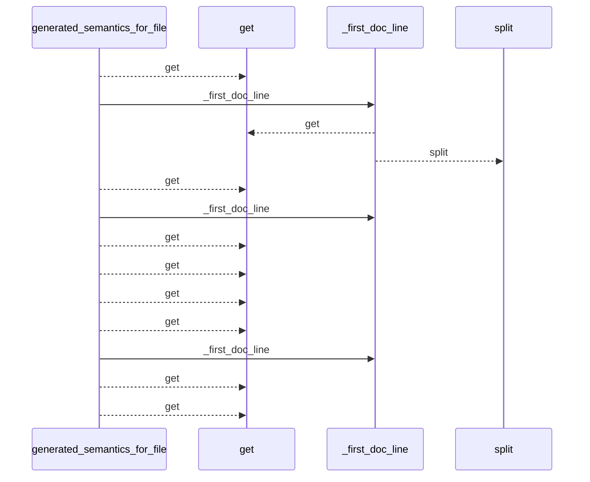
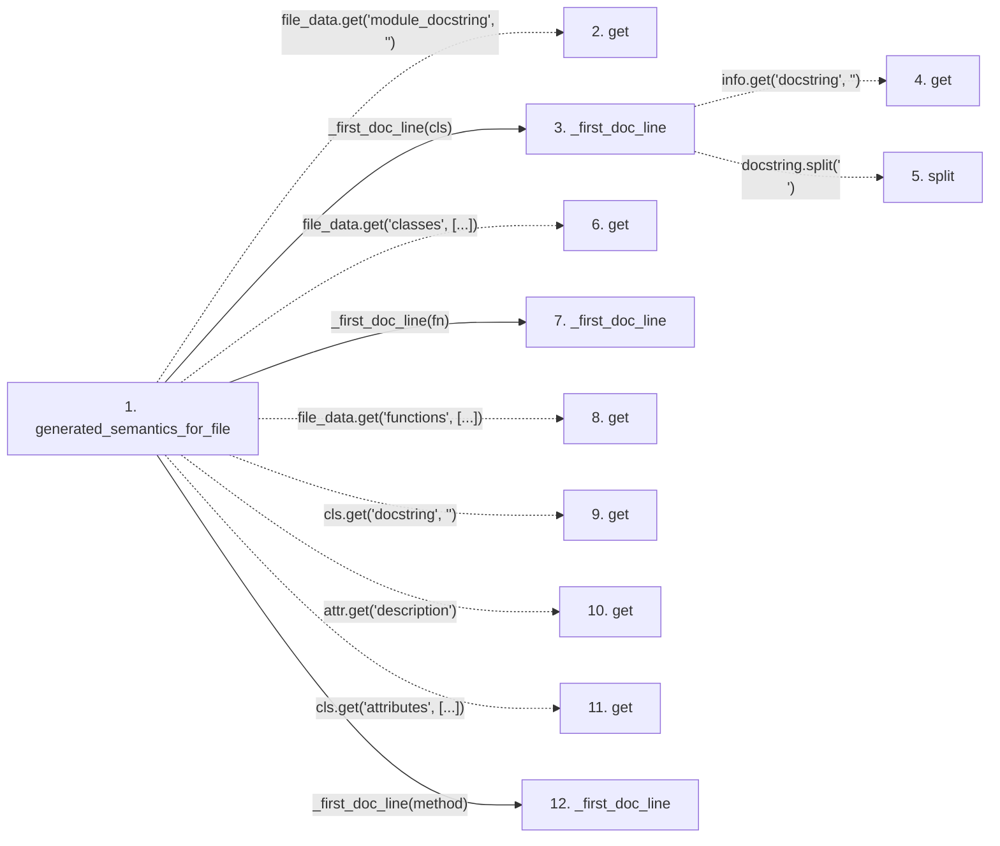

# generated_semantics_for_file

**Entry point:** `generated_semantics_for_file` (`api`)
**Source:** [sync_manifest](../modules/sync_manifest.md)
**Modules touched:** [sync_manifest](../modules/sync_manifest.md)

## Call sequence

<!-- Auto-generated from static call edges. Dashed arrows are external or unresolved calls. Reviewed runtime conditions and side effects belong in Behavior. -->

## Data flow

<!-- Auto-generated static analysis. Treat values and boundaries as best-effort hints, not runtime proof. -->

### Step data

| Step | Inputs | Reads | Writes | Returns |
|---|---|---|---|---|
| `generated_semantics_for_file` | `filepath: str`, `file_data: Mapping[str, Any]` | - | - | `{...}` |
| `get` | - | - | - | - |
| `_first_doc_line` | `info: Mapping[str, Any]` | - | - | `...` |
| `get` | - | - | - | - |
| `split` | - | - | - | - |
| `get` | - | - | - | - |
| `_first_doc_line` | `info: Mapping[str, Any]` | - | - | `...` |
| `get` | - | - | - | - |
| `get` | - | - | - | - |
| `get` | - | - | - | - |
| `get` | - | - | - | - |
| `_first_doc_line` | `info: Mapping[str, Any]` | - | - | `...` |

### Call data

| From | To | Line | Call |
|---|---|---:|---|
| generated_semantics_for_file | get | 669 | `file_data.get('module_docstring', '')` |
| generated_semantics_for_file | _first_doc_line | 675 | `_first_doc_line(cls)` |
| _first_doc_line | get | 520 | `info.get('docstring', '')` |
| _first_doc_line | split | 521 | `docstring.split('\n')` |
| generated_semantics_for_file | get | 676 | `file_data.get('classes', [...])` |
| generated_semantics_for_file | _first_doc_line | 679 | `_first_doc_line(fn)` |
| generated_semantics_for_file | get | 679 | `file_data.get('functions', [...])` |
| generated_semantics_for_file | get | 684 | `cls.get('docstring', '')` |
| generated_semantics_for_file | get | 687 | `attr.get('description')` |
| generated_semantics_for_file | get | 688 | `cls.get('attributes', [...])` |
| generated_semantics_for_file | _first_doc_line | 691 | `_first_doc_line(method)` |

### Boundary effects

*No boundary effects detected.*

### Static analysis gaps

| Kind | Step | Target | Line |
|---|---|---|---:|
| unresolved_call | `generated_semantics_for_file` | `file_data.get` | 669 |
| unresolved_call | `_first_doc_line` | `info.get` | 520 |
| unresolved_call | `_first_doc_line` | `docstring.split` | 521 |
| unresolved_call | `generated_semantics_for_file` | `file_data.get` | 676 |
| unresolved_call | `generated_semantics_for_file` | `file_data.get` | 679 |
| unresolved_call | `generated_semantics_for_file` | `cls.get` | 684 |
| unresolved_call | `generated_semantics_for_file` | `attr.get` | 687 |
| unresolved_call | `generated_semantics_for_file` | `cls.get` | 688 |
| step_limit | `generated_semantics_for_file` | `first 12 steps` | 0 |

## Behavior

This flow starts at `generated_semantics_for_file` and is classified as `api`. The generated call and data-flow sections are bounded static projections; runtime conditions and side effects require source-level confirmation.
