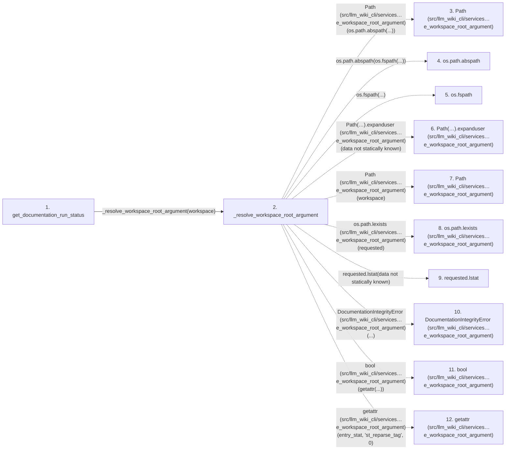

# get_documentation_run_status

**Entry point:** `get_documentation_run_status` (`api`)
**Source:** [workspace](../modules/workspace.md)
**Modules touched:** [workspace](../modules/workspace.md)

## Call sequence

```mermaid
sequenceDiagram
    participant p0 as get_documentation_run_status
    participant p1 as _resolve_workspace_root_argument
    participant p2 as Path (src/llm_wiki_cli/services…e_workspace_root_argument)
    participant p3 as os.path.abspath
    participant p4 as os.fspath
    participant p5 as Path(…).expanduser (src/llm_wiki_cli/services…e_workspace_root_argument)
    participant p6 as os.path.lexists (src/llm_wiki_cli/services…e_workspace_root_argument)
    participant p7 as requested.lstat
    participant p8 as DocumentationIntegrityError (src/llm_wiki_cli/services…e_workspace_root_argument)
    participant p9 as bool (src/llm_wiki_cli/services…e_workspace_root_argument)
    participant p10 as getattr (src/llm_wiki_cli/services…e_workspace_root_argument)
    participant p11 as stat.S_ISLNK (src/llm_wiki_cli/services…e_workspace_root_argument)
    participant p12 as stat.S_ISDIR (src/llm_wiki_cli/services…e_workspace_root_argument)
    participant p13 as requested.resolve
    participant p14 as _assert_existing_workspace_layout_safe
    participant p15 as os.path.lexists (src/llm_wiki_cli/services…ing_workspace_layout_safe)
    participant p16 as _assert_safe_workspace_directory
    participant p17 as directory.lstat
    participant p18 as DocumentationIntegrityError (src/llm_wiki_cli/services…_safe_workspace_directory)
    participant p19 as bool (src/llm_wiki_cli/services…_safe_workspace_directory)
    participant p20 as getattr (src/llm_wiki_cli/services…_safe_workspace_directory)
    participant p21 as stat.S_ISLNK (src/llm_wiki_cli/services…_safe_workspace_directory)
    p0->>p1: _resolve_workspace_root_argument
    p1-->>p2: Path (src/llm_wiki_cli/services…e_workspace_root_argument)
    p1-->>p3: os.path.abspath
    p1-->>p4: os.fspath
    p1-->>p5: Path(…).expanduser (src/llm_wiki_cli/services…e_workspace_root_argument)
    p1-->>p2: Path (src/llm_wiki_cli/services…e_workspace_root_argument)
    p1-->>p6: os.path.lexists (src/llm_wiki_cli/services…e_workspace_root_argument)
    p1-->>p7: requested.lstat
    p1-->>p8: DocumentationIntegrityError (src/llm_wiki_cli/services…e_workspace_root_argument)
    p1-->>p9: bool (src/llm_wiki_cli/services…e_workspace_root_argument)
    p1-->>p10: getattr (src/llm_wiki_cli/services…e_workspace_root_argument)
    p1-->>p9: bool (src/llm_wiki_cli/services…e_workspace_root_argument)
    p1-->>p10: getattr (src/llm_wiki_cli/services…e_workspace_root_argument)
    p1-->>p11: stat.S_ISLNK (src/llm_wiki_cli/services…e_workspace_root_argument)
    p1-->>p8: DocumentationIntegrityError (src/llm_wiki_cli/services…e_workspace_root_argument)
    p1-->>p12: stat.S_ISDIR (src/llm_wiki_cli/services…e_workspace_root_argument)
    p1-->>p8: DocumentationIntegrityError (src/llm_wiki_cli/services…e_workspace_root_argument)
    p1-->>p13: requested.resolve
    p1-->>p6: os.path.lexists (src/llm_wiki_cli/services…e_workspace_root_argument)
    p1->>p14: _assert_existing_workspace_layout_safe
    p14-->>p15: os.path.lexists (src/llm_wiki_cli/services…ing_workspace_layout_safe)
    p14->>p16: _assert_safe_workspace_directory
    p16-->>p17: directory.lstat
    p16-->>p18: DocumentationIntegrityError (src/llm_wiki_cli/services…_safe_workspace_directory)
    p16-->>p19: bool (src/llm_wiki_cli/services…_safe_workspace_directory)
    p16-->>p20: getattr (src/llm_wiki_cli/services…_safe_workspace_directory)
    p16-->>p19: bool (src/llm_wiki_cli/services…_safe_workspace_directory)
    p16-->>p20: getattr (src/llm_wiki_cli/services…_safe_workspace_directory)
    p16-->>p21: stat.S_ISLNK (src/llm_wiki_cli/services…_safe_workspace_directory)
    p16-->>p18: DocumentationIntegrityError (src/llm_wiki_cli/services…_safe_workspace_directory)
```

<!-- Auto-generated from static call edges. Dashed arrows are external or unresolved calls. Reviewed runtime conditions and side effects belong in Behavior. -->

> Call sequence diagram shows 30 of 165 interactions; 135 omitted to keep the visualization within the 30-interaction and generated-diagram limits.

## Data flow

<!-- Auto-generated static analysis. Treat values and boundaries as best-effort hints, not runtime proof. -->

### Step data

| Step | Inputs | Reads | Writes | Returns |
|---|---|---|---|---|
| `get_documentation_run_status` | `workspace: str \| Path` | - | - | `DocumentationRunStatus(...)` |
| `_resolve_workspace_root_argument` | `workspace: str \| Path` | - | - | `resolved` |
| `Path (src/llm_wiki_cli/services…e_workspace_root_argument)` | - | - | - | - |
| `os.path.abspath` | - | - | - | - |
| `os.fspath` | - | - | - | - |
| `Path(…).expanduser (src/llm_wiki_cli/services…e_workspace_root_argument)` | - | - | - | - |
| `Path (src/llm_wiki_cli/services…e_workspace_root_argument)` | - | - | - | - |
| `os.path.lexists (src/llm_wiki_cli/services…e_workspace_root_argument)` | - | - | - | - |
| `requested.lstat` | - | - | - | - |
| `DocumentationIntegrityError (src/llm_wiki_cli/services…e_workspace_root_argument)` | - | - | - | - |
| `bool (src/llm_wiki_cli/services…e_workspace_root_argument)` | - | - | - | - |
| `getattr (src/llm_wiki_cli/services…e_workspace_root_argument)` | - | - | - | - |

### Call data

| From | To | Line | Call |
|---|---|---:|---|
| get_documentation_run_status | _resolve_workspace_root_argument | 74 | `_resolve_workspace_root_argument(workspace)` |
| _resolve_workspace_root_argument | Path (src/llm_wiki_cli/services…e_workspace_root_argument) | 102 | `Path(os.path.abspath(...))` |
| _resolve_workspace_root_argument | os.path.abspath | 102 | `os.path.abspath(os.fspath(...))` |
| _resolve_workspace_root_argument | os.fspath | 102 | `os.fspath(...)` |
| _resolve_workspace_root_argument | Path(…).expanduser (src/llm_wiki_cli/services…e_workspace_root_argument) | 102 | `Path(workspace).expanduser(data not statically known)` |
| _resolve_workspace_root_argument | Path (src/llm_wiki_cli/services…e_workspace_root_argument) | 102 | `Path(workspace)` |
| _resolve_workspace_root_argument | os.path.lexists (src/llm_wiki_cli/services…e_workspace_root_argument) | 103 | `os.path.lexists(requested)` |
| _resolve_workspace_root_argument | requested.lstat | 105 | `requested.lstat(data not statically known)` |
| _resolve_workspace_root_argument | DocumentationIntegrityError (src/llm_wiki_cli/services…e_workspace_root_argument) | 107 | `DocumentationIntegrityError(...)` |
| _resolve_workspace_root_argument | bool (src/llm_wiki_cli/services…e_workspace_root_argument) | 110 | `bool(getattr(...))` |
| _resolve_workspace_root_argument | getattr (src/llm_wiki_cli/services…e_workspace_root_argument) | 110 | `getattr(entry_stat, 'st_reparse_tag', 0)` |

### Boundary effects

*No boundary effects detected.*

### Static analysis gaps

| Kind | Step | Target | Line |
|---|---|---|---:|
| unresolved_call | `_resolve_workspace_root_argument` | `os.path.abspath` | 102 |
| unresolved_call | `_resolve_workspace_root_argument` | `os.fspath` | 102 |
| unresolved_call | `_resolve_workspace_root_argument` | `Path(workspace).expanduser` | 102 |
| unresolved_call | `_resolve_workspace_root_argument` | `os.path.lexists` | 103 |
| unresolved_call | `_resolve_workspace_root_argument` | `requested.lstat` | 105 |
| unresolved_call | `_resolve_workspace_root_argument` | `DocumentationIntegrityError` | 107 |
| unresolved_call | `_resolve_workspace_root_argument` | `getattr` | 110 |
| step_limit | `get_documentation_run_status` | `first 12 steps` | 0 |

## Behavior

This flow starts at `get_documentation_run_status` and is classified as `api`. The generated call and data-flow sections are bounded static projections; runtime conditions and side effects require source-level confirmation.
