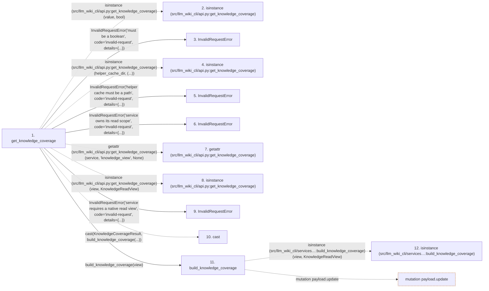

# get_knowledge_coverage

**Entry point:** `get_knowledge_coverage` (`api`)
**Source:** [api](../modules/api.md)
**Modules touched:** [api](../modules/api.md), [common](../modules/common.md), [config](../modules/config.md), [context_packet](../modules/context_packet.md), and 53 more

**Complete modules touched:**

- [api](../modules/api.md)
- [common](../modules/common.md)
- [config](../modules/config.md)
- [context_packet](../modules/context_packet.md)
- [context_service](../modules/context_service.md)
- [data_flow](../modules/data_flow.md)
- [dependency_versions](../modules/dependency_versions.md)
- [documentation_queries](../modules/documentation_queries.md)
- [documentation_query_builder](../modules/documentation_query_builder.md)
- [entrypoints](../modules/entrypoints.md)
- [extraction_jobs](../modules/extraction_jobs.md)
- [extraction_service](../modules/extraction_service.md)
- [filesystem_guard](../modules/filesystem_guard.md)
- [go_calls](../modules/go_calls.md)
- [immutable](../modules/immutable.md)
- [imports](../modules/imports.md)
- [infrastructure_inventory](../modules/infrastructure_inventory.md)
- [infrastructure_sync](../modules/infrastructure_sync.md)
- [inventory_cache](../modules/inventory_cache.md)
- [io](../modules/io.md)
- [knowledge_artifacts](../modules/knowledge_artifacts.md)
- [knowledge_consumption](../modules/knowledge_consumption.md)
- [knowledge_coverage](../modules/knowledge_coverage.md)
- [knowledge_envelope](../modules/knowledge_envelope.md)
- [knowledge_evidence](../modules/knowledge_evidence.md)
- [knowledge_freshness](../modules/knowledge_freshness.md)
- [knowledge_generation](../modules/knowledge_generation.md)
- [knowledge_governance](../modules/knowledge_governance.md)
- [knowledge_graph](../modules/knowledge_graph.md)
- [knowledge_index](../modules/knowledge_index.md)
- [knowledge_loader](../modules/knowledge_loader.md)
- [knowledge_model](../modules/knowledge_model.md)
- [knowledge_orchestration](../modules/knowledge_orchestration.md)
- [knowledge_packs](../modules/knowledge_packs.md)
- [knowledge_reuse](../modules/knowledge_reuse.md)
- [knowledge_storage](../modules/knowledge_storage.md)
- [knowledge_storage_io](../modules/knowledge_storage_io.md)
- [knowledge_verification](../modules/knowledge_verification.md)
- [manifest_storage](../modules/manifest_storage.md)
- [packages](../modules/packages.md)
- [paths](../modules/paths.md)
- [plugins](../modules/plugins.md)
- [progress](../modules/progress.md)
- [python_calls](../modules/python_calls.md)
- [python_contracts](../modules/python_contracts.md)
- [python_imports](../modules/python_imports.md)
- [python_observations](../modules/python_observations.md)
- [section_ownership](../modules/section_ownership.md)
- [services_dependencies](../modules/services_dependencies.md)
- [source_selection](../modules/source_selection.md)
- [source_snapshot](../modules/source_snapshot.md)
- [sync_manifest](../modules/sync_manifest.md)
- [validation](../modules/validation.md)
- [verification_contracts](../modules/verification_contracts.md)
- [wiki_media](../modules/wiki_media.md)
- [wiki_surface](../modules/wiki_surface.md)
- [wiki_surface_index](../modules/wiki_surface_index.md)

## Call sequence

```mermaid
sequenceDiagram
    participant p0 as get_knowledge_coverage
    participant p1 as isinstance (src/llm_wiki_cli/api.py:get_knowledge_coverage)
    participant p2 as InvalidRequestError
    participant p3 as getattr (src/llm_wiki_cli/api.py:get_knowledge_coverage)
    participant p4 as cast
    participant p5 as build_knowledge_coverage
    participant p6 as isinstance (src/llm_wiki_cli/services…:build_knowledge_coverage)
    participant p7 as TypeError (src/llm_wiki_cli/services…:build_knowledge_coverage)
    participant p8 as set (src/llm_wiki_cli/services…:build_knowledge_coverage)
    participant p9 as ValueError (src/llm_wiki_cli/services…:build_knowledge_coverage)
    participant p10 as counts
    participant p11 as Counter (src/llm_wiki_cli/services…:build_knowledge_coverage)
    participant p12 as getattr (src/llm_wiki_cli/services…:build_knowledge_coverage)
    participant p13 as by_kind.setdefault
    participant p14 as structural_freshness_modeled
    participant p15 as int (src/llm_wiki_cli/services…:build_knowledge_coverage)
    participant p16 as payload.update
    participant p17 as dict (src/llm_wiki_cli/services…:build_knowledge_coverage)
    participant p18 as sorted (src/llm_wiki_cli/services…:build_knowledge_coverage)
    participant p19 as by_kind.items (src/llm_wiki_cli/services…:build_knowledge_coverage)
    participant p20 as reasons.items
    participant p21 as len (src/llm_wiki_cli/services…:build_knowledge_coverage)
    p0-->>p1: isinstance (src/llm_wiki_cli/api.py:get_knowledge_coverage)
    p0->>p2: InvalidRequestError
    p0-->>p1: isinstance (src/llm_wiki_cli/api.py:get_knowledge_coverage)
    p0->>p2: InvalidRequestError
    p0->>p2: InvalidRequestError
    p0-->>p3: getattr (src/llm_wiki_cli/api.py:get_knowledge_coverage)
    p0-->>p1: isinstance (src/llm_wiki_cli/api.py:get_knowledge_coverage)
    p0->>p2: InvalidRequestError
    p0-->>p4: cast
    p0->>p5: build_knowledge_coverage
    p5-->>p6: isinstance (src/llm_wiki_cli/services…:build_knowledge_coverage)
    p5-->>p7: TypeError (src/llm_wiki_cli/services…:build_knowledge_coverage)
    p5-->>p8: set (src/llm_wiki_cli/services…:build_knowledge_coverage)
    p5-->>p9: ValueError (src/llm_wiki_cli/services…:build_knowledge_coverage)
    p5-->>p10: counts
    p5-->>p11: Counter (src/llm_wiki_cli/services…:build_knowledge_coverage)
    p5-->>p12: getattr (src/llm_wiki_cli/services…:build_knowledge_coverage)
    p5-->>p13: by_kind.setdefault
    p5-->>p10: counts
    p5->>p14: structural_freshness_modeled
    p5-->>p9: ValueError (src/llm_wiki_cli/services…:build_knowledge_coverage)
    p5-->>p15: int (src/llm_wiki_cli/services…:build_knowledge_coverage)
    p5-->>p16: payload.update
    p5-->>p17: dict (src/llm_wiki_cli/services…:build_knowledge_coverage)
    p5-->>p18: sorted (src/llm_wiki_cli/services…:build_knowledge_coverage)
    p5-->>p19: by_kind.items (src/llm_wiki_cli/services…:build_knowledge_coverage)
    p5-->>p17: dict (src/llm_wiki_cli/services…:build_knowledge_coverage)
    p5-->>p18: sorted (src/llm_wiki_cli/services…:build_knowledge_coverage)
    p5-->>p20: reasons.items
    p5-->>p21: len (src/llm_wiki_cli/services…:build_knowledge_coverage)
```

<!-- Auto-generated from static call edges. Dashed arrows are external or unresolved calls. Reviewed runtime conditions and side effects belong in Behavior. -->

> Call sequence diagram shows 30 of 3623 interactions; 3593 omitted to keep the visualization within the 30-interaction and generated-diagram limits.

> Trace truncated at the depth limit; deeper calls are omitted.

## Data flow

<!-- Auto-generated static analysis. Treat values and boundaries as best-effort hints, not runtime proof. -->

### Step data

| Step | Inputs | Reads | Writes | Returns |
|---|---|---|---|---|
| `get_knowledge_coverage` | `src_dir: str`, `wiki_dir: str`, `live: bool`, `service: DocumentationGraphQueryService \| None`, `allow_external_src: bool`, `source_selection: str \| Path \| None`, `helper_cache_dir: str \| Path \| None` | `Path`, `DEFAULT_WIKI_DIR`, `KnowledgeCoverageResult`, `KnowledgeCoverageResult` | - | `cast(...)`, `cast(...)` |
| `isinstance (src/llm_wiki_cli/api.py:get_knowledge_coverage)` | - | - | - | - |
| `InvalidRequestError` | - | - | - | - |
| `isinstance (src/llm_wiki_cli/api.py:get_knowledge_coverage)` | - | - | - | - |
| `InvalidRequestError` | - | - | - | - |
| `InvalidRequestError` | - | - | - | - |
| `getattr (src/llm_wiki_cli/api.py:get_knowledge_coverage)` | - | - | - | - |
| `isinstance (src/llm_wiki_cli/api.py:get_knowledge_coverage)` | - | - | - | - |
| `InvalidRequestError` | - | - | - | - |
| `cast` | - | - | - | - |
| `build_knowledge_coverage` | `view: KnowledgeReadView` | `KnowledgeReadView`, `KNOWLEDGE_COVERAGE_SCHEMA_VERSION`, `_KINDS`, `KNOWN_FRESHNESS_REASON_CODES`, `MAX_COVERAGE_BYTES` | `target[...]`, `target[...]`, `reasons[...]` | `payload`, `payload` |
| `isinstance (src/llm_wiki_cli/services…:build_knowledge_coverage)` | - | - | - | - |

### Call data

| From | To | Line | Call |
|---|---|---:|---|
| get_knowledge_coverage | isinstance (src/llm_wiki_cli/api.py:get_knowledge_coverage) | 896 | `isinstance(value, bool)` |
| get_knowledge_coverage | InvalidRequestError | 897 | `InvalidRequestError('must be a boolean', code='invalid-request', details={...})` |
| get_knowledge_coverage | isinstance (src/llm_wiki_cli/api.py:get_knowledge_coverage) | 900 | `isinstance(helper_cache_dir, (...))` |
| get_knowledge_coverage | InvalidRequestError | 901 | `InvalidRequestError('helper cache must be a path', code='invalid-request', details={...})` |
| get_knowledge_coverage | InvalidRequestError | 915 | `InvalidRequestError('service owns its read scope', code='invalid-request', details={...})` |
| get_knowledge_coverage | getattr (src/llm_wiki_cli/api.py:get_knowledge_coverage) | 920 | `getattr(service, 'knowledge_view', None)` |
| get_knowledge_coverage | isinstance (src/llm_wiki_cli/api.py:get_knowledge_coverage) | 921 | `isinstance(view, KnowledgeReadView)` |
| get_knowledge_coverage | InvalidRequestError | 922 | `InvalidRequestError('service requires a native read view', code='invalid-request', details={...})` |
| get_knowledge_coverage | cast | 927 | `cast(KnowledgeCoverageResult, build_knowledge_coverage(...))` |
| get_knowledge_coverage | build_knowledge_coverage | 927 | `build_knowledge_coverage(view)` |
| build_knowledge_coverage | isinstance (src/llm_wiki_cli/services…:build_knowledge_coverage) | 23 | `isinstance(view, KnowledgeReadView)` |

### Boundary effects

| Kind | Target | Step | Line |
|---|---|---|---:|
| mutation | `payload.update` | `build_knowledge_coverage` | 81 |

### Static analysis gaps

| Kind | Step | Target | Line |
|---|---|---|---:|
| external_call | `get_knowledge_coverage` | `isinstance` | 896 |
| external_call | `get_knowledge_coverage` | `isinstance` | 900 |
| external_call | `get_knowledge_coverage` | `getattr` | 920 |
| external_call | `get_knowledge_coverage` | `isinstance` | 921 |
| external_call | `get_knowledge_coverage` | `cast` | 927 |
| external_call | `build_knowledge_coverage` | `isinstance` | 23 |
| step_limit | `get_knowledge_coverage` | `first 12 steps` | 0 |
| truncated_flow | `get_knowledge_coverage` | `depth limit` | 0 |

## Behavior

This flow starts at `get_knowledge_coverage` and is classified as `api`. The generated call and data-flow sections are bounded static projections; runtime conditions and side effects require source-level confirmation.
