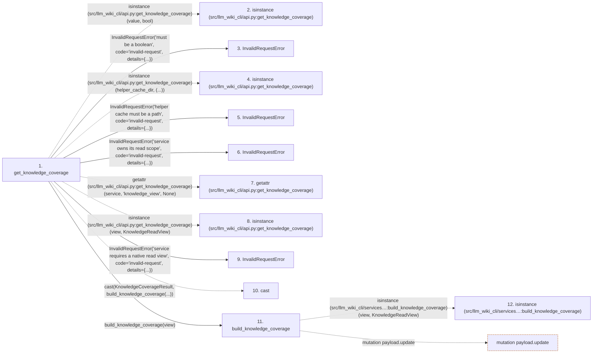

# get_knowledge_coverage

**Entry point:** `get_knowledge_coverage` (`api`)
**Source:** [api](../modules/api.md)
**Modules touched:** [analysis_capture](../modules/analysis_capture.md), [analysis_compatibility](../modules/analysis_compatibility.md), [api](../modules/api.md), [common](../modules/common.md), and 58 more

**Complete modules touched:**

- [analysis_capture](../modules/analysis_capture.md)
- [analysis_compatibility](../modules/analysis_compatibility.md)
- [api](../modules/api.md)
- [common](../modules/common.md)
- [config](../modules/config.md)
- [context_packet](../modules/context_packet.md)
- [context_service](../modules/context_service.md)
- [data_flow](../modules/data_flow.md)
- [dependency_versions](../modules/dependency_versions.md)
- [documentation_queries](../modules/documentation_queries.md)
- [documentation_query_builder](../modules/documentation_query_builder.md)
- [entrypoints](../modules/entrypoints.md)
- [extraction_service](../modules/extraction_service.md)
- [filesystem_guard](../modules/filesystem_guard.md)
- [go_calls](../modules/go_calls.md)
- [immutable](../modules/immutable.md)
- [implementation_evidence](../modules/implementation_evidence.md)
- [imports](../modules/imports.md)
- [infrastructure_inventory](../modules/infrastructure_inventory.md)
- [infrastructure_sync](../modules/infrastructure_sync.md)
- [io](../modules/io.md)
- [knowledge_artifacts](../modules/knowledge_artifacts.md)
- [knowledge_consumption](../modules/knowledge_consumption.md)
- [knowledge_coverage](../modules/knowledge_coverage.md)
- [knowledge_envelope](../modules/knowledge_envelope.md)
- [knowledge_evidence](../modules/knowledge_evidence.md)
- [knowledge_freshness](../modules/knowledge_freshness.md)
- [knowledge_generation](../modules/knowledge_generation.md)
- [knowledge_governance](../modules/knowledge_governance.md)
- [knowledge_graph](../modules/knowledge_graph.md)
- [knowledge_index](../modules/knowledge_index.md)
- [knowledge_loader](../modules/knowledge_loader.md)
- [knowledge_model](../modules/knowledge_model.md)
- [knowledge_orchestration](../modules/knowledge_orchestration.md)
- [knowledge_packs](../modules/knowledge_packs.md)
- [knowledge_reuse](../modules/knowledge_reuse.md)
- [knowledge_storage](../modules/knowledge_storage.md)
- [knowledge_storage_io](../modules/knowledge_storage_io.md)
- [knowledge_verification](../modules/knowledge_verification.md)
- [maintenance_evidence](../modules/maintenance_evidence.md)
- [maintenance_protocol](../modules/maintenance_protocol.md)
- [maintenance_service](../modules/maintenance_service.md)
- [maintenance_shapes](../modules/maintenance_shapes.md)
- [maintenance_state](../modules/maintenance_state.md)
- [maintenance_status](../modules/maintenance_status.md)
- [manifest_storage](../modules/manifest_storage.md)
- [paths](../modules/paths.md)
- [plugins](../modules/plugins.md)
- [python_bindings](../modules/python_bindings.md)
- [python_calls](../modules/python_calls.md)
- [python_implementation](../modules/python_implementation.md)
- [python_imports](../modules/python_imports.md)
- [section_ownership](../modules/section_ownership.md)
- [services_dependencies](../modules/services_dependencies.md)
- [source_selection](../modules/source_selection.md)
- [source_snapshot](../modules/source_snapshot.md)
- [sync_manifest](../modules/sync_manifest.md)
- [validation](../modules/validation.md)
- [verification_contracts](../modules/verification_contracts.md)
- [wiki_media](../modules/wiki_media.md)
- [wiki_surface](../modules/wiki_surface.md)
- [wiki_surface_index](../modules/wiki_surface_index.md)

## Call sequence

> Static overview in presentation order, not runtime execution order. Arrows retain captured callers; siblings are shown before deeper helper detail.

<!-- Auto-generated from static call edges. Dashed arrows are external or unresolved calls. Reviewed runtime conditions and side effects belong in Behavior. -->

```mermaid
sequenceDiagram
    participant p0 as get_knowledge_coverage
    participant p1 as isinstance (src/llm_wiki_cli/api.py:get_knowledge_coverage)
    participant p2 as InvalidRequestError
    participant p3 as getattr (src/llm_wiki_cli/api.py:get_knowledge_coverage)
    participant p4 as cast
    participant p5 as build_knowledge_coverage
    participant p6 as capture_context_read
    participant p7 as str (src/llm_wiki_cli/api.py:get_knowledge_coverage)
    participant p8 as _assert_source_unchanged
    participant p9 as _assert_wiki_unchanged
    participant p10 as _validate_wiki_dir
    participant p11 as _wiki_anchor
    participant p12 as load_knowledge_read_view
    participant p13 as isinstance (src/llm_wiki_cli/services…:build_knowledge_coverage)
    participant p14 as isinstance (src/llm_wiki_cli/services…t.py:capture_context_read)
    participant p15 as validate_path
    participant p16 as isinstance (src/llm_wiki_cli/services…:load_knowledge_read_view)
    participant p17 as TypeError (src/llm_wiki_cli/services…:build_knowledge_coverage)
    participant p18 as TypeError (src/llm_wiki_cli/services…t.py:capture_context_read)
    participant p19 as TypeError (src/llm_wiki_cli/services…:load_knowledge_read_view)
    participant p20 as set (src/llm_wiki_cli/services…:build_knowledge_coverage)
    p0-->>p1: isinstance (src/llm_wiki_cli/api.py:get_knowledge_coverage)(value, bool)
    p0->>p2: InvalidRequestError
    p0-->>p1: isinstance (src/llm_wiki_cli/api.py:get_knowledge_coverage)(helper_cache_dir, (...))
    p0->>p2: InvalidRequestError
    p0->>p2: InvalidRequestError
    p0-->>p3: getattr (src/llm_wiki_cli/api.py:get_knowledge_coverage)(service, 'knowledge_view', None)
    p0-->>p1: isinstance (src/llm_wiki_cli/api.py:get_knowledge_coverage)(view, KnowledgeReadView)
    p0->>p2: InvalidRequestError
    p0-->>p4: cast(KnowledgeCoverageResult, build_knowledge_coverage(...))
    p0->>p5: build_knowledge_coverage
    p0->>p6: capture_context_read
    p0-->>p7: str (src/llm_wiki_cli/api.py:get_knowledge_coverage)(helper_cache_dir)
    p0->>p5: build_knowledge_coverage
    p0->>p8: _assert_source_unchanged
    p0->>p9: _assert_wiki_unchanged
    p0->>p10: _validate_wiki_dir
    p0->>p11: _wiki_anchor
    p0->>p12: load_knowledge_read_view
    p0->>p5: build_knowledge_coverage
    p0->>p9: _assert_wiki_unchanged
    p0-->>p4: cast(KnowledgeCoverageResult, payload)
    p5-->>p13: isinstance (src/llm_wiki_cli/services…:build_knowledge_coverage)(view, KnowledgeReadView)
    p6-->>p14: isinstance (src/llm_wiki_cli/services…t.py:capture_context_read)(read_only, bool)
    p10->>p15: validate_path
    p12-->>p16: isinstance (src/llm_wiki_cli/services…:load_knowledge_read_view)(include_machine_verification, bool)
    p5-->>p17: TypeError (src/llm_wiki_cli/services…:build_knowledge_coverage)('view must be a validated knowledge read view')
    p6-->>p18: TypeError (src/llm_wiki_cli/services…t.py:capture_context_read)('read_only must be a boolean')
    p12-->>p19: TypeError (src/llm_wiki_cli/services…:load_knowledge_read_view)('include_machine_verification must be a boolean')
    p5-->>p20: set (src/llm_wiki_cli/services…:build_knowledge_coverage)(freshness.by_locator)
    p6-->>p14: isinstance (src/llm_wiki_cli/services…t.py:capture_context_read)(allow_external_src, bool)
```

> Call sequence diagram shows 30 of 4090 interactions; 4060 omitted to keep the visualization within the 30-interaction and generated-diagram limits, with uncertain identities omitted rather than inferred.

> Captured boundary calls: external 15 of 1295 (1280 omitted); unresolved 0 of 1343 (1343 omitted). These counts cover the captured static trace.

Omitted captured detail, grouped by actual caller occurrence and target module:

| Caller | Parent step | Target module | Kind | Omitted interactions |
| --- | --- | --- | --- | --- |
| `src/llm_wiki_cli/services/knowledge_coverage.py:build_knowledge_coverage` | 11 | - | external | 12 |
| `src/llm_wiki_cli/services/knowledge_coverage.py:build_knowledge_coverage` | 11 | - | unresolved | 7 |
| `src/llm_wiki_cli/services/knowledge_coverage.py:build_knowledge_coverage` | 11 | [src/llm_wiki_cli/services/knowledge_freshness.py](../modules/knowledge_freshness.md) | internal | 1 |
| `src/llm_wiki_cli/services/context_packet.py:capture_context_read` | 35 | - | external | 33 |
| `src/llm_wiki_cli/services/context_packet.py:capture_context_read` | 35 | [src/llm_wiki_cli/config.py](../modules/config.md) | internal | 2 |
| `src/llm_wiki_cli/config.py:validate_source_root` | 48 | [src/llm_wiki_cli/config.py](../modules/config.md) | internal | 7 |
| `src/llm_wiki_cli/config.py:validate_path` | 49 | [src/llm_wiki_cli/config.py](../modules/config.md) | internal | 2 |
| `src/llm_wiki_cli/config.py:validate_path` | 49 | - | unresolved | 3 |
> Omission summary shows 8 of 1010 groups; 1002 further groups are not expanded here. Counts above include all omitted interactions.
> Detailed flow queries retain their own coverage and limits; omitted paths may execute at runtime.

> Trace truncated at the depth limit; deeper calls are omitted.

## Data flow

<!-- Auto-generated static analysis. Treat values and boundaries as best-effort hints, not runtime proof. -->

```mermaid
flowchart LR
    s1["1. get_knowledge_coverage"]
    s2["2. isinstance (src/llm_wiki_cli/api.py:get_knowledge_coverage)"]
    s3["3. InvalidRequestError"]
    s4["4. isinstance (src/llm_wiki_cli/api.py:get_knowledge_coverage)"]
    s5["5. InvalidRequestError"]
    s6["6. InvalidRequestError"]
    s7["7. getattr (src/llm_wiki_cli/api.py:get_knowledge_coverage)"]
    s8["8. isinstance (src/llm_wiki_cli/api.py:get_knowledge_coverage)"]
    s9["9. InvalidRequestError"]
    s10["10. cast"]
    s11["11. build_knowledge_coverage"]
    s12["12. isinstance (src/llm_wiki_cli/services…:build_knowledge_coverage)"]
    s1 -. "isinstance (src/llm_wiki_cli/api.py:get_knowledge_coverage)(value, bool)" .-> s2
    s1 -->|"InvalidRequestError('must be a boolean', code='invalid-request', details={...})"| s3
    s1 -. "isinstance (src/llm_wiki_cli/api.py:get_knowledge_coverage)(helper_cache_dir, (...))" .-> s4
    s1 -->|"InvalidRequestError('helper cache must be a path', code='invalid-request', details={...})"| s5
    s1 -->|"InvalidRequestError('service owns its read scope', code='invalid-request', details={...})"| s6
    s1 -. "getattr (src/llm_wiki_cli/api.py:get_knowledge_coverage)(service, 'knowledge_view', None)" .-> s7
    s1 -. "isinstance (src/llm_wiki_cli/api.py:get_knowledge_coverage)(view, KnowledgeReadView)" .-> s8
    s1 -->|"InvalidRequestError('service requires a native read view', code='invalid-request', details={...})"| s9
    s1 -. "cast(KnowledgeCoverageResult, build_knowledge_coverage(...))" .-> s10
    s1 -->|"build_knowledge_coverage(view)"| s11
    s11 -. "isinstance (src/llm_wiki_cli/services…:build_knowledge_coverage)(view, KnowledgeReadView)" .-> s12
    b0["mutation payload.update"]
    s11 -. "mutation payload.update" .-> b0
    click s1 "../modules/api.md"
    click s3 "../modules/api.md"
    click s5 "../modules/api.md"
    click s6 "../modules/api.md"
    click s9 "../modules/api.md"
    click s11 "../modules/knowledge_coverage.md"
    classDef boundary stroke:#b45309,stroke-dasharray: 4 2
    class b0 boundary
```

### Step data

| Step | Inputs | Reads | Writes | Returns |
|---|---|---|---|---|
| `get_knowledge_coverage` | `src_dir: str`, `wiki_dir: str`, `live: bool`, `service: DocumentationGraphQueryService \| None`, `allow_external_src: bool`, `source_selection: str \| Path \| None`, `helper_cache_dir: str \| Path \| None`, `comparison_policy: str \| None` | `Path`, `DEFAULT_WIKI_DIR`, `KnowledgeCoverageResult`, `KnowledgeCoverageResult` | - | `cast(...)`, `cast(...)` |
| `isinstance (src/llm_wiki_cli/api.py:get_knowledge_coverage)` | - | - | - | - |
| `InvalidRequestError` | - | - | - | - |
| `isinstance (src/llm_wiki_cli/api.py:get_knowledge_coverage)` | - | - | - | - |
| `InvalidRequestError` | - | - | - | - |
| `InvalidRequestError` | - | - | - | - |
| `getattr (src/llm_wiki_cli/api.py:get_knowledge_coverage)` | - | - | - | - |
| `isinstance (src/llm_wiki_cli/api.py:get_knowledge_coverage)` | - | - | - | - |
| `InvalidRequestError` | - | - | - | - |
| `cast` | - | - | - | - |
| `build_knowledge_coverage` | `view: KnowledgeReadView` | `KnowledgeReadView`, `KNOWLEDGE_COVERAGE_SCHEMA_VERSION`, `_KINDS`, `KNOWN_FRESHNESS_REASON_CODES`, `MAX_COVERAGE_BYTES` | `target[...]`, `target[...]`, `reasons[...]` | `payload`, `payload` |
| `isinstance (src/llm_wiki_cli/services…:build_knowledge_coverage)` | - | - | - | - |

### Call data

| From | To | Line | Call |
|---|---|---:|---|
| get_knowledge_coverage | isinstance (src/llm_wiki_cli/api.py:get_knowledge_coverage) | 947 | `isinstance(value, bool)` |
| get_knowledge_coverage | InvalidRequestError | 948 | `InvalidRequestError('must be a boolean', code='invalid-request', details={...})` |
| get_knowledge_coverage | isinstance (src/llm_wiki_cli/api.py:get_knowledge_coverage) | 951 | `isinstance(helper_cache_dir, (...))` |
| get_knowledge_coverage | InvalidRequestError | 952 | `InvalidRequestError('helper cache must be a path', code='invalid-request', details={...})` |
| get_knowledge_coverage | InvalidRequestError | 966 | `InvalidRequestError('service owns its read scope', code='invalid-request', details={...})` |
| get_knowledge_coverage | getattr (src/llm_wiki_cli/api.py:get_knowledge_coverage) | 971 | `getattr(service, 'knowledge_view', None)` |
| get_knowledge_coverage | isinstance (src/llm_wiki_cli/api.py:get_knowledge_coverage) | 972 | `isinstance(view, KnowledgeReadView)` |
| get_knowledge_coverage | InvalidRequestError | 973 | `InvalidRequestError('service requires a native read view', code='invalid-request', details={...})` |
| get_knowledge_coverage | cast | 978 | `cast(KnowledgeCoverageResult, build_knowledge_coverage(...))` |
| get_knowledge_coverage | build_knowledge_coverage | 978 | `build_knowledge_coverage(view)` |
| build_knowledge_coverage | isinstance (src/llm_wiki_cli/services…:build_knowledge_coverage) | 23 | `isinstance(view, KnowledgeReadView)` |

### Boundary effects

| Kind | Target | Step | Line |
|---|---|---|---:|
| mutation | `payload.update` | `build_knowledge_coverage` | 81 |

### Static analysis gaps

| Kind | Step | Target | Line |
|---|---|---|---:|
| external_call | `get_knowledge_coverage` | `isinstance` | 947 |
| external_call | `get_knowledge_coverage` | `isinstance` | 951 |
| external_call | `get_knowledge_coverage` | `getattr` | 971 |
| external_call | `get_knowledge_coverage` | `isinstance` | 972 |
| external_call | `get_knowledge_coverage` | `cast` | 978 |
| external_call | `build_knowledge_coverage` | `isinstance` | 23 |
| step_limit | `get_knowledge_coverage` | `first 12 steps` | 0 |
| truncated_flow | `get_knowledge_coverage` | `depth limit` | 0 |

## Behavior

This flow starts at `get_knowledge_coverage` and is classified as `api`. The generated call and data-flow sections are bounded static projections; runtime conditions and side effects require source-level confirmation.
