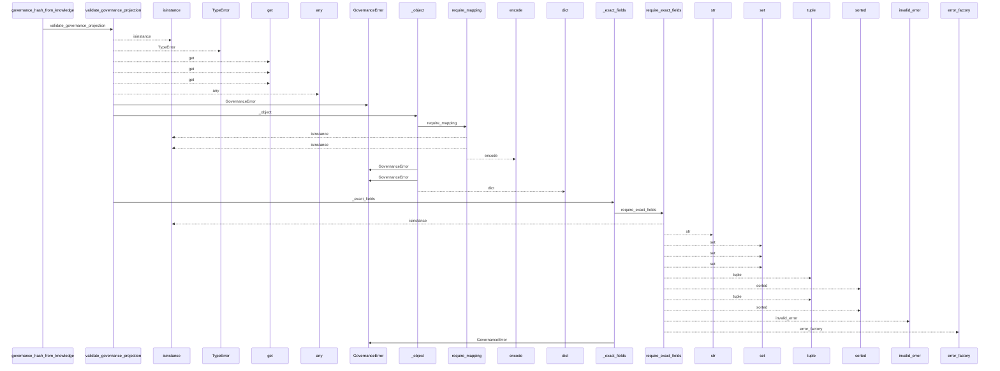
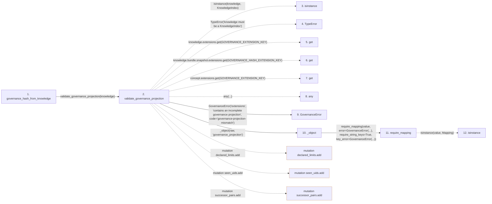

# governance_hash_from_knowledge

**Entry point:** `governance_hash_from_knowledge` (`api`)
**Source:** [knowledge_governance](../modules/knowledge_governance.md)
**Modules touched:** [concept_identity](../modules/concept_identity.md), [knowledge_evidence](../modules/knowledge_evidence.md), [knowledge_governance](../modules/knowledge_governance.md), and 4 more

**Complete modules touched:**

- [concept_identity](../modules/concept_identity.md)
- [knowledge_evidence](../modules/knowledge_evidence.md)
- [knowledge_governance](../modules/knowledge_governance.md)
- [knowledge_graph](../modules/knowledge_graph.md)
- [knowledge_model](../modules/knowledge_model.md)
- [validation](../modules/validation.md)
- [wiki_surface](../modules/wiki_surface.md)

## Call sequence

<!-- Auto-generated from static call edges. Dashed arrows are external or unresolved calls. Reviewed runtime conditions and side effects belong in Behavior. -->

> Call sequence diagram shows 30 of 1116 interactions; 1086 omitted to keep the visualization within the 30-interaction and generated-diagram limits.

> Trace truncated at the depth limit; deeper calls are omitted.

## Data flow

<!-- Auto-generated static analysis. Treat values and boundaries as best-effort hints, not runtime proof. -->

### Step data

| Step | Inputs | Reads | Writes | Returns |
|---|---|---|---|---|
| `governance_hash_from_knowledge` | `knowledge: KnowledgeIndex` | - | - | `None`, `value` |
| `validate_governance_projection` | `knowledge: KnowledgeIndex`, `ledger: GovernanceLedger \| None`, `event_limit: int \| None` | `KnowledgeIndex`, `GOVERNANCE_EXTENSION_KEY`, `GOVERNANCE_HASH_EXTENSION_KEY`, `GOVERNANCE_EXTENSION_KEY`, `GOVERNANCE_SCHEMA_VERSION`, `GOVERNANCE_SCHEMA_VERSION`, `GOVERNANCE_HASH_EXTENSION_KEY`, `GOVERNANCE_EXTENSION_KEY` | - | `None`, `projection` |
| `isinstance` | - | - | - | - |
| `TypeError` | - | - | - | - |
| `get` | - | - | - | - |
| `get` | - | - | - | - |
| `get` | - | - | - | - |
| `any` | - | - | - | - |
| `GovernanceError` | - | - | - | - |
| `_object` | `value: object`, `path: str` | - | - | `dict(...)` |
| `require_mapping` | `value: object`, `error: Exception`, `require_string_keys: bool`, `key_error: Exception \| None`, `require_utf8_keys: bool`, `utf8_key_error: Exception \| None` | `Mapping` | - | `value` |
| `isinstance` | - | - | - | - |

### Call data

| From | To | Line | Call |
|---|---|---:|---|
| governance_hash_from_knowledge | validate_governance_projection | 2002 | `validate_governance_projection(knowledge)` |
| validate_governance_projection | isinstance | 1815 | `isinstance(knowledge, KnowledgeIndex)` |
| validate_governance_projection | TypeError | 1816 | `TypeError('knowledge must be a KnowledgeIndex')` |
| validate_governance_projection | get | 1817 | `knowledge.extensions.get(GOVERNANCE_EXTENSION_KEY)` |
| validate_governance_projection | get | 1818 | `knowledge.bundle.snapshot.extensions.get(GOVERNANCE_HASH_EXTENSION_KEY)` |
| validate_governance_projection | get | 1822 | `concept.extensions.get(GOVERNANCE_EXTENSION_KEY)` |
| validate_governance_projection | any | 1826 | `any(...)` |
| validate_governance_projection | GovernanceError | 1829 | `GovernanceError('extensions', 'contains an incomplete governance projection', code='governance-projection-mismatch')` |
| validate_governance_projection | _object | 1835 | `_object(raw, 'governance_projection')` |
| _object | require_mapping | 3136 | `require_mapping(value, error=GovernanceError(...), require_string_keys=True, key_error=GovernanceError(...))` |
| require_mapping | isinstance | 727 | `isinstance(value, Mapping)` |

### Boundary effects

| Kind | Target | Step | Line |
|---|---|---|---:|
| mutation | `declared_limits.add` | `validate_governance_projection` | 1920 |
| mutation | `seen_uids.add` | `validate_governance_projection` | 1927 |
| mutation | `successor_pairs.add` | `validate_governance_projection` | 1942 |

### Static analysis gaps

| Kind | Step | Target | Line |
|---|---|---|---:|
| unresolved_call | `validate_governance_projection` | `isinstance` | 1815 |
| unresolved_call | `validate_governance_projection` | `TypeError` | 1816 |
| unresolved_call | `validate_governance_projection` | `knowledge.extensions.get` | 1817 |
| unresolved_call | `validate_governance_projection` | `knowledge.bundle.snapshot.extensions.get` | 1818 |
| unresolved_call | `validate_governance_projection` | `concept.extensions.get` | 1822 |
| unresolved_call | `validate_governance_projection` | `any` | 1826 |
| unresolved_call | `require_mapping` | `isinstance` | 727 |
| step_limit | `governance_hash_from_knowledge` | `first 12 steps` | 0 |
| truncated_flow | `governance_hash_from_knowledge` | `depth limit` | 0 |

## Behavior

This flow starts at `governance_hash_from_knowledge` and is classified as `api`. The generated call and data-flow sections are bounded static projections; runtime conditions and side effects require source-level confirmation.
