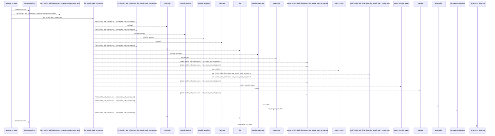
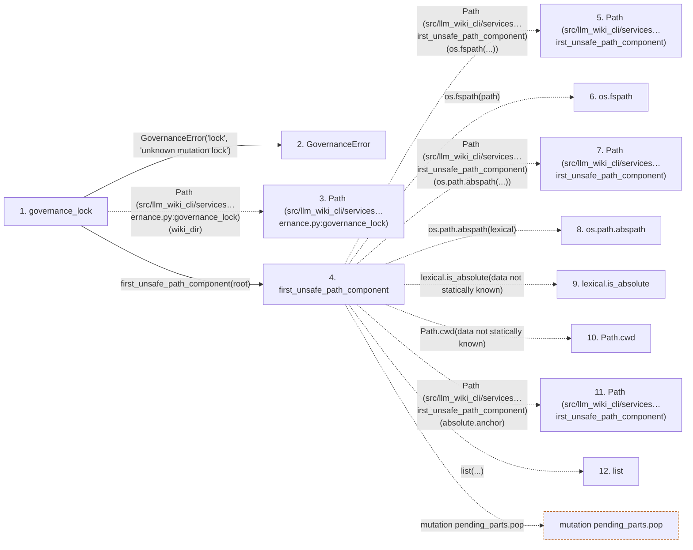

# governance_lock

**Entry point:** `governance_lock` (`api`)
**Source:** [knowledge_governance](../modules/knowledge_governance.md)
**Modules touched:** [io](../modules/io.md), [knowledge_governance](../modules/knowledge_governance.md)

## Call sequence

<!-- Auto-generated from static call edges. Dashed arrows are external or unresolved calls. Reviewed runtime conditions and side effects belong in Behavior. -->

> Call sequence diagram shows 30 of 61 interactions; 31 omitted to keep the visualization within the 30-interaction and generated-diagram limits.

## Data flow

<!-- Auto-generated static analysis. Treat values and boundaries as best-effort hints, not runtime proof. -->

### Step data

| Step | Inputs | Reads | Writes | Returns |
|---|---|---|---|---|
| `governance_lock` | `wiki_dir: str \| Path`, `_lock_filename: str` | `GOVERNANCE_LOCK_FILENAME`, `os`, `os`, `os`, `sys`, `sys`, `GOVERNANCE_FILENAME`, `sys` | - | - |
| `GovernanceError` | - | - | - | - |
| `Path (src/llm_wiki_cli/services…ernance.py:governance_lock)` | - | - | - | - |
| `first_unsafe_path_component` | `path: str \| Path`, `trusted_symlink_uids: Set[int] \| None`, `trusted_symlink_owner: Callable[[Path], bool] \| None` | `stat`, `os` | - | `lexical`, `None`, `current`, `current`, `current`, `current`, `current`, `None` |
| `Path (src/llm_wiki_cli/services…irst_unsafe_path_component)` | - | - | - | - |
| `os.fspath` | - | - | - | - |
| `Path (src/llm_wiki_cli/services…irst_unsafe_path_component)` | - | - | - | - |
| `os.path.abspath` | - | - | - | - |
| `lexical.is_absolute` | - | - | - | - |
| `Path.cwd` | - | - | - | - |
| `Path (src/llm_wiki_cli/services…irst_unsafe_path_component)` | - | - | - | - |
| `list` | - | - | - | - |

### Call data

| From | To | Line | Call |
|---|---|---:|---|
| governance_lock | GovernanceError | 860 | `GovernanceError('lock', 'unknown mutation lock')` |
| governance_lock | Path (src/llm_wiki_cli/services…ernance.py:governance_lock) | 861 | `Path(wiki_dir)` |
| governance_lock | first_unsafe_path_component | 862 | `first_unsafe_path_component(root)` |
| first_unsafe_path_component | Path (src/llm_wiki_cli/services…irst_unsafe_path_component) | 51 | `Path(os.fspath(...))` |
| first_unsafe_path_component | os.fspath | 51 | `os.fspath(path)` |
| first_unsafe_path_component | Path (src/llm_wiki_cli/services…irst_unsafe_path_component) | 59 | `Path(os.path.abspath(...))` |
| first_unsafe_path_component | os.path.abspath | 59 | `os.path.abspath(lexical)` |
| first_unsafe_path_component | lexical.is_absolute | 60 | `lexical.is_absolute(data not statically known)` |
| first_unsafe_path_component | Path.cwd | 66 | `Path.cwd(data not statically known)` |
| first_unsafe_path_component | Path (src/llm_wiki_cli/services…irst_unsafe_path_component) | 67 | `Path(absolute.anchor)` |
| first_unsafe_path_component | list | 68 | `list(...)` |

### Boundary effects

| Kind | Target | Step | Line |
|---|---|---|---:|
| mutation | `pending_parts.pop` | `first_unsafe_path_component` | 71 |

### Static analysis gaps

| Kind | Step | Target | Line |
|---|---|---|---:|
| external_call | `first_unsafe_path_component` | `os.fspath` | 51 |
| external_call | `first_unsafe_path_component` | `os.path.abspath` | 59 |
| unresolved_call | `first_unsafe_path_component` | `lexical.is_absolute` | 60 |
| external_call | `first_unsafe_path_component` | `Path.cwd` | 66 |
| step_limit | `governance_lock` | `first 12 steps` | 0 |

## Behavior

This flow starts at `governance_lock` and is classified as `api`. The generated call and data-flow sections are bounded static projections; runtime conditions and side effects require source-level confirmation.
