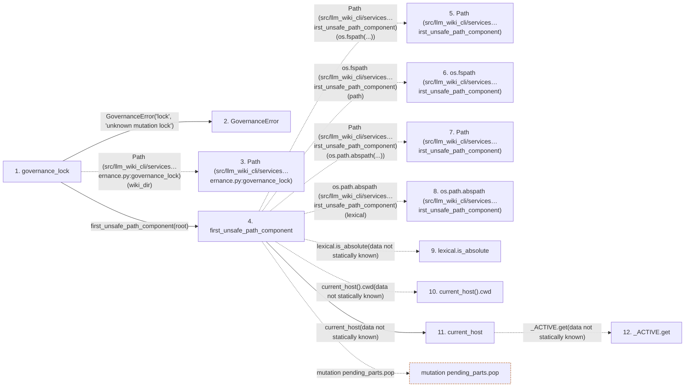

# governance_lock

**Entry point:** `governance_lock` (`api`)
**Source:** [knowledge_governance](../modules/knowledge_governance.md)
**Modules touched:** [host](../modules/host.md), [io](../modules/io.md), [knowledge_governance](../modules/knowledge_governance.md)

## Call sequence

> Static overview in presentation order, not runtime execution order. Arrows retain captured callers; representative internal continuations and boundary examples precede repeated helper detail.

<!-- Auto-generated from static call edges. Dashed arrows are external or unresolved calls. Reviewed runtime conditions and side effects belong in Behavior. -->

```mermaid
sequenceDiagram
    participant p0 as governance_lock
    participant p1 as first_unsafe_path_component
    participant p2 as GovernanceError
    participant p3 as _governance_lock_root
    participant p4 as _lock_open_diagnostic
    participant p5 as GovernanceConflictError
    participant p6 as current_host
    participant p7 as Path (src/llm_wiki_cli/services…ernance.py:governance_lock)
    participant p8 as lock_root.mkdir
    participant p9 as getattr (src/llm_wiki_cli/services…ernance.py:governance_lock)
    participant p10 as os.open
    participant p11 as os.fstat
    participant p12 as stat.S_ISREG
    participant p13 as os.write
    participant p14 as os.fsync
    participant p15 as os.fdopen
    participant p16 as os.close
    participant p17 as descriptor.seek
    participant p18 as msvcrt.locking
    participant p19 as descriptor.fileno
    participant p20 as fcntl.flock
    participant p21 as descriptor.close
    participant p22 as Path (src/llm_wiki_cli/services…irst_unsafe_path_component)
    participant p23 as wiki_dir.resolve
    participant p24 as type
    participant p25 as os.fspath (src/llm_wiki_cli/services…irst_unsafe_path_component)
    p0->>p1: first_unsafe_path_component
    p0->>p2: GovernanceError
    p0->>p3: _governance_lock_root
    p0->>p4: _lock_open_diagnostic
    p0->>p5: GovernanceConflictError
    p1->>p6: current_host
    p0-->>p7: Path (src/llm_wiki_cli/services…ernance.py:governance_lock)(wiki_dir)
    p0-->>p8: lock_root.mkdir(parents=True, exist_ok=True)
    p0-->>p9: getattr (src/llm_wiki_cli/services…ernance.py:governance_lock)(os, 'O_CLOEXEC', 0)
    p0-->>p9: getattr (src/llm_wiki_cli/services…ernance.py:governance_lock)(os, 'O_NOFOLLOW', 0)
    p0-->>p10: os.open(lock_path, flags, 384)
    p0-->>p11: os.fstat(file_descriptor)
    p0-->>p12: stat.S_ISREG(metadata.st_mode)
    p0-->>p13: os.write(file_descriptor, b'\x00')
    p0-->>p14: os.fsync(file_descriptor)
    p0-->>p15: os.fdopen(file_descriptor, 'r+', encoding='utf-8')
    p0-->>p16: os.close(file_descriptor)
    p0-->>p17: descriptor.seek(0)
    p0-->>p18: msvcrt.locking(descriptor.fileno(...), msvcrt.LK_NBLCK, 1)
    p0-->>p19: descriptor.fileno
    p0-->>p20: fcntl.flock(descriptor, ...)
    p0-->>p17: descriptor.seek(0)
    p0-->>p18: msvcrt.locking(descriptor.fileno(...), msvcrt.LK_UNLCK, 1)
    p0-->>p19: descriptor.fileno
    p0-->>p20: fcntl.flock(descriptor, fcntl.LOCK_UN)
    p0-->>p21: descriptor.close
    p1-->>p22: Path (src/llm_wiki_cli/services…irst_unsafe_path_component)(os.fspath(...))
    p3-->>p23: wiki_dir.resolve(strict=False)
    p4-->>p24: type(error)
    p1-->>p25: os.fspath (src/llm_wiki_cli/services…irst_unsafe_path_component)(path)
```

> Call sequence diagram shows 30 of 72 interactions; 42 omitted to keep the visualization within the 30-interaction and generated-diagram limits, with uncertain identities omitted rather than inferred.

> Captured boundary calls: external 17 of 46 (29 omitted); unresolved 7 of 15 (8 omitted). These counts cover the captured static trace.

Omitted captured detail, grouped by actual caller occurrence and target module:

| Caller | Parent step | Target module | Kind | Omitted interactions |
| --- | --- | --- | --- | --- |
| `src/llm_wiki_cli/services/io.py:first_unsafe_path_component` | 4 | - | external | 17 |
| `src/llm_wiki_cli/services/io.py:first_unsafe_path_component` | 4 | - | unresolved | 6 |
| `src/llm_wiki_cli/services/host.py:current_host` | 11 | - | unresolved | 1 |
| `src/llm_wiki_cli/services/knowledge_governance.py:governance_lock` | 1 | [src/llm_wiki_cli/services/knowledge_governance.py](../modules/knowledge_governance.md) | internal | 4 |
| `src/llm_wiki_cli/services/knowledge_governance.py:_governance_lock_root` | 33 | - | unresolved | 1 |
| `src/llm_wiki_cli/services/knowledge_governance.py:_governance_lock_root` | 33 | - | external | 7 |
| `src/llm_wiki_cli/services/knowledge_governance.py:governance_lock` | 1 | [src/llm_wiki_cli/services/io.py](../modules/io.md) | internal | 1 |
| `src/llm_wiki_cli/services/knowledge_governance.py:_lock_open_diagnostic` | 50 | - | external | 5 |
> Detailed flow queries retain their own coverage and limits; omitted paths may execute at runtime.

## Data flow

<!-- Auto-generated static analysis. Treat values and boundaries as best-effort hints, not runtime proof. -->

### Analysis coverage

**Effect analysis partially available.** Flow assembly and source effect analysis are separate; empty observations do not prove an empty handler body.

Source steps: 12; effect analysis evaluated: 6, partial: 0, unavailable: 6. Counts include steps omitted from the displayed trace.

Collector observations for 6 source steps with known totals: observed: 47, emitted: 47, omitted: 0. Unavailable totals are excluded.

- Callable record unavailable for one or more source steps; those steps have no represented callable body.
- Effect collector totals unavailable; observed counts cover captured records only.

| Step | Callable record | Effect analysis | Collector totals | Observed | Emitted | Omitted |
|---|---|---|---|---:|---:|---:|
| `governance_lock` | `available` | `evaluated` | `available` | `10` | `10` | `0` |
| `GovernanceError` | `unavailable` | `unavailable` | `unavailable` | — | — | — |
| `Path (src/llm_wiki_cli/services…ernance.py:governance_lock)` | `not_applicable` | `not_applicable` | `not_applicable` | — | — | — |
| `first_unsafe_path_component` | `available` | `evaluated` | `available` | `14` | `14` | `0` |
| `Path (src/llm_wiki_cli/services…irst_unsafe_path_component)` | `not_applicable` | `not_applicable` | `not_applicable` | — | — | — |
| `os.fspath (src/llm_wiki_cli/services…irst_unsafe_path_component)` | `not_applicable` | `not_applicable` | `not_applicable` | — | — | — |
| `Path (src/llm_wiki_cli/services…irst_unsafe_path_component)` | `not_applicable` | `not_applicable` | `not_applicable` | — | — | — |
| `os.path.abspath (src/llm_wiki_cli/services…irst_unsafe_path_component)` | `not_applicable` | `not_applicable` | `not_applicable` | — | — | — |
| `lexical.is_absolute` | `not_applicable` | `not_applicable` | `not_applicable` | — | — | — |
| `current_host().cwd` | `not_applicable` | `not_applicable` | `not_applicable` | — | — | — |
| `current_host` | `available` | `evaluated` | `available` | `2` | `2` | `0` |
| `_ACTIVE.get` | `not_applicable` | `not_applicable` | `not_applicable` | — | — | — |

```mermaid
flowchart LR
    s1["1. governance_lock"]
    s2["2. GovernanceError"]
    s3["3. Path (src/llm_wiki_cli/services…ernance.py:governance_lock)"]
    s4["4. first_unsafe_path_component"]
    s5["5. Path (src/llm_wiki_cli/services…irst_unsafe_path_component)"]
    s6["6. os.fspath (src/llm_wiki_cli/services…irst_unsafe_path_component)"]
    s7["7. Path (src/llm_wiki_cli/services…irst_unsafe_path_component)"]
    s8["8. os.path.abspath (src/llm_wiki_cli/services…irst_unsafe_path_component)"]
    s9["9. lexical.is_absolute"]
    s10["10. current_host().cwd"]
    s11["11. current_host"]
    s12["12. _ACTIVE.get"]
    s1 -->|"GovernanceError('lock', 'unknown mutation lock')"| s2
    s1 -. "Path (src/llm_wiki_cli/services…ernance.py:governance_lock)(wiki_dir)" .-> s3
    s1 -->|"first_unsafe_path_component(root)"| s4
    s4 -. "Path (src/llm_wiki_cli/services…irst_unsafe_path_component)(os.fspath(...))" .-> s5
    s4 -. "os.fspath (src/llm_wiki_cli/services…irst_unsafe_path_component)(path)" .-> s6
    s4 -. "Path (src/llm_wiki_cli/services…irst_unsafe_path_component)(os.path.abspath(...))" .-> s7
    s4 -. "os.path.abspath (src/llm_wiki_cli/services…irst_unsafe_path_component)(lexical)" .-> s8
    s4 -. "lexical.is_absolute(data not statically known)" .-> s9
    s4 -. "current_host().cwd(data not statically known)" .-> s10
    s4 -->|"current_host(data not statically known)"| s11
    s11 -. "_ACTIVE.get(data not statically known)" .-> s12
    b0["mutation pending_parts.pop"]
    s4 -. "mutation pending_parts.pop" .-> b0
    click s1 "../modules/knowledge_governance.md"
    click s2 "../modules/knowledge_governance.md"
    click s4 "../modules/io.md"
    click s11 "../modules/host.md"
    classDef boundary stroke:#b45309,stroke-dasharray: 4 2
    class b0 boundary
```

### Step data

| Step | Inputs | Reads | Writes | Returns |
|---|---|---|---|---|
| `governance_lock` | `wiki_dir: str \| Path`, `_lock_filename: str` | `GOVERNANCE_LOCK_FILENAME`, `os`, `os`, `os`, `sys`, `sys`, `GOVERNANCE_FILENAME`, `sys` | - | - |
| `GovernanceError` | - | - | - | - |
| `Path (src/llm_wiki_cli/services…ernance.py:governance_lock)` | - | - | - | - |
| `first_unsafe_path_component` | `path: str \| Path`, `trusted_symlink_uids: Set[int] \| None`, `trusted_symlink_owner: Callable[[Path], bool] \| None` | `stat`, `os` | - | `lexical`, `None`, `current`, `current`, `current`, `current`, `current`, `None` |
| `Path (src/llm_wiki_cli/services…irst_unsafe_path_component)` | - | - | - | - |
| `os.fspath (src/llm_wiki_cli/services…irst_unsafe_path_component)` | - | - | - | - |
| `Path (src/llm_wiki_cli/services…irst_unsafe_path_component)` | - | - | - | - |
| `os.path.abspath (src/llm_wiki_cli/services…irst_unsafe_path_component)` | - | - | - | - |
| `lexical.is_absolute` | - | - | - | - |
| `current_host().cwd` | - | - | - | - |
| `current_host` | - | `_DEFAULT` | - | `...` |
| `_ACTIVE.get` | - | - | - | - |

### Call data

| From | To | Line | Call |
|---|---|---:|---|
| governance_lock | GovernanceError | 883 | `GovernanceError('lock', 'unknown mutation lock')` |
| governance_lock | Path (src/llm_wiki_cli/services…ernance.py:governance_lock) | 884 | `Path(wiki_dir)` |
| governance_lock | first_unsafe_path_component | 885 | `first_unsafe_path_component(root)` |
| first_unsafe_path_component | Path (src/llm_wiki_cli/services…irst_unsafe_path_component) | 52 | `Path(os.fspath(...))` |
| first_unsafe_path_component | os.fspath (src/llm_wiki_cli/services…irst_unsafe_path_component) | 52 | `os.fspath(path)` |
| first_unsafe_path_component | Path (src/llm_wiki_cli/services…irst_unsafe_path_component) | 60 | `Path(os.path.abspath(...))` |
| first_unsafe_path_component | os.path.abspath (src/llm_wiki_cli/services…irst_unsafe_path_component) | 60 | `os.path.abspath(lexical)` |
| first_unsafe_path_component | lexical.is_absolute | 61 | `lexical.is_absolute(data not statically known)` |
| first_unsafe_path_component | current_host().cwd | 67 | `current_host().cwd(data not statically known)` |
| first_unsafe_path_component | current_host | 67 | `current_host(data not statically known)` |
| current_host | _ACTIVE.get | 166 | `_ACTIVE.get(data not statically known)` |

### Boundary effects

| Kind | Target | Step | Line |
|---|---|---|---:|
| mutation | `pending_parts.pop` | `first_unsafe_path_component` | 72 |

### Static analysis gaps

| Kind | Step | Target | Line |
|---|---|---|---:|
| external_call | `first_unsafe_path_component` | `os.fspath` | 52 |
| external_call | `first_unsafe_path_component` | `os.path.abspath` | 60 |
| unresolved_call | `first_unsafe_path_component` | `lexical.is_absolute` | 61 |
| unresolved_call | `first_unsafe_path_component` | `current_host().cwd` | 67 |
| unresolved_call | `current_host` | `_ACTIVE.get` | 166 |
| step_limit | `governance_lock` | `first 12 steps` | 0 |

## Behavior

The mutation body runs only after a safe regular-file lock has been acquired.
Symbolic-link, reparse-point and hardlink refusals remain separate from competing
owner conflicts. A failed open raises the existing governance error and retains
its original filesystem exception; it does not retry or choose another lock.

The open-failure message identifies `lock-open-failed`, the resolved native lock
path, errno and any Windows error number, and the bounded cause. JSON quoting
preserves filesystem spelling and escapes control characters. The cause is
limited to 256 characters and discloses truncation. CLI text and JSON error routes
retain failure status; read-only storage diagnostics acquire no mutation lock.
