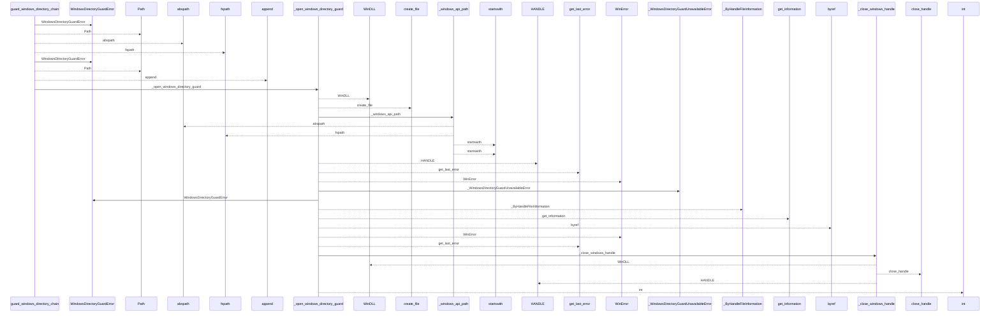
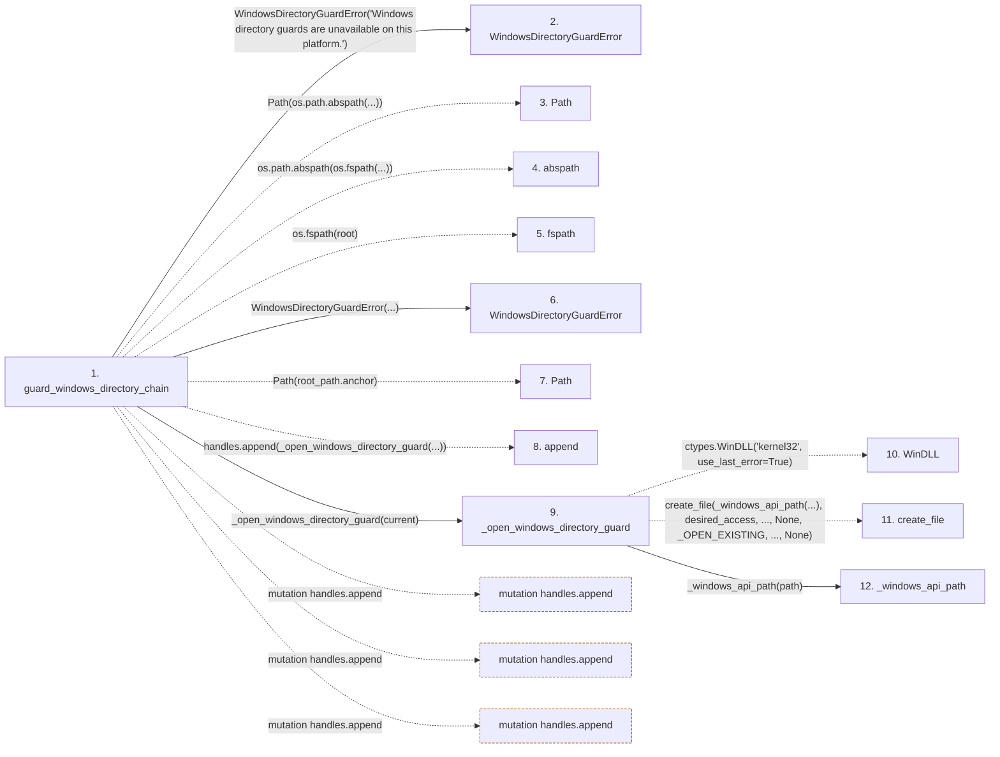

# guard_windows_directory_chain

**Entry point:** `guard_windows_directory_chain` (`api`)
**Source:** [filesystem_guard](../modules/filesystem_guard.md)
**Modules touched:** [filesystem_guard](../modules/filesystem_guard.md)

## Call sequence

<!-- Auto-generated from static call edges. Dashed arrows are external or unresolved calls. Reviewed runtime conditions and side effects belong in Behavior. -->

> Call sequence diagram shows 30 of 212 interactions; 182 omitted to keep the visualization within the 30-interaction and generated-diagram limits.

## Data flow

<!-- Auto-generated static analysis. Treat values and boundaries as best-effort hints, not runtime proof. -->

### Step data

| Step | Inputs | Reads | Writes | Returns |
|---|---|---|---|---|
| `guard_windows_directory_chain` | `root: Path`, `relative_components: Sequence[str]`, `create_missing: bool`, `require_restrictive_dacl: bool` | `os`, `WindowsDurabilityError` | - | - |
| `WindowsDirectoryGuardError` | - | - | - | - |
| `Path` | - | - | - | - |
| `abspath` | - | - | - | - |
| `fspath` | - | - | - | - |
| `WindowsDirectoryGuardError` | - | - | - | - |
| `Path` | - | - | - | - |
| `append` | - | - | - | - |
| `_open_windows_directory_guard` | `path: Path`, `require_restrictive_dacl: bool` | `_FILE_LIST_DIRECTORY`, `_FILE_READ_ATTRIBUTES`, `_READ_CONTROL`, `_FILE_SHARE_READ`, `_FILE_SHARE_WRITE`, `_OPEN_EXISTING`, `_FILE_FLAG_BACKUP_SEMANTICS`, `_FILE_FLAG_OPEN_REPARSE_POINT` | `create_file.argtypes`, `create_file.restype`, `get_information.argtypes`, `get_information.restype` | `int(...)` |
| `WinDLL` | - | - | - | - |
| `create_file` | - | - | - | - |
| `_windows_api_path` | `path: Path` | - | - | `value`, `...`, `...` |

### Call data

| From | To | Line | Call |
|---|---|---:|---|
| guard_windows_directory_chain | WindowsDirectoryGuardError | 170 | `WindowsDirectoryGuardError('Windows directory guards are unavailable on this platform.')` |
| guard_windows_directory_chain | Path | 174 | `Path(os.path.abspath(...))` |
| guard_windows_directory_chain | abspath | 174 | `os.path.abspath(os.fspath(...))` |
| guard_windows_directory_chain | fspath | 174 | `os.fspath(root)` |
| guard_windows_directory_chain | WindowsDirectoryGuardError | 176 | `WindowsDirectoryGuardError(...)` |
| guard_windows_directory_chain | Path | 179 | `Path(root_path.anchor)` |
| guard_windows_directory_chain | append | 182 | `handles.append(_open_windows_directory_guard(...))` |
| guard_windows_directory_chain | _open_windows_directory_guard | 182 | `_open_windows_directory_guard(current)` |
| _open_windows_directory_guard | WinDLL | 235 | `ctypes.WinDLL('kernel32', use_last_error=True)` |
| _open_windows_directory_guard | create_file | 259 | `create_file(_windows_api_path(...), desired_access, ..., None, _OPEN_EXISTING, ..., None)` |
| _open_windows_directory_guard | _windows_api_path | 260 | `_windows_api_path(path)` |

### Boundary effects

| Kind | Target | Step | Line |
|---|---|---|---:|
| mutation | `handles.append` | `guard_windows_directory_chain` | 182 |
| mutation | `handles.append` | `guard_windows_directory_chain` | 189 |
| mutation | `handles.append` | `guard_windows_directory_chain` | 216 |

### Static analysis gaps

| Kind | Step | Target | Line |
|---|---|---|---:|
| external_call | `guard_windows_directory_chain` | `os.path.abspath` | 174 |
| external_call | `guard_windows_directory_chain` | `os.fspath` | 174 |
| external_call | `_open_windows_directory_guard` | `ctypes.WinDLL` | 235 |
| unresolved_call | `_open_windows_directory_guard` | `create_file` | 259 |
| step_limit | `guard_windows_directory_chain` | `first 12 steps` | 0 |

## Behavior

This flow starts at `guard_windows_directory_chain` and is classified as `api`. The generated call and data-flow sections are bounded static projections; runtime conditions and side effects require source-level confirmation.
