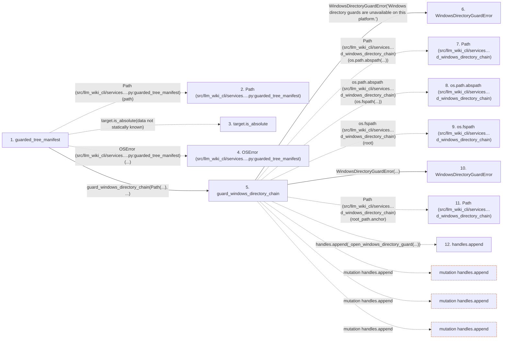

# guarded_tree_manifest

**Entry point:** `guarded_tree_manifest` (`api`)
**Source:** [filesystem_guard](../modules/filesystem_guard.md)
**Modules touched:** [filesystem_guard](../modules/filesystem_guard.md)

## Call sequence

> Static overview in presentation order, not runtime execution order. Arrows retain captured callers; representative internal continuations and boundary examples precede repeated helper detail.

<!-- Auto-generated from static call edges. Dashed arrows are external or unresolved calls. Reviewed runtime conditions and side effects belong in Behavior. -->

```mermaid
sequenceDiagram
    participant p0 as guarded_tree_manifest
    participant p1 as guard_windows_directory_chain
    participant p2 as _guarded_tree_manifest_windows_path
    participant p3 as _guarded_tree_manifest_posix_fd
    participant p4 as _open_windows_directory_guard
    participant p5 as _guarded_tree_entry_windows_path
    participant p6 as create_private_windows_directory
    participant p7 as windows_object_identity
    participant p8 as _private_windows_security_attributes
    participant p9 as open_windows_readonly_file
    participant p10 as move_windows_path_write_through
    participant p11 as _verify_windows_handle_restrictive_dacl
    participant p12 as windows_object_identity_from_values
    participant p13 as _open_windows_readonly_file_handle
    participant p14 as _current_windows_user_sid
    participant p15 as _windows_sid_string
    participant p16 as WindowsDirectoryGuardError
    participant p17 as _read_posix_descriptor
    participant p18 as _close_windows_handle
    participant p19 as _windows_api_path
    participant p20 as _WindowsDirectoryGuardUnavailableError
    participant p21 as WindowsFileGuardError
    participant p22 as WindowsDurabilityError
    participant p23 as WindowsSecurityGuardError
    participant p24 as WindowsIdentityUnavailableError
    participant p25 as WindowsObjectIdentity
    participant p26 as Path (src/llm_wiki_cli/services….py:guarded_tree_manifest)
    participant p27 as target.is_absolute
    participant p28 as OSError (src/llm_wiki_cli/services….py:guarded_tree_manifest)
    participant p29 as getattr (src/llm_wiki_cli/services….py:guarded_tree_manifest)
    p0->>p1: guard_windows_directory_chain
    p0->>p2: _guarded_tree_manifest_windows_path
    p0->>p3: _guarded_tree_manifest_posix_fd
    p1->>p4: _open_windows_directory_guard
    p2->>p5: _guarded_tree_entry_windows_path
    p1->>p6: create_private_windows_directory
    p5->>p7: windows_object_identity
    p6->>p8: _private_windows_security_attributes
    p5->>p9: open_windows_readonly_file
    p6->>p10: move_windows_path_write_through
    p4->>p11: _verify_windows_handle_restrictive_dacl
    p7->>p12: windows_object_identity_from_values
    p9->>p13: _open_windows_readonly_file_handle
    p11->>p14: _current_windows_user_sid
    p14->>p15: _windows_sid_string
    p1->>p16: WindowsDirectoryGuardError
    p3->>p17: _read_posix_descriptor
    p1->>p18: _close_windows_handle
    p4->>p19: _windows_api_path
    p4->>p20: _WindowsDirectoryGuardUnavailableError
    p5->>p21: WindowsFileGuardError
    p10->>p22: WindowsDurabilityError
    p8->>p23: WindowsSecurityGuardError
    p12->>p24: WindowsIdentityUnavailableError
    p12->>p25: WindowsObjectIdentity
    p0-->>p26: Path (src/llm_wiki_cli/services….py:guarded_tree_manifest)(path)
    p0-->>p27: target.is_absolute
    p0-->>p28: OSError (src/llm_wiki_cli/services….py:guarded_tree_manifest)(...)
    p0-->>p26: Path (src/llm_wiki_cli/services….py:guarded_tree_manifest)(target.anchor)
    p0-->>p29: getattr (src/llm_wiki_cli/services….py:guarded_tree_manifest)(os, 'O_NOFOLLOW', None)
```

> Call sequence diagram shows 30 of 335 interactions; 305 omitted to keep the visualization within the 30-interaction and generated-diagram limits, with uncertain identities omitted rather than inferred.

> Captured boundary calls: external 4 of 202 (198 omitted); unresolved 1 of 47 (46 omitted). These counts cover the captured static trace.

Omitted captured detail, grouped by actual caller occurrence and target module:

| Caller | Parent step | Target module | Kind | Omitted interactions |
| --- | --- | --- | --- | --- |
| `src/llm_wiki_cli/services/filesystem_guard.py:guard_windows_directory_chain` | 5 | - | external | 9 |
| `src/llm_wiki_cli/services/filesystem_guard.py:guard_windows_directory_chain` | 5 | [src/llm_wiki_cli/services/filesystem_guard.py](../modules/filesystem_guard.md) | internal | 5 |
| `src/llm_wiki_cli/services/filesystem_guard.py:guard_windows_directory_chain` | 5 | - | unresolved | 4 |
| `src/llm_wiki_cli/services/filesystem_guard.py:_open_windows_directory_guard` | 13 | - | external | 14 |
| `src/llm_wiki_cli/services/filesystem_guard.py:_open_windows_directory_guard` | 13 | - | unresolved | 3 |
| `src/llm_wiki_cli/services/filesystem_guard.py:_windows_api_path` | 16 | - | external | 2 |
| `src/llm_wiki_cli/services/filesystem_guard.py:_windows_api_path` | 16 | - | unresolved | 2 |
| `src/llm_wiki_cli/services/filesystem_guard.py:_open_windows_directory_guard` | 13 | [src/llm_wiki_cli/services/filesystem_guard.py](../modules/filesystem_guard.md) | internal | 6 |
> Omission summary shows 8 of 47 groups; 39 further groups are not expanded here. Counts above include all omitted interactions.
> Detailed flow queries retain their own coverage and limits; omitted paths may execute at runtime.

## Data flow

<!-- Auto-generated static analysis. Treat values and boundaries as best-effort hints, not runtime proof. -->

### Analysis coverage

**Effect analysis partially available.** Flow assembly and source effect analysis are separate; empty observations do not prove an empty handler body.

Source steps: 87; effect analysis evaluated: 38, partial: 7, unavailable: 42. Counts include steps omitted from the displayed trace.

Collector observations for 45 source steps with known totals: observed: 323, emitted: 314, omitted: 9. Unavailable totals are excluded.

- Callable record unavailable; the selected entry symbol has no represented callable body.
- Effect collector omitted observations before flow assembly; displayed effects are partial.
- Effect collector totals unavailable; observed counts cover captured records only.

| Step | Callable record | Effect analysis | Collector totals | Observed | Emitted | Omitted |
|---|---|---|---|---:|---:|---:|
| `guarded_tree_manifest` | `available` | `evaluated` | `available` | `7` | `7` | `0` |
| `Path (src/llm_wiki_cli/services….py:guarded_tree_manifest)` | `not_applicable` | `not_applicable` | `not_applicable` | — | — | — |
| `target.is_absolute` | `not_applicable` | `not_applicable` | `not_applicable` | — | — | — |
| `OSError (src/llm_wiki_cli/services….py:guarded_tree_manifest)` | `not_applicable` | `not_applicable` | `not_applicable` | — | — | — |
| `guard_windows_directory_chain` | `available` | `evaluated` | `available` | `9` | `9` | `0` |
| `WindowsDirectoryGuardError` | `unavailable` | `unavailable` | `unavailable` | — | — | — |
| `Path (src/llm_wiki_cli/services…d_windows_directory_chain)` | `not_applicable` | `not_applicable` | `not_applicable` | — | — | — |
| `os.path.abspath (src/llm_wiki_cli/services…d_windows_directory_chain)` | `not_applicable` | `not_applicable` | `not_applicable` | — | — | — |
| `os.fspath (src/llm_wiki_cli/services…d_windows_directory_chain)` | `not_applicable` | `not_applicable` | `not_applicable` | — | — | — |
| `WindowsDirectoryGuardError` | `unavailable` | `unavailable` | `unavailable` | — | — | — |
| `Path (src/llm_wiki_cli/services…d_windows_directory_chain)` | `not_applicable` | `not_applicable` | `not_applicable` | — | — | — |
| `handles.append` | `not_applicable` | `not_applicable` | `not_applicable` | — | — | — |

```mermaid
flowchart LR
    s1["1. guarded_tree_manifest"]
    s2["2. Path (src/llm_wiki_cli/services….py:guarded_tree_manifest)"]
    s3["3. target.is_absolute"]
    s4["4. OSError (src/llm_wiki_cli/services….py:guarded_tree_manifest)"]
    s5["5. guard_windows_directory_chain"]
    s6["6. WindowsDirectoryGuardError"]
    s7["7. Path (src/llm_wiki_cli/services…d_windows_directory_chain)"]
    s8["8. os.path.abspath (src/llm_wiki_cli/services…d_windows_directory_chain)"]
    s9["9. os.fspath (src/llm_wiki_cli/services…d_windows_directory_chain)"]
    s10["10. WindowsDirectoryGuardError"]
    s11["11. Path (src/llm_wiki_cli/services…d_windows_directory_chain)"]
    s12["12. handles.append"]
    s1 -. "Path (src/llm_wiki_cli/services….py:guarded_tree_manifest)(path)" .-> s2
    s1 -. "target.is_absolute(data not statically known)" .-> s3
    s1 -. "OSError (src/llm_wiki_cli/services….py:guarded_tree_manifest)(...)" .-> s4
    s1 -->|"guard_windows_directory_chain(Path(...), ...)"| s5
    s5 -->|"WindowsDirectoryGuardError('Windows directory guards are unavailable on this platform.')"| s6
    s5 -. "Path (src/llm_wiki_cli/services…d_windows_directory_chain)(os.path.abspath(...))" .-> s7
    s5 -. "os.path.abspath (src/llm_wiki_cli/services…d_windows_directory_chain)(os.fspath(...))" .-> s8
    s5 -. "os.fspath (src/llm_wiki_cli/services…d_windows_directory_chain)(root)" .-> s9
    s5 -->|"WindowsDirectoryGuardError(...)"| s10
    s5 -. "Path (src/llm_wiki_cli/services…d_windows_directory_chain)(root_path.anchor)" .-> s11
    s5 -. "handles.append(_open_windows_directory_guard(...))" .-> s12
    b0["mutation handles.append"]
    s5 -. "mutation handles.append" .-> b0
    b1["mutation handles.append"]
    s5 -. "mutation handles.append" .-> b1
    b2["mutation handles.append"]
    s5 -. "mutation handles.append" .-> b2
    click s1 "../modules/filesystem_guard.md"
    click s5 "../modules/filesystem_guard.md"
    click s6 "../modules/filesystem_guard.md"
    click s10 "../modules/filesystem_guard.md"
    classDef boundary stroke:#b45309,stroke-dasharray: 4 2
    class b0 boundary
    class b1 boundary
    class b2 boundary
```

### Step data

| Step | Inputs | Reads | Writes | Returns |
|---|---|---|---|---|
| `guarded_tree_manifest` | `path: Path` | `os`, `os`, `os`, `os` | - | `_guarded_tree_manifest_windows_path(...)`, `_guarded_tree_manifest_posix_fd(...)` |
| `Path (src/llm_wiki_cli/services….py:guarded_tree_manifest)` | - | - | - | - |
| `target.is_absolute` | - | - | - | - |
| `OSError (src/llm_wiki_cli/services….py:guarded_tree_manifest)` | - | - | - | - |
| `guard_windows_directory_chain` | `root: Path`, `relative_components: Sequence[str]`, `create_missing: bool`, `require_restrictive_dacl: bool` | `os`, `WindowsDurabilityError` | - | - |
| `WindowsDirectoryGuardError` | - | - | - | - |
| `Path (src/llm_wiki_cli/services…d_windows_directory_chain)` | - | - | - | - |
| `os.path.abspath (src/llm_wiki_cli/services…d_windows_directory_chain)` | - | - | - | - |
| `os.fspath (src/llm_wiki_cli/services…d_windows_directory_chain)` | - | - | - | - |
| `WindowsDirectoryGuardError` | - | - | - | - |
| `Path (src/llm_wiki_cli/services…d_windows_directory_chain)` | - | - | - | - |
| `handles.append` | - | - | - | - |

### Call data

| From | To | Line | Call |
|---|---|---:|---|
| guarded_tree_manifest | Path (src/llm_wiki_cli/services….py:guarded_tree_manifest) | 1521 | `Path(path)` |
| guarded_tree_manifest | target.is_absolute | 1522 | `target.is_absolute(data not statically known)` |
| guarded_tree_manifest | OSError (src/llm_wiki_cli/services….py:guarded_tree_manifest) | 1523 | `OSError(...)` |
| guarded_tree_manifest | guard_windows_directory_chain | 1525 | `guard_windows_directory_chain(Path(...), ...)` |
| guard_windows_directory_chain | WindowsDirectoryGuardError | 170 | `WindowsDirectoryGuardError('Windows directory guards are unavailable on this platform.')` |
| guard_windows_directory_chain | Path (src/llm_wiki_cli/services…d_windows_directory_chain) | 174 | `Path(os.path.abspath(...))` |
| guard_windows_directory_chain | os.path.abspath (src/llm_wiki_cli/services…d_windows_directory_chain) | 174 | `os.path.abspath(os.fspath(...))` |
| guard_windows_directory_chain | os.fspath (src/llm_wiki_cli/services…d_windows_directory_chain) | 174 | `os.fspath(root)` |
| guard_windows_directory_chain | WindowsDirectoryGuardError | 176 | `WindowsDirectoryGuardError(...)` |
| guard_windows_directory_chain | Path (src/llm_wiki_cli/services…d_windows_directory_chain) | 179 | `Path(root_path.anchor)` |
| guard_windows_directory_chain | handles.append | 182 | `handles.append(_open_windows_directory_guard(...))` |

### Boundary effects

| Kind | Target | Step | Line |
|---|---|---|---:|
| mutation | `handles.append` | `guard_windows_directory_chain` | 182 |
| mutation | `handles.append` | `guard_windows_directory_chain` | 189 |
| mutation | `handles.append` | `guard_windows_directory_chain` | 216 |

### Static analysis gaps

| Kind | Step | Target | Line |
|---|---|---|---:|
| unresolved_call | `guarded_tree_manifest` | `target.is_absolute` | 1522 |
| external_call | `guarded_tree_manifest` | `OSError` | 1523 |
| external_call | `guard_windows_directory_chain` | `os.path.abspath` | 174 |
| external_call | `guard_windows_directory_chain` | `os.fspath` | 174 |
| step_limit | `guarded_tree_manifest` | `first 12 steps` | 0 |

## Behavior

This flow starts at `guarded_tree_manifest` and is classified as `api`. The generated call and data-flow sections are bounded static projections; runtime conditions and side effects require source-level confirmation.
