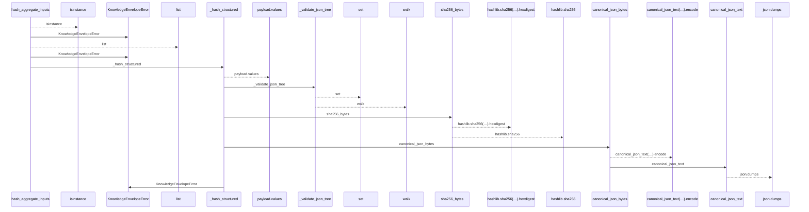
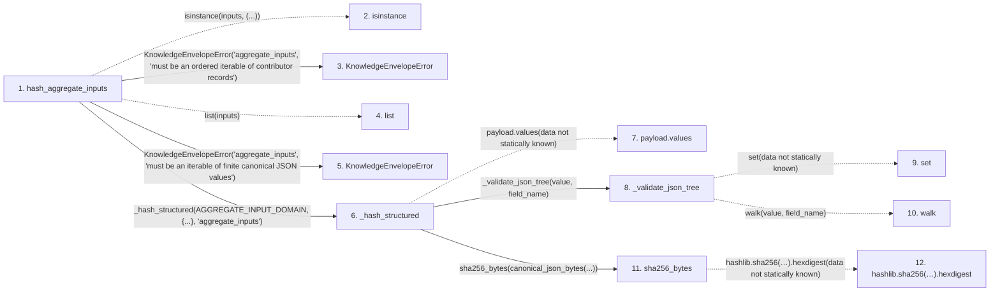

# hash_aggregate_inputs

**Entry point:** `hash_aggregate_inputs` (`api`)
**Source:** [knowledge_envelope](../modules/knowledge_envelope.md)
**Modules touched:** [knowledge_envelope](../modules/knowledge_envelope.md), [knowledge_evidence](../modules/knowledge_evidence.md)

## Call sequence

<!-- Auto-generated from static call edges. Dashed arrows are external or unresolved calls. Reviewed runtime conditions and side effects belong in Behavior. -->

## Data flow

<!-- Auto-generated static analysis. Treat values and boundaries as best-effort hints, not runtime proof. -->

### Step data

| Step | Inputs | Reads | Writes | Returns |
|---|---|---|---|---|
| `hash_aggregate_inputs` | `inputs: Sequence[Any] \| Iterable[Any]` | `Mapping`, `AGGREGATE_INPUT_DOMAIN` | - | `_hash_structured(...)` |
| `isinstance` | - | - | - | - |
| `KnowledgeEnvelopeError` | - | - | - | - |
| `list` | - | - | - | - |
| `KnowledgeEnvelopeError` | - | - | - | - |
| `_hash_structured` | `domain: str`, `payload: Mapping[str, Any]`, `field_name: str` | `KnowledgeEnvelopeError` | - | `sha256_bytes(...)` |
| `payload.values` | - | - | - | - |
| `_validate_json_tree` | `value: object`, `field_name: str` | - | - | - |
| `set` | - | - | - | - |
| `walk` | - | - | - | - |
| `sha256_bytes` | `value: bytes` | - | - | `...` |
| `hashlib.sha256(…).hexdigest` | - | - | - | - |

### Call data

| From | To | Line | Call |
|---|---|---:|---|
| hash_aggregate_inputs | isinstance | 872 | `isinstance(inputs, (...))` |
| hash_aggregate_inputs | KnowledgeEnvelopeError | 873 | `KnowledgeEnvelopeError('aggregate_inputs', 'must be an ordered iterable of contributor records')` |
| hash_aggregate_inputs | list | 878 | `list(inputs)` |
| hash_aggregate_inputs | KnowledgeEnvelopeError | 880 | `KnowledgeEnvelopeError('aggregate_inputs', 'must be an iterable of finite canonical JSON values')` |
| hash_aggregate_inputs | _hash_structured | 884 | `_hash_structured(AGGREGATE_INPUT_DOMAIN, {...}, 'aggregate_inputs')` |
| _hash_structured | payload.values | 1604 | `payload.values(data not statically known)` |
| _hash_structured | _validate_json_tree | 1605 | `_validate_json_tree(value, field_name)` |
| _validate_json_tree | set | 1626 | `set(data not statically known)` |
| _validate_json_tree | walk | 1667 | `walk(value, field_name)` |
| _hash_structured | sha256_bytes | 1606 | `sha256_bytes(canonical_json_bytes(...))` |
| sha256_bytes | hashlib.sha256(…).hexdigest | 198 | `hashlib.sha256(value).hexdigest(data not statically known)` |

### Boundary effects

*No boundary effects detected.*

### Static analysis gaps

| Kind | Step | Target | Line |
|---|---|---|---:|
| external_call | `hash_aggregate_inputs` | `isinstance` | 872 |
| unresolved_call | `_hash_structured` | `payload.values` | 1604 |
| unresolved_call | `_validate_json_tree` | `walk` | 1667 |
| unresolved_call | `sha256_bytes` | `hashlib.sha256(value).hexdigest` | 198 |
| step_limit | `hash_aggregate_inputs` | `first 12 steps` | 0 |

## Behavior

This flow starts at `hash_aggregate_inputs` and is classified as `api`. The generated call and data-flow sections are bounded static projections; runtime conditions and side effects require source-level confirmation.
