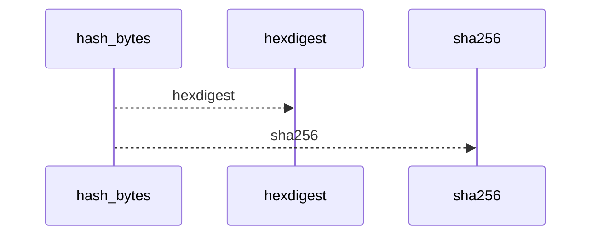
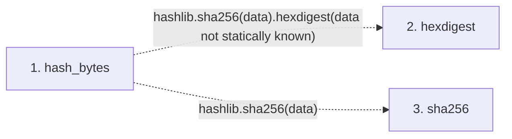

# hash_bytes

**Entry point:** `hash_bytes` (`api`)
**Source:** [documentation_policy](../modules/documentation_policy.md)
**Modules touched:** [documentation_policy](../modules/documentation_policy.md)

## Call sequence

<!-- Auto-generated from static call edges. Dashed arrows are external or unresolved calls. Reviewed runtime conditions and side effects belong in Behavior. -->

## Data flow

<!-- Auto-generated static analysis. Treat values and boundaries as best-effort hints, not runtime proof. -->

### Step data

| Step | Inputs | Reads | Writes | Returns |
|---|---|---|---|---|
| `hash_bytes` | `data: bytes` | - | - | `...` |
| `hexdigest` | - | - | - | - |
| `sha256` | - | - | - | - |

### Call data

| From | To | Line | Call |
|---|---|---:|---|
| hash_bytes | hexdigest | 520 | `hashlib.sha256(data).hexdigest(data not statically known)` |
| hash_bytes | sha256 | 520 | `hashlib.sha256(data)` |

### Boundary effects

*No boundary effects detected.*

### Static analysis gaps

| Kind | Step | Target | Line |
|---|---|---|---:|
| external_call | `hash_bytes` | `hashlib.sha256(data).hexdigest` | 520 |
| external_call | `hash_bytes` | `hashlib.sha256` | 520 |

## Behavior

This flow starts at `hash_bytes` and is classified as `api`. The generated call and data-flow sections are bounded static projections; runtime conditions and side effects require source-level confirmation.
